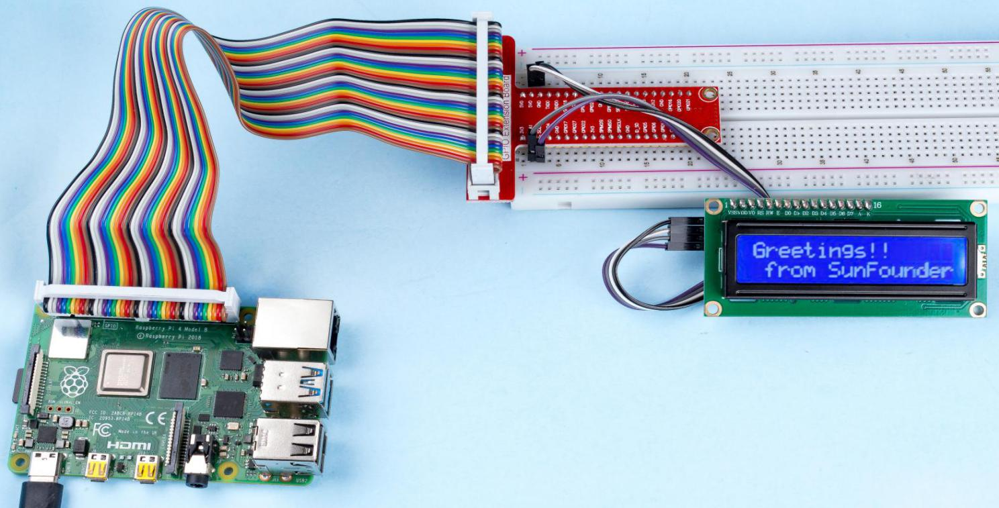

.. note::

    ¡Hola! Bienvenido a la Comunidad de Entusiastas de SunFounder para Raspberry Pi, Arduino y ESP32 en Facebook. Sumérgete en el apasionante mundo de Raspberry Pi, Arduino y ESP32 junto a otros entusiastas.

    **¿Por qué unirte?**

    - **Soporte Experto**: Resuelve problemas postventa y desafíos técnicos con la ayuda de nuestra comunidad y equipo.
    - **Aprende y Comparte**: Intercambia consejos y tutoriales para mejorar tus habilidades.
    - **Avances Exclusivos**: Obtén acceso anticipado a nuevos anuncios de productos y adelantos exclusivos.
    - **Descuentos Especiales**: Disfruta de descuentos exclusivos en nuestros productos más recientes.
    - **Promociones Festivas y Sorteos**: Participa en sorteos y promociones especiales de temporada.

    👉 ¿Listo para explorar y crear con nosotros? Haz clic en [|link_sf_facebook|] y únete hoy mismo.

LCD1602 I2C
=============

Introducción
--------------

LCD1602 es una pantalla de cristal líquido de tipo carácter que puede mostrar 
32 caracteres (16*2) al mismo tiempo.

Componentes
---------------

.. image:: ../img/list_i2c_lcd.png

Diagrama del Circuito
------------------------

============ ========
T-Board Name physical
SDA1         Pin 3
SCL1         Pin 5
============ ========

.. image:: ../img/schematic_i2c_lcd.png

Procedimiento Experimental
----------------------------

**Paso 1**: Construye el circuito.

.. image:: ../img/image96.png

**Paso 2**: Configura I2C (consulta :ref:`I2C Configuration`. Si ya configuraste I2C, omite este paso.)

**Paso 3**: Ve a la carpeta del código.

.. raw:: html

   <run></run>

.. code-block::

    cd ~/davinci-kit-for-raspberry-pi/nodejs/

**Paso 4**: Instala las dependencias.

.. raw:: html

   <run></run>

.. code-block:: 

    sudo npm install @oawu/lcd1602

**Paso 5**: Ejecuta el código.

.. raw:: html

   <run></run>

.. code-block::

    sudo node i2c_lcd1602.js

Al ejecutar el código, verás en el LCD el mensaje ``Greetings!!, From SunFounder``.

**Código**

.. code-block:: js

    const LCD = require('@oawu/lcd1602');
    const lcd = new LCD();

    lcd.text(0, 0, 'Greetings!!');
    lcd.text(1, 1, 'from SunFounder');

**Explicación del Código**

.. code-block:: js

    const LCD = require('@oawu/lcd1602');
    const lcd = new LCD();

Importa el módulo ``lcd1602`` y represéntalo con ``lcd``.

.. note::
    Para más información sobre el módulo lcd1602, consulta: https://www.npmjs.com/package/@oawu/lcd1602

   
.. code-block:: js

    lcd.text(0, 0, 'Greetings!!');
    lcd.text(1, 1, 'from SunFounder');

Llamando a la función encapsulada ``text()`` en la clase ``LCD``, podemos hacer que el lcd1602 muestre el texto que queremos.

La función ``text()`` recibe tres parámetros: 
el primer parámetro es la línea del lcd1602, 
el segundo parámetro representa la posición del texto que se mostrará, 
y el tercer parámetro es el texto que queremos mostrar.

El número **1602** en el modelo LCD significa que tiene 2 filas de 16 celdas cada una.

Imagen del Fenómeno
-----------------------

