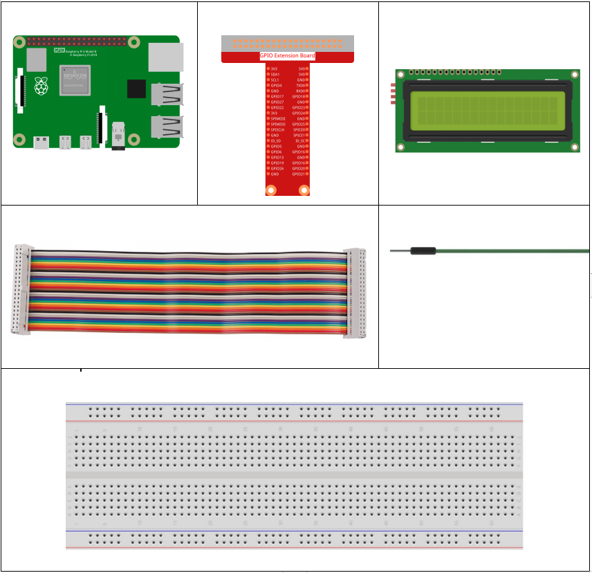
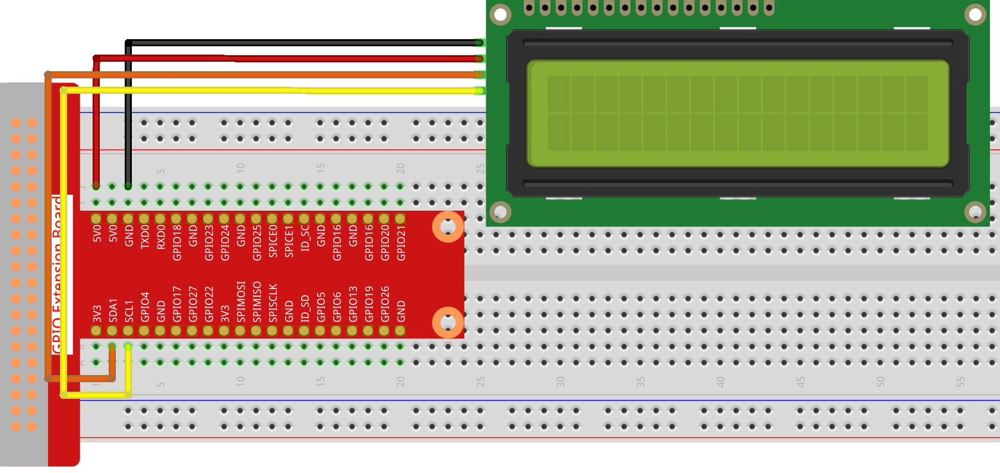

1.1.6 I2C LCD1602
=======================

Introduction
------------------

LCD1602 is a character type liquid crystal display, which can display 32
(16*2) characters at the same time.

Components
-------------------

* :ref:`GPIO Extension Board`
* :ref:`Breadboard`
* :ref:`I2C LCD1602`

Schematic Diagram
---------------------

============ ========
T-Board Name physical
SDA1         Pin 3
SCL1         Pin 5
============ ========

.. image:: ../media/schematic_i2c_lcd.png

Experimental Procedures
-----------------------------

**Step 1:** Build the circuit.

**Step 2**: Setup I2C (see :ref:`I2C Configuration`. If you have set I2C, skip this step.)

**Step 3:** Go to the folder of the code.

.. raw:: html

   <run></run>

.. code-block::

    cd /home/pi/davinci-kit-for-raspberry-pi/nodejs/

**Step 4:** Install dependencies.

.. raw:: html

   <run></run>

.. code-block:: 

    sudo npm install @oawu/lcd1602

**Step 5:** Run the code.

.. raw:: html

   <run></run>

.. code-block::

    sudo node i2c_lcd1602.js

After the code runs, you can see ``Greetings!!, From SunFounder`` displaying on the LCD.

**Code**

.. code-block:: js

    const LCD = require('@oawu/lcd1602');
    const lcd = new LCD();

    lcd.text(0, 0, 'Greetings!!');
    lcd.text(1, 1, 'from SunFounder');

**Code Explanation**

.. code-block:: js

    const LCD = require('@oawu/lcd1602');
    const lcd = new LCD();

Import the ``lcd1602`` module and represent it with ``lcd``.

.. note::
    For the lcd1602 module, please refer to: https://www.npmjs.com/package/@oawu/lcd1602

   
.. code-block:: js

    lcd.text(0, 0, 'Greetings!!');
    lcd.text(1, 1, 'from SunFounder');

Calling the encapsulated ``text()`` function in the ``LCD`` class can make the lcd1602 display the text we want.

The ``text()`` function receives three parameters, 
the first parameter is the line of lcd1602, 
the second parameter represents the position of the displayed text, 
and the third parameter represents the text we want to display.

The **1602** number in the LCD model means it has 2 rows of 16 cells each.

Phenomenon Picture
--------------------------

.. image:: ../media/image97.jpeg
