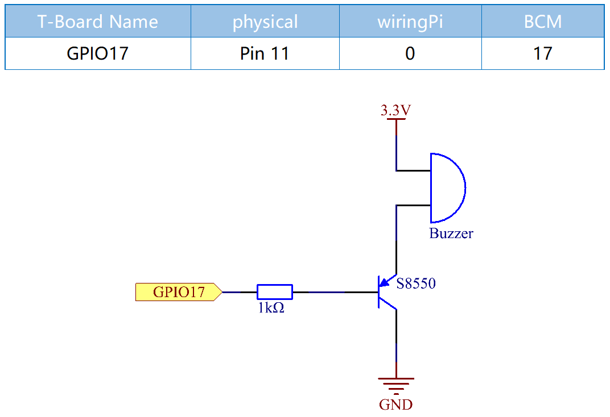
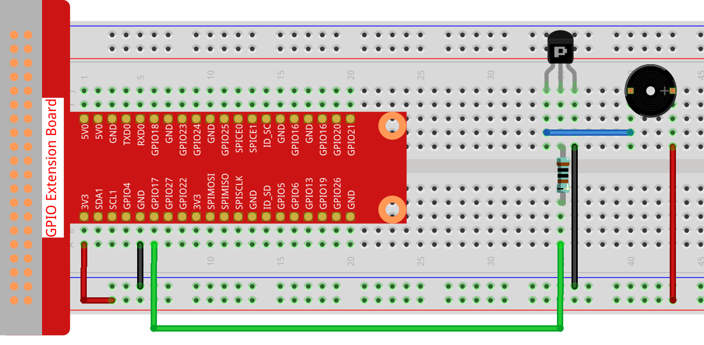
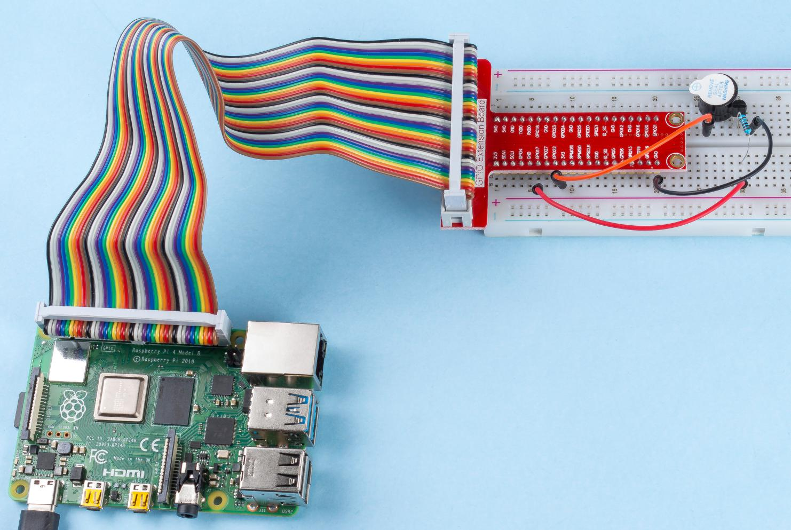

.. note::

    Ciao, benvenuto nella SunFounder Raspberry Pi & Arduino & ESP32 Enthusiasts Community su Facebook! Approfondisci le tue conoscenze su Raspberry Pi, Arduino ed ESP32 insieme ad altri appassionati.

    **Perché Unirsi?**

    - **Supporto Esperto**: Risolvi problemi post-vendita e sfide tecniche con l'aiuto della nostra community e del nostro team.
    - **Impara e Condividi**: Scambia suggerimenti e tutorial per migliorare le tue competenze.
    - **Anteprime Esclusive**: Accedi in anteprima agli annunci dei nuovi prodotti.
    - **Sconti Speciali**: Approfitta di sconti esclusivi sui nostri nuovi prodotti.
    - **Promozioni Festive e Omaggi**: Partecipa a omaggi e promozioni speciali per le festività.

    👉 Pronto a esplorare e creare con noi? Clicca su [|link_sf_facebook|] e unisciti subito!

Buzzer Attivo
====================

Introduzione
---------------

In questo progetto, impareremo come azionare un buzzer attivo per emettere 
un suono utilizzando un transistor PNP.

Componenti
-------------

.. image:: ../img/list_1.2.1.png

Schema Elettrico
-------------------

In questo esperimento, sono utilizzati un buzzer attivo, un transistor 
PNP e una resistenza da 1kΩ tra la base del transistor e il GPIO per 
proteggere il transistor. Quando il GPIO17 del Raspberry Pi è impostato 
su livello basso (0V) tramite programmazione, il transistor entrerà in 
conduzione grazie alla saturazione di corrente e il buzzer emetterà un 
suono. Quando invece viene applicato un livello alto al GPIO, il transistor 
si disattiva e il buzzer smette di emettere suoni.

Procedura Sperimentale
--------------------------

**Passo 1:** Costruisci il circuito. (Il buzzer attivo ha un adesivo bianco sulla superficie e un retro nero.)

**Passo 2**: Vai alla cartella del codice.

.. raw:: html

   <run></run>

.. code-block::

    cd ~/davinci-kit-for-raspberry-pi/nodejs/

**Passo 3**: Esegui.

.. raw:: html

   <run></run>

.. code-block::

    sudo node active_buzzer.js

Dopo l’esecuzione del codice, il buzzer emette un suono.

**Codice**

.. code-block:: js

  const Gpio = require('pigpio').Gpio;
  const active = new Gpio(17,{mode: Gpio.OUTPUT});

  setInterval(() => {
    active.digitalWrite(!active.digitalRead());
  }, 500);

  process.on('SIGINT',function(){
    active.digitalWrite(1);
    process.exit();
  });

**Spiegazione del Codice**

.. code-block:: js

    const Gpio = require('pigpio').Gpio;
    const active = new Gpio(17,{mode: Gpio.OUTPUT});

Importa il modulo ``pigpio``, e istanzia un oggetto active per controllare la porta IO Gpio17, impostandola in modalità di output.

.. code-block:: js

  setInterval(() => {
    active.digitalWrite(!active.digitalRead());
  }, 500);

Il buzzer attivo funziona in modo simile al LED e può essere controllato con ``digitalWrite()``, mentre ``digitalRead()`` viene utilizzato per leggere il livello corrente del pin.
In questo esempio, facciamo cambiare lo stato del buzzer attivo ogni 500ms.

.. code-block:: js

  process.on('SIGINT', function() {
      /* DO SOME STUFF HERE */

      process.exit()
  })

Gestisce Ctrl+C, qui utilizzato per fermare il suono del buzzer all'uscita dal programma.

`Process - NodeJS <https://nodejs.org/api/process.html>`_

Immagine del Fenomeno
--------------------------

