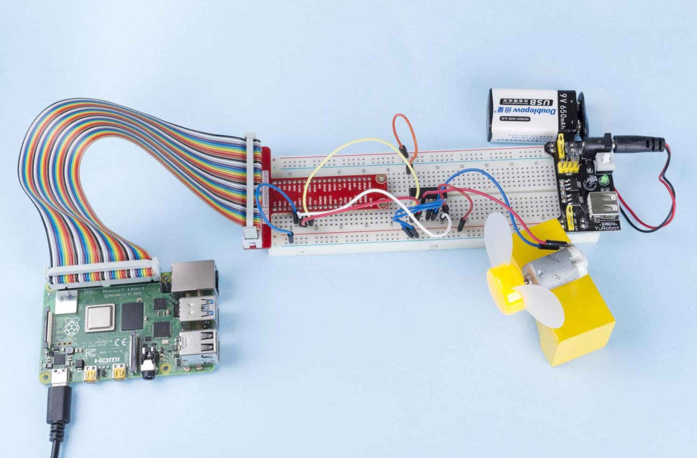

.. note::

    こんにちは、SunFounder Raspberry Pi & Arduino & ESP32 Enthusiasts Community on Facebookへようこそ！Raspberry Pi、Arduino、ESP32を愛好する仲間たちと一緒に、これらの技術を深く探求しましょう。

    **参加する理由**

    - **専門家のサポート**: コミュニティやチームの助けを借りて、購入後の問題や技術的な課題を解決します。
    - **学びと共有**: スキルを向上させるためのヒントやチュートリアルを交換します。
    - **独占プレビュー**: 新製品の発表やプレビューに早期アクセスできます。
    - **特別割引**: 最新の製品に対する独占割引を楽しめます。
    - **フェスティブプロモーションとギブアウェイ**: ギブアウェイやフェスティブプロモーションに参加できます。

    👉 私たちと一緒に探索と創造を始める準備はできましたか？[|link_sf_facebook|]をクリックして、今日参加しましょう！

1.3.1 モーター
===================

イントロダクション
--------------------

このプロジェクトでは、L293Dを使用してDCモーターを駆動し、時計回りおよび反時計回りに回転させる方法を学びます。DCモーターは大きな電流を必要とするため、安全のために、ここでは電源モジュールを使用してモーターに電力を供給します。

コンポーネント
-----------------

.. image:: ../img/list_1.3.1.png

回路図
------------------

電源モジュールをブレッドボードに差し込み、ジャンパーキャップを5Vピンに挿入すると、5Vの電圧が出力されます。L293Dのピン1をGPIO22に接続し、高レベルに設定します。ピン2をGPIO27に、ピン7をGPIO17に接続し、一方のピンを高レベル、もう一方を低レベルに設定します。これにより、モーターの回転方向を変更できます。

.. image:: ../img/image336.png

**実験手順**

**ステップ1:** 回路を構築します。

.. image:: ../img/image117.png

.. note::
    電源モジュールは、キット内の9V電池と9Vバッテリーバックルを使用できます。電源モジュールのジャンパーキャップをブレッドボードの5Vバスストリップに挿入してください。

.. image:: ../img/image118.jpeg

**ステップ2:** コードのフォルダに移動します。

.. raw:: html

   <run></run>

.. code-block::

    cd ~/davinci-kit-for-raspberry-pi/nodejs/

**ステップ4:** コードを実行します。

.. raw:: html

   <run></run>

.. code-block::

    sudo node motor.js

コードが実行されると、モーターは最初に時計回りに1秒間回転し、次に1秒間停止し、その後反時計回りに1秒間回転します。その後、モーターは1秒間停止します。この一連の動作は繰り返し実行されます。

**コード**

.. code-block:: js

    const Gpio = require('pigpio').Gpio;

    MotorPin1 = new Gpio(17, { mode: Gpio.OUTPUT });
    MotorPin2 = new Gpio(27, { mode: Gpio.OUTPUT });
    MotorEnable = new Gpio(22, { mode: Gpio.OUTPUT });

    // モーターを回転させるためのモーターファンクションを定義
    // 方向は次の通り
    // 2(時計回り)、1(反時計回り)、0(停止)
    function motor(direction) {
        switch (direction) {
            case 2: // 時計回り
                // 方向を設定
                MotorPin1.digitalWrite(1)
                MotorPin2.digitalWrite(0)
                // モーターを有効にする
                MotorEnable.digitalWrite(1)
                console.log('Clockwise')
                break;
            case 1:  // 反時計回り
                // 方向を設定
                MotorPin1.digitalWrite(0)
                MotorPin2.digitalWrite(1)
                // モーターを有効にする
                MotorEnable.digitalWrite(1)
                console.log('Counterclockwise')
                break;
            case 0: // 停止
                // モーターを無効にする
                MotorEnable.digitalWrite(0)
                console.log('Stop')

        }
    }

    process.on('SIGINT', function () {
        MotorEnable.digitalWrite(0)
        process.exit();
    })

    let index=-1
    setInterval(() => {
        index=(index+1)%3
        motor(index)
    }, 1000)    
 

**コードの説明**

.. code-block:: js

    MotorPin1 = new Gpio(17, { mode: Gpio.OUTPUT });
    MotorPin2 = new Gpio(27, { mode: Gpio.OUTPUT });
    MotorEnable = new Gpio(22, { mode: Gpio.OUTPUT });

pigpioモジュールをインポートし、Gpio17、Gpio27、Gpio22の3つのIOポートを制御するために3つのGpioクラスオブジェクトを作成します。

.. code-block:: js

    function motor(direction) {
        switch (direction) {
            case 2: // 時計回り
                // 方向を設定
                MotorPin1.digitalWrite(1)
                MotorPin2.digitalWrite(0)
                // モーターを有効にする
                MotorEnable.digitalWrite(1)
                console.log('Clockwise')
                break;
            case 1:  // 反時計回り
                // 方向を設定
                MotorPin1.digitalWrite(0)
                MotorPin2.digitalWrite(1)
                // モーターを有効にする
                MotorEnable.digitalWrite(1)
                console.log('Counterclockwise')
                break;
            case 0: // 停止
                // モーターを無効にする
                MotorEnable.digitalWrite(0)
                console.log('Stop')

        }
    }

motor()関数を定義してモーターを制御します。

#. 方向が2の場合、MotorPin1ポートに高レベルを書き込み、MotorPin2ポートに低レベルを書き込み、有効ポートMotorEnableに高レベルを書き込み、モーターを時計回りに回転させます。
#. 方向が1の場合、MotorPin1ポートに低レベルを書き込み、MotorPin2ポートに高レベルを書き込み、有効ポートMotorEnableに高レベルを書き込み、モーターを反時計回りに回転させます。
#. 方向が0の場合、有効ポートMotorEnableに低レベルを書き込み、モーターの回転を停止させます。  

.. code-block:: js

    let index=-1
    setInterval(() => {
        index=(index+1)%3
        motor(index)
    }, 1000)    

モーターを時計回りおよび反時計回りに交互に1秒間隔で回転させます。

.. code-block:: js

    process.on('SIGINT', function () {
        MotorEnable.digitalWrite(0)
        process.exit();
    })

**ctrl+c** が押されたことを検出すると、MotorEnableは低レベルに設定され、モーターの回転が停止します。

現象の写真
------------------

