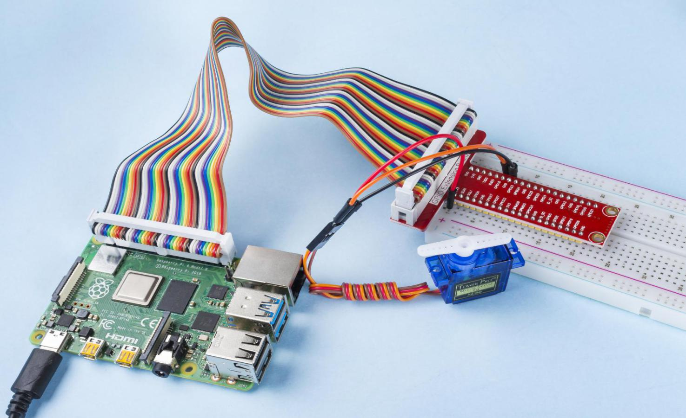

.. note::

    ¡Hola! Bienvenido a la Comunidad de Entusiastas de SunFounder para Raspberry Pi, Arduino y ESP32 en Facebook. Sumérgete en el fascinante mundo de Raspberry Pi, Arduino y ESP32 junto a otros entusiastas.

    **¿Por qué unirte?**

    - **Soporte Experto**: Resuelve problemas postventa y desafíos técnicos con la ayuda de nuestra comunidad y equipo.
    - **Aprende y Comparte**: Intercambia consejos y tutoriales para mejorar tus habilidades.
    - **Avances Exclusivos**: Obtén acceso anticipado a nuevos anuncios de productos y adelantos exclusivos.
    - **Descuentos Especiales**: Disfruta de descuentos exclusivos en nuestros productos más recientes.
    - **Promociones Festivas y Sorteos**: Participa en sorteos y promociones especiales de temporada.

     👉 ¿Listo para explorar y crear con nosotros? Haz clic en [|link_sf_facebook|] y únete hoy mismo.

Servo
========

Introducción
----------------

En este proyecto, aprenderemos cómo hacer que el servomotor gire.

Componentes
----------------

.. image:: ../img/list_1.3.2.png

Diagrama del Circuito
--------------------------

.. image:: ../img/image337.png

Procedimiento Experimental
-------------------------------

**Paso 1:** Construye el circuito.

.. image:: ../img/image125.png

**Paso 2**: Dirígete a la carpeta del código.

.. raw:: html

   <run></run>

.. code-block::

    cd ~/davinci-kit-for-raspberry-pi/nodejs/

**Paso 3**: Ejecuta el código.

.. raw:: html

   <run></run>

.. code-block::

    sudo node servo.js

Al ejecutar el programa, el servo girará de 0 grados a 180 grados, y luego 
de 180 grados a 0 grados, de forma continua.

**Código**

.. code-block:: js

    const Gpio = require('pigpio').Gpio;

    SERVO_MIN_ANGLE = 0
    SERVO_MAX_ANGLE = 180
    SERVO_MIN_PULSE = 500
    SERVO_MAX_PULSE = 2500

    ServoPin = new Gpio(18,{mode: Gpio.OUTPUT})

    function map(value, inMin, inMax, outMin, outMax){
        return (outMax - outMin) * (value - inMin) / (inMax - inMin) + outMin
    }

    function angle2pulse(angle){
        return Math.floor(map(angle,SERVO_MIN_ANGLE,SERVO_MAX_ANGLE,SERVO_MIN_PULSE ,SERVO_MAX_PULSE))
    }

    let angle=90;
    let step=5;
    setInterval(() => {
        if(angle>=180||angle<=0){
            step=-step
        }
        angle+=step;
        ServoPin.servoWrite(angle2pulse(angle));
    }, 20);

**Explicación del Código**

.. code-block:: js

    const Gpio = require('pigpio').Gpio;

    ServoPin = new Gpio(18,{mode: Gpio.OUTPUT})

Importa el módulo pigpio y crea un objeto de la clase Gpio, ServoPin, para controlar la salida de Gpio18.  

.. code-block:: js

    SERVO_MIN_ANGLE = 0
    SERVO_MAX_ANGLE = 180
    SERVO_MIN_PULSE = 500
    SERVO_MAX_PULSE = 2500

    function map(value, inMin, inMax, outMin, outMax){
        return (outMax - outMin) * (value - inMin) / (inMax - inMin) + outMin
    }

    function angle2pulse(angle){
        return Math.floor(map(angle,SERVO_MIN_ANGLE,SERVO_MAX_ANGLE,SERVO_MIN_PULSE ,SERVO_MAX_PULSE))
    }

Se define una función para mapear el ángulo a la anchura del pulso. Esto es 
necesario ya que la función ``servoWrite(pulseWidth)`` de la clase Gpio requiere escribir un ancho de pulso en lugar de un ángulo.
El rango de ángulos del servomotor es de 0 a 180, y debe ser mapeado al rango de anchura de pulso, 500 a 2500.

.. code-block:: js

    let angle=90;
    let step=5;
    setInterval(() => {
        if(angle>=180||angle<=0){
            step=-step
        }
        angle+=step;
        ServoPin.servoWrite(angle2pulse(angle));
    }, 20);

Permite que el ángulo del servomotor oscile entre 0 y 180 grados.

Imagen del Fenómeno
-----------------------

