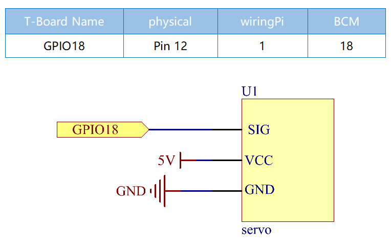
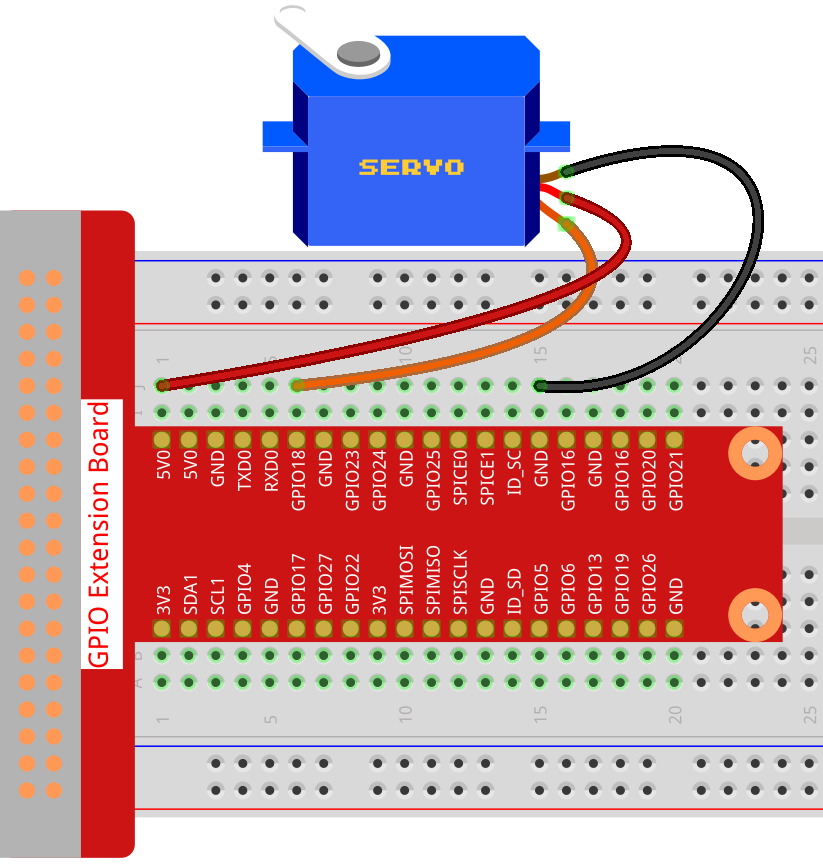

.. note::

    Ciao, benvenuto nella SunFounder Raspberry Pi & Arduino & ESP32 Enthusiasts Community su Facebook! Approfondisci le tue conoscenze su Raspberry Pi, Arduino ed ESP32 insieme ad altri appassionati.

    **Perché Unirsi?**

    - **Supporto Esperto**: Risolvi problemi post-vendita e sfide tecniche con l'aiuto della nostra community e del nostro team.
    - **Impara e Condividi**: Scambia suggerimenti e tutorial per migliorare le tue competenze.
    - **Anteprime Esclusive**: Accedi in anteprima agli annunci dei nuovi prodotti.
    - **Sconti Speciali**: Approfitta di sconti esclusivi sui nostri nuovi prodotti.
    - **Promozioni Festive e Omaggi**: Partecipa a omaggi e promozioni speciali per le festività.

    👉 Pronto a esplorare e creare con noi? Clicca su [|link_sf_facebook|] e unisciti subito!

Servo
=================

Introduzione
--------------

In questo progetto, impareremo come far ruotare il servomotore.

Componenti
------------

.. image:: ../img/list_1.3.2.png

Schema Elettrico
-------------------

Procedure Sperimentali
-------------------------

**Passo 1:** Costruisci il circuito.

**Passo 2**: Vai alla cartella del codice.

.. raw:: html

   <run></run>

.. code-block::

    cd ~/davinci-kit-for-raspberry-pi/nodejs/

**Passo 3**: Esegui il codice.

.. raw:: html

   <run></run>

.. code-block::

    sudo node servo.js

Dopo l'esecuzione del programma, il servomotore ruoterà da 0 gradi a 180 
gradi, e poi da 180 gradi a 0 gradi, ciclicamente.

**Codice**

.. code-block:: js

    const Gpio = require('pigpio').Gpio;

    SERVO_MIN_ANGLE = 0
    SERVO_MAX_ANGLE = 180
    SERVO_MIN_PULSE = 500
    SERVO_MAX_PULSE = 2500

    ServoPin = new Gpio(18,{mode: Gpio.OUTPUT})

    function map(value, inMin, inMax, outMin, outMax){
        return (outMax - outMin) * (value - inMin) / (inMax - inMin) + outMin
    }

    function angle2pulse(angle){
        return Math.floor(map(angle,SERVO_MIN_ANGLE,SERVO_MAX_ANGLE,SERVO_MIN_PULSE ,SERVO_MAX_PULSE))
    }

    let angle=90;
    let step=5;
    setInterval(() => {
        if(angle>=180||angle<=0){
            step=-step
        }
        angle+=step;
        ServoPin.servoWrite(angle2pulse(angle));
    }, 20);

**Spiegazione del Codice**

.. code-block:: js

    const Gpio = require('pigpio').Gpio;

    ServoPin = new Gpio(18,{mode: Gpio.OUTPUT})

Importa il modulo pigpio e crea un oggetto della classe Gpio, ServoPin, per controllare l'uscita del pin Gpio18.

.. code-block:: js

    SERVO_MIN_ANGLE = 0
    SERVO_MAX_ANGLE = 180
    SERVO_MIN_PULSE = 500
    SERVO_MAX_PULSE = 2500

    function map(value, inMin, inMax, outMin, outMax){
        return (outMax - outMin) * (value - inMin) / (inMax - inMin) + outMin
    }

    function angle2pulse(angle){
        return Math.floor(map(angle,SERVO_MIN_ANGLE,SERVO_MAX_ANGLE,SERVO_MIN_PULSE ,SERVO_MAX_PULSE))
    }

Qui è definita la funzione che mappa l'angolo alla larghezza dell'impulso. 
Questo perché la funzione ``servoWrite(pulseWidth)`` della classe Gpio 
richiede di scrivere la larghezza dell'impulso anziché l'angolo. La gamma 
di angoli del servo che utilizziamo è 0~180, che deve essere mappata alla 
gamma di larghezza degli impulsi, 500~2500.

.. code-block:: js

    let angle=90;
    let step=5;
    setInterval(() => {
        if(angle>=180||angle<=0){
            step=-step
        }
        angle+=step;
        ServoPin.servoWrite(angle2pulse(angle));
    }, 20);

Imposta l'angolo del servo per oscillare avanti e indietro da 0 a 180 gradi.

Immagine del Fenomeno
---------------------------

.. image:: ../img/image126.jpeg
