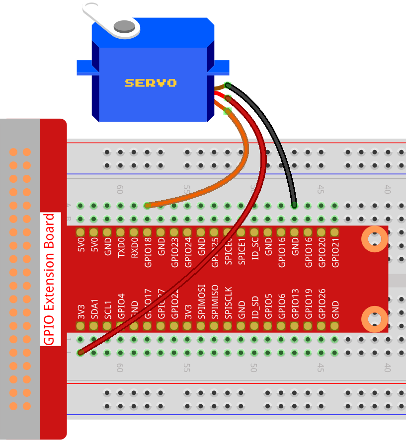

1.3.2 Servo
============

Introduction
--------------

In this project, we will learn how to make the servo rotate.

Components
----------

.. image:: ../media/list_1.3.2.png

* :ref:`GPIO Extension Board`
* :ref:`Breadboard`
* :ref:`Servo`

Schematic Diagram
-----------------

.. image:: ../media/image337.png

Experimental Procedures
-----------------------

**Step 1:** Build the circuit.

**Step 2**: Go to the folder of the code.

.. raw:: html

   <run></run>

.. code-block::

    cd /home/pi/davinci-kit-for-raspberry-pi/nodejs/

**Step 3**: Run the code.

.. raw:: html

   <run></run>

.. code-block::

    sudo node servo.js

After the program is executed, the servo will rotate from 0 degrees 
to 180 degrees, and then from 180 degrees to 0 degrees, circularly.

**Code**

.. code-block:: js

    const Gpio = require('pigpio').Gpio;

    SERVO_MIN_ANGLE = 0
    SERVO_MAX_ANGLE = 180
    SERVO_MIN_PULSE = 500
    SERVO_MAX_PULSE = 2500

    ServoPin = new Gpio(18,{mode: Gpio.OUTPUT})

    function map(value, inMin, inMax, outMin, outMax){
        return (outMax - outMin) * (value - inMin) / (inMax - inMin) + outMin
    }

    function angle2pulse(angle){
        return Math.floor(map(angle,SERVO_MIN_ANGLE,SERVO_MAX_ANGLE,SERVO_MIN_PULSE ,SERVO_MAX_PULSE))
    }

    let angle=90;
    let step=5;
    setInterval(() => {
        if(angle>=180||angle<=0){
            step=-step
        }
        angle+=step;
        ServoPin.servoWrite(angle2pulse(angle));
    }, 20);

**Code Explanation**

.. code-block:: js

    const Gpio = require('pigpio').Gpio;

    ServoPin = new Gpio(18,{mode: Gpio.OUTPUT})

Import the pigpio module and create an object of class Gpio, ServoPin, to control the output of Gpio18.    
  

.. code-block:: js

    SERVO_MIN_ANGLE = 0
    SERVO_MAX_ANGLE = 180
    SERVO_MIN_PULSE = 500
    SERVO_MAX_PULSE = 2500

    function map(value, inMin, inMax, outMin, outMax){
        return (outMax - outMin) * (value - inMin) / (inMax - inMin) + outMin
    }

    function angle2pulse(angle){
        return Math.floor(map(angle,SERVO_MIN_ANGLE,SERVO_MAX_ANGLE,SERVO_MIN_PULSE ,SERVO_MAX_PULSE))
    }

The function that maps the angle to the pulse width is defined here.
This is because the servo control function ``servoWrite(pulseWidth)`` encapsulated in the Gpio class needs to write pulse width instead of angle.
The angle range of the servo we use is 0~180, which needs to be mapped to the range of pulseWidth, 500~2500.

.. code-block:: js

    let angle=90;
    let step=5;
    setInterval(() => {
        if(angle>=180||angle<=0){
            step=-step
        }
        angle+=step;
        ServoPin.servoWrite(angle2pulse(angle));
    }, 20);

Let the servo angle deflect back and forth from 0 to 180.

Phenomenon Picture
------------------

.. image:: ../media/image126.jpeg

