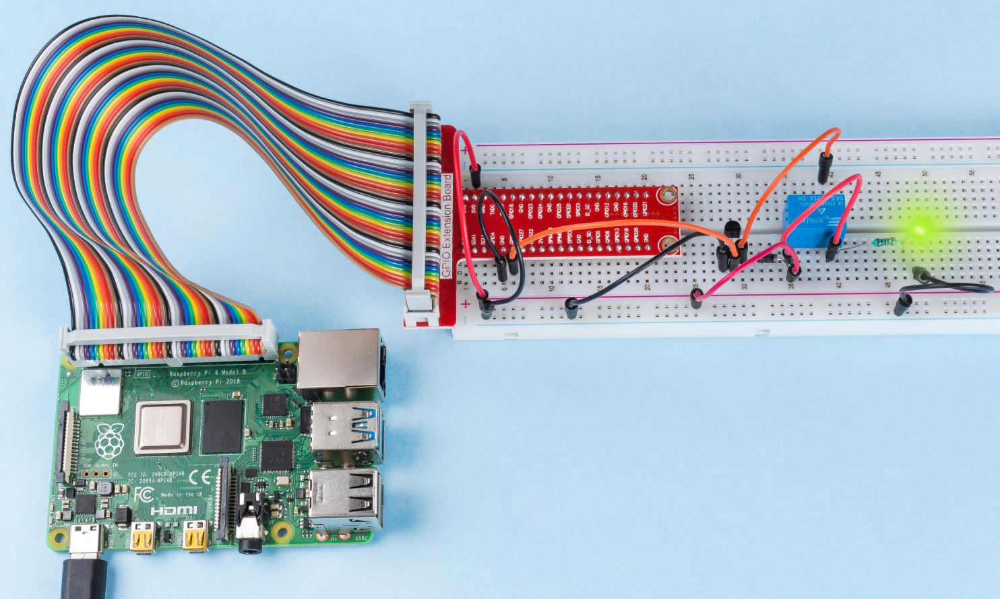

.. note::

    Ciao, benvenuto nella SunFounder Raspberry Pi & Arduino & ESP32 Enthusiasts Community su Facebook! Approfondisci le tue conoscenze su Raspberry Pi, Arduino ed ESP32 insieme ad altri appassionati.

    **Perché Unirsi?**

    - **Supporto Esperto**: Risolvi problemi post-vendita e sfide tecniche con l'aiuto della nostra community e del nostro team.
    - **Impara e Condividi**: Scambia suggerimenti e tutorial per migliorare le tue competenze.
    - **Anteprime Esclusive**: Accedi in anteprima agli annunci dei nuovi prodotti.
    - **Sconti Speciali**: Approfitta di sconti esclusivi sui nostri nuovi prodotti.
    - **Promozioni Festive e Omaggi**: Partecipa a omaggi e promozioni speciali per le festività.

    👉 Pronto a esplorare e creare con noi? Clicca su [|link_sf_facebook|] e unisciti subito!

Relè
============

Introduzione
---------------

In questo progetto, impareremo a usare un relè, uno dei componenti più 
utilizzati nei sistemi di controllo automatico. Quando la tensione, la 
corrente, la temperatura, la pressione, ecc., raggiungono, superano o sono 
inferiori al valore prestabilito, il relè collega o interrompe il circuito, 
per controllare e proteggere l'attrezzatura.

Componenti
-------------

.. image:: ../img/list_1.3.4.png

Schema Elettrico
-----------------

.. image:: ../img/image345.png

Procedure Sperimentali
------------------------

**Passo 1:** Costruisci il circuito.

.. image:: ../img/image144.png

**Passo 2:** Vai alla cartella del codice.

.. raw:: html

   <run></run>

.. code-block::

    cd ~/davinci-kit-for-raspberry-pi/nodejs/

**Passo 3:** Esegui il codice.

.. raw:: html

   <run></run>

.. code-block::

    sudo node relay.js

Durante l'esecuzione del codice, il LED si accenderà. Inoltre, potrai 
sentire un ticchettio causato dall'interruzione del contatto normalmente 
chiuso e dalla chiusura del contatto normalmente aperto.

**Codice**

.. code-block:: js

    const Gpio = require('pigpio').Gpio;
    const relay = new Gpio(17,{mode: Gpio.OUTPUT});

    setInterval(() => {
        relay.digitalWrite(!relay.digitalRead());
    }, 500);

    process.on('SIGINT',function(){
        relay.digitalWrite(0);
        process.exit();
    });

**Spiegazione del Codice**

.. code-block:: js

    const Gpio = require('pigpio').Gpio;
    const relay = new Gpio(17,{mode: Gpio.OUTPUT});

Importa il modulo ``pigpio`` e crea un'istanza dell'oggetto relay di Gpio per controllare la porta IO Gpio17, impostandola in modalità output.

.. code-block:: js

    setInterval(() => {
        relay.digitalWrite(!relay.digitalRead());
    }, 500);

Il relè si apre e si chiude continuamente, facendo accendere e spegnere il LED a intervalli di 500 ms.

.. code-block:: js

    process.on('SIGINT',function(){
        relay.digitalWrite(0);
        process.exit();
    });

Quando viene rilevato **ctrl+c**, il relè viene aperto.

Immagine del Fenomeno
----------------------------

