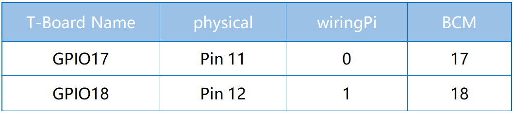
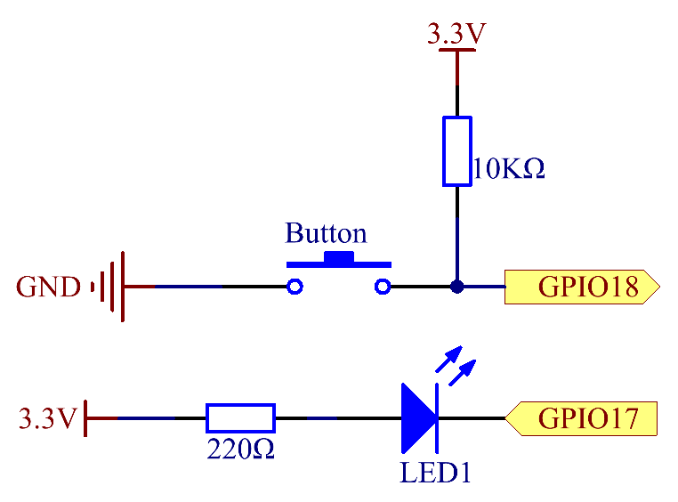
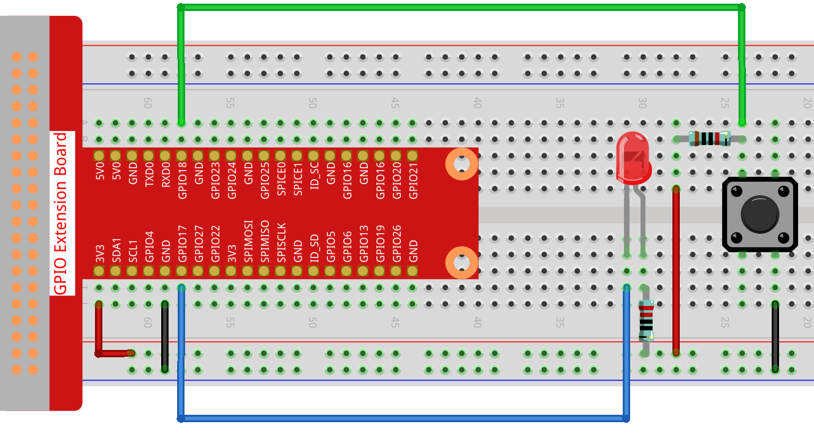
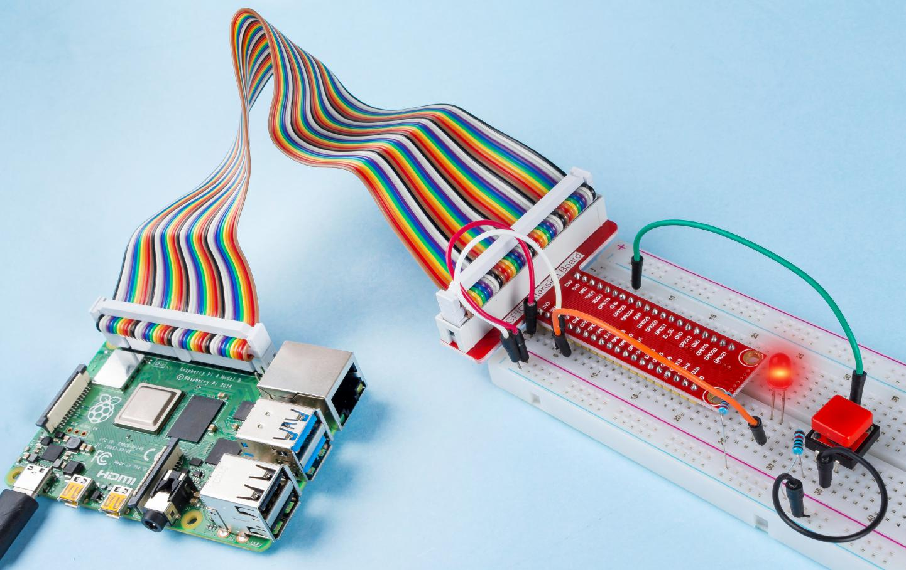

.. note::

    こんにちは、SunFounder Raspberry Pi & Arduino & ESP32 Enthusiasts Community on Facebookへようこそ！Raspberry Pi、Arduino、ESP32を愛好する仲間たちと一緒に、これらの技術を深く探求しましょう。

    **参加する理由**

    - **専門家のサポート**: コミュニティやチームの助けを借りて、購入後の問題や技術的な課題を解決します。
    - **学びと共有**: スキルを向上させるためのヒントやチュートリアルを交換します。
    - **独占プレビュー**: 新製品の発表やプレビューに早期アクセスできます。
    - **特別割引**: 最新の製品に対する独占割引を楽しめます。
    - **フェスティブプロモーションとギブアウェイ**: ギブアウェイやフェスティブプロモーションに参加できます。

    👉 私たちと一緒に探索と創造を始める準備はできましたか？[|link_sf_facebook|]をクリックして、今日参加しましょう！

2.1.1 ボタン
================

イントロダクション
------------------

このプロジェクトでは、ボタンを使ってLEDをオンまたはオフにする方法を学びます。

コンポーネント
-----------------

.. image:: ../img/list_2.1.1_Button.png

回路図
---------------------

通常開ボタンをRaspberry Piの入力として使用します。接続は以下の回路図に示されています。ボタンが押されると、GPIO18は低レベル（0V）になります。プログラムを通じてGPIO18の状態を検出できます。つまり、GPIO18が低レベルになるとボタンが押されたことを意味します。ボタンが押されたときに対応するコードを実行すると、LEDが点灯します。

.. note::
    LEDの長いピンがアノードで、短いピンがカソードです。

実験手順
---------------------------

**ステップ1**: 回路を構築します。

**ステップ2**: コードのフォルダに移動します。

.. raw:: html

   <run></run>

.. code-block:: 

    cd ~/davinci-kit-for-raspberry-pi/nodejs/

**ステップ3**: コードを実行します。

.. raw:: html

   <run></run>

.. code-block:: 

    sudo node button.js

これで、ボタンを押すとLEDが点灯し、ボタンを離すとLEDが消灯します。

**コード**

.. code-block:: js

    const Gpio = require('pigpio').Gpio; 

    
    const led = new Gpio(17, {mode: Gpio.OUTPUT});
   
    const button = new Gpio(18, {
      mode: Gpio.INPUT,
      pullUpDown: Gpio.PUD_DOWN,     
      edge: Gpio.EITHER_EDGE        
    });

    
    button.on('interrupt', (level) => {  
      led.digitalWrite(level);          
    });

**コードの説明**

.. code-block:: js

    const Gpio = require('pigpio').Gpio;    

    const led = new Gpio(17, {mode: Gpio.OUTPUT});

pigpioモジュールをインポートし、ledオブジェクトを作成してIOポートGpio17を制御し、出力モードに設定します。

.. code-block:: js

    const button = new Gpio(18, {
      mode: Gpio.INPUT,
      pullUpDown: Gpio.PUD_DOWN,     
      edge: Gpio.EITHER_EDGE       
    });

ボタンオブジェクトを作成してIOポートGpio18を制御し、入力モードに設定します。プルダウン（ボタンが押されていないときは低レベル、押されているときは高レベル）。割り込み関数を設定し、モードをEITHER_EDGEに設定します。これは、立ち上がりエッジと立ち下がりエッジの両方で割り込み関数がトリガーされることを意味します。

.. code-block:: js

    button.on('interrupt', (level) => {  
      led.digitalWrite(level);          
    });

割り込み関数を記述します。ボタンが押されると、立ち下がりエッジとなり、割り込み関数がトリガーされます。この時、ボタンのIOポートの低レベルがledのIOポートに書き込まれ、ledが点灯します。

ボタンが放されると、立ち上がりエッジとなり、割り込み関数がトリガーされます。この時、ボタンのIOポートの高レベルがledのIOポートに書き込まれ、ledが消灯します。     

現象の写真
^^^^^^^^^^^^^^^^^^

