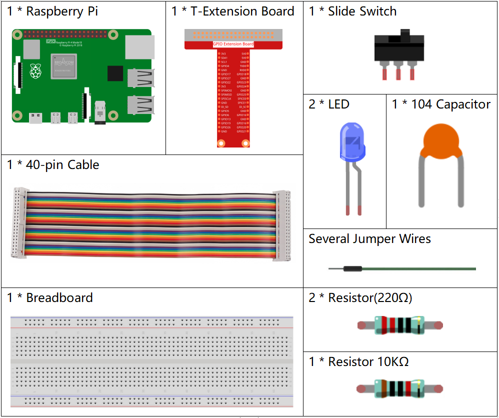
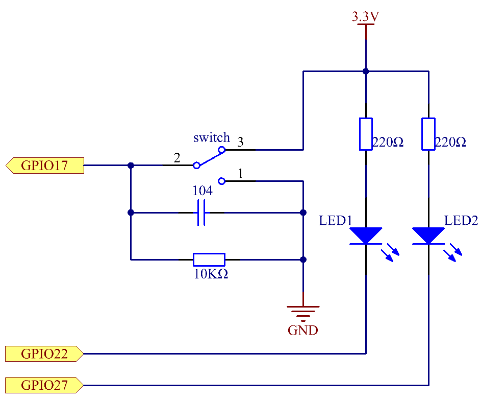
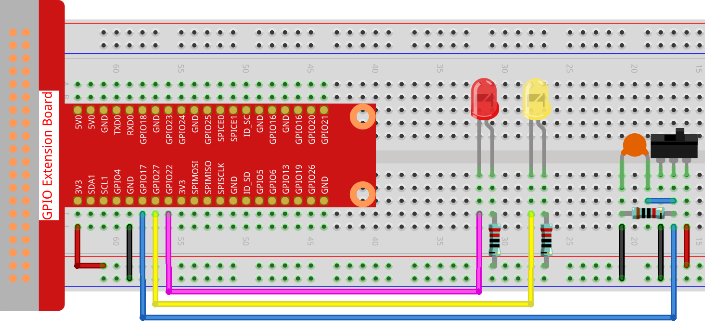

.. note::

    こんにちは、SunFounder Raspberry Pi & Arduino & ESP32 Enthusiasts Community on Facebookへようこそ！Raspberry Pi、Arduino、ESP32を愛好する仲間たちと一緒に、これらの技術を深く探求しましょう。

    **参加する理由**

    - **専門家のサポート**: コミュニティやチームの助けを借りて、購入後の問題や技術的な課題を解決します。
    - **学びと共有**: スキルを向上させるためのヒントやチュートリアルを交換します。
    - **独占プレビュー**: 新製品の発表やプレビューに早期アクセスできます。
    - **特別割引**: 最新の製品に対する独占割引を楽しめます。
    - **フェスティブプロモーションとギブアウェイ**: ギブアウェイやフェスティブプロモーションに参加できます。

    👉 私たちと一緒に探索と創造を始める準備はできましたか？[|link_sf_facebook|]をクリックして、今日参加しましょう！

2.1.2 スライドスイッチ
======================

イントロダクション
-------------------

このプロジェクトでは、スライドスイッチの使い方を学びます。通常、スライドスイッチは電源スイッチとしてPCBにハンダ付けされますが、ここではブレッドボードに挿入して使用するため、固定されない場合があります。その機能を示すためにブレッドボードで使用します。

コンポーネント
-----------------

回路図
-----------------

スライドスイッチの中央ピンをGPIO17に、2つのLEDをそれぞれGPIO22とGPIO27に接続します。スライドスイッチを操作すると、2つのLEDが交互に点灯するのがわかります。

.. image:: ../img/image305.png

実験手順
-----------------------

**ステップ1:** 回路を構築します。

**ステップ2:** コードのフォルダに移動します。

.. raw:: html

   <run></run>

.. code-block::

    cd ~/davinci-kit-for-raspberry-pi/nodejs/

**ステップ3:** コードを実行します。

.. raw:: html

   <run></run>

.. code-block::

    sudo node slide_switch.js

コードが実行されると、スイッチを左にすると黄色のLEDが点灯し、右にすると赤のLEDが点灯します。

**コード**

.. code-block:: js

    const Gpio = require('pigpio').Gpio; 

    const led1 = new Gpio(22, {mode: Gpio.OUTPUT});
    const led2 = new Gpio(27, {mode: Gpio.OUTPUT});

    const slideSwitch = new Gpio(17, {
        mode: Gpio.INPUT,
        pullUpDown: Gpio.PUD_DOWN,     
        edge: Gpio.EITHER_EDGE        
    });

    slideSwitch.on('interrupt', (level) => {  
        led1.digitalWrite(level);   
        led2.digitalWrite(!level);       
    });

**コードの説明**

.. code-block:: js

    const Gpio = require('pigpio').Gpio; 

    const led1 = new Gpio(22, {mode: Gpio.OUTPUT});
    const led2 = new Gpio(27, {mode: Gpio.OUTPUT});

    const slideSwitch = new Gpio(17, {
        mode: Gpio.INPUT,
        pullUpDown: Gpio.PUD_DOWN,     
        edge: Gpio.EITHER_EDGE        
    });

pigpioモジュールをインポートし、3つのオブジェクトled1、led2、slideSwitchを作成します。そして、slideSwitchのIOポートのレベルを読み取って、led1とled2のオンとオフを制御します。   

.. code-block:: js

    slideSwitch.on('interrupt', (level) => {  
        led1.digitalWrite(level);   
        led2.digitalWrite(!level);       
    });

slideSwitchのIOポートの読み取りレベルが変化すると、led1に同じレベルを書き込み、led2には逆のレベルを書き込みます。

現象の写真
------------------

.. image:: ../img/image162.jpeg

