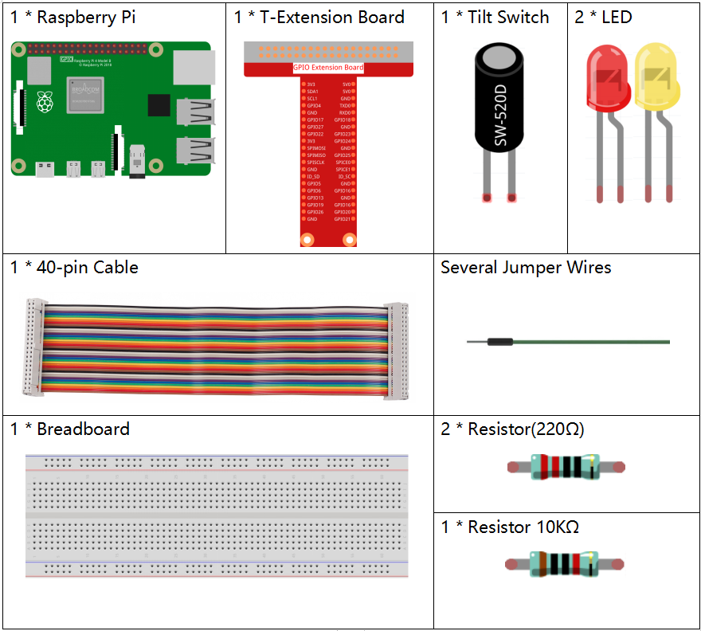

.. note::

    ¡Hola! Bienvenido a la Comunidad de Entusiastas de SunFounder para Raspberry Pi, Arduino y ESP32 en Facebook. Sumérgete en el fascinante mundo de Raspberry Pi, Arduino y ESP32 junto a otros entusiastas.

    **¿Por qué unirte?**

    - **Soporte Experto**: Resuelve problemas postventa y desafíos técnicos con la ayuda de nuestra comunidad y equipo.
    - **Aprende y Comparte**: Intercambia consejos y tutoriales para mejorar tus habilidades.
    - **Avances Exclusivos**: Obtén acceso anticipado a nuevos anuncios de productos y adelantos exclusivos.
    - **Descuentos Especiales**: Disfruta de descuentos exclusivos en nuestros productos más recientes.
    - **Promociones Festivas y Sorteos**: Participa en sorteos y promociones especiales de temporada.

     👉 ¿Listo para explorar y crear con nosotros? Haz clic en [|link_sf_facebook|] y únete hoy mismo.

2.1.3Interruptor de Inclinación
=======================================

Introducción
---------------

Este es un interruptor de inclinación con una bola metálica en su interior. Se utiliza para detectar inclinaciones de ángulos pequeños.

Componentes
--------------

Diagrama del Circuito
-------------------------

.. image:: ../img/image307.png

.. image:: ../img/image308.png

Procedimientos Experimentales
--------------------------------

**Paso 1:** Construye el circuito.

.. image:: ../img/image169.png

**Paso 2:** Dirígete a la carpeta del código.

.. raw:: html

   <run></run>

.. code-block:: 

    cd ~/davinci-kit-for-raspberry-pi/nodejs/

**Paso 3:** Ejecuta el código.

.. raw:: html

   <run></run>

.. code-block:: 

    sudo node tilt_switch.js

Coloca el interruptor de inclinación verticalmente, y el LED 
verde se encenderá. Si lo inclinas, el LED rojo se encenderá. 
Colócalo nuevamente en posición vertical, y el LED verde se encenderá.

**Código**

.. raw:: html

    <run></run>

.. code-block:: js

    const Gpio = require('pigpio').Gpio;

    const led1 = new Gpio(22, { mode: Gpio.OUTPUT });
    const led2 = new Gpio(27, { mode: Gpio.OUTPUT });

    const tilt = new Gpio(17, {
        mode: Gpio.INPUT,
        pullUpDown: Gpio.PUD_DOWN,     
        edge: Gpio.EITHER_EDGE        
    });

    tilt.on('interrupt', (level) => {  
        if (level) {
            console.log("Horizontally");
        }
        else {
            console.log("Vertically");
        }
        led1.digitalWrite(level);
        led2.digitalWrite(!level);    
    });

**Explicación del Código**

.. code-block:: js

    const Gpio = require('pigpio').Gpio;

    const led1 = new Gpio(22, { mode: Gpio.OUTPUT });
    const led2 = new Gpio(27, { mode: Gpio.OUTPUT });

    const tilt = new Gpio(17, {
        mode: Gpio.INPUT,
        pullUpDown: Gpio.PUD_DOWN,     
        edge: Gpio.EITHER_EDGE        
    }); 

Importa el módulo pigpio y crea tres objetos: led1, led2 y tilt, 
para controlar el encendido y apagado de los LED led1 y led2 leyendo el nivel del puerto IO de tilt.

.. code-block:: js

    const tilt = new Gpio(17, {
        mode: Gpio.INPUT,
        pullUpDown: Gpio.PUD_DOWN,     
        edge: Gpio.EITHER_EDGE       
    });

Crea un objeto tilt para controlar el puerto IO Gpio17, configúralo en modo de entrada con resistencia pull-down (nivel bajo inicial).
Establece la función de interrupción con modo EITHER_EDGE, es decir, los bordes de subida y bajada activarán la función de interrupción.

.. code-block:: js

    tilt.on('interrupt', (level) => {  
        if (level) {
            console.log("Horizontally");
        }
        else {
            console.log("Vertically");
        }
        led1.digitalWrite(level);
        led2.digitalWrite(!level);    
    });

Cuando se activa la interrupción, se escribe el mismo nivel en led1 y el nivel opuesto en led2. 
Cuando el puerto IO de tilt está en alto, el terminal imprime "Horizontal";
Cuando el puerto IO de tilt está en bajo, el terminal imprime "Vertical".

Imagen del Fenómeno
-----------------------

.. image:: ../img/image170.jpeg
