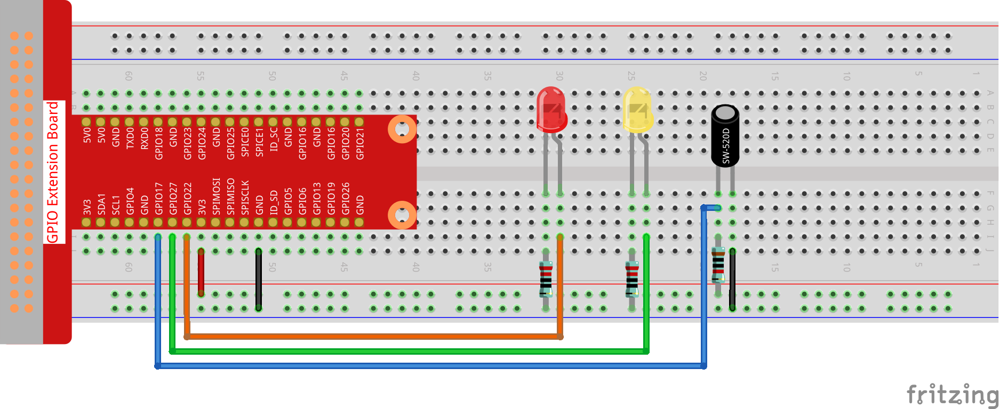
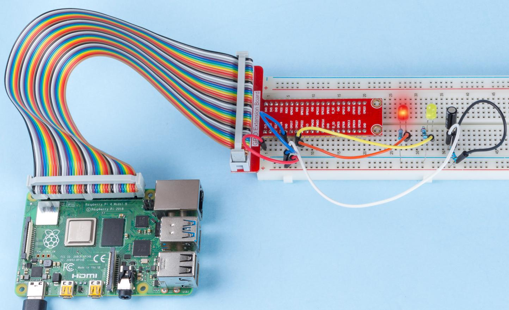

.. note::

    Ciao, benvenuto nella SunFounder Raspberry Pi & Arduino & ESP32 Enthusiasts Community su Facebook! Approfondisci Raspberry Pi, Arduino ed ESP32 con altri appassionati.

    **Perché Unirsi?**

    - **Supporto Esperto**: Risolvi problemi post-vendita e sfide tecniche con l'aiuto della nostra comunità e del nostro team.
    - **Impara & Condividi**: Scambia consigli e tutorial per migliorare le tue competenze.
    - **Anteprime Esclusive**: Ottieni accesso anticipato agli annunci dei nuovi prodotti.
    - **Sconti Speciali**: Godi di sconti esclusivi sui nostri prodotti più recenti.
    - **Promozioni Festive e Omaggi**: Partecipa a omaggi e promozioni speciali per le festività.

    👉 Pronto a esplorare e creare con noi? Clicca su [|link_sf_facebook|] e unisciti oggi stesso!

2.1.3 Interruttore a Inclinazione
=======================================

Introduzione
---------------

Questo è un interruttore a inclinazione a sfera con una sfera di metallo 
all'interno. Viene utilizzato per rilevare inclinazioni di un piccolo angolo.

Componenti
-----------

.. image:: ../img/list_2.1.3_tilt_switch.png

Schema a Blocchi
------------------

.. image:: ../img/image307.png
.. image:: ../img/image308.png

Procedure Sperimentali
-----------------------

**Passo 1:** Costruisci il circuito.

**Passo 2:** Vai alla cartella del codice.

.. raw:: html

   <run></run>

.. code-block:: 

    cd ~/davinci-kit-for-raspberry-pi/nodejs/

**Passo 3:** Esegui il codice.

.. raw:: html

   <run></run>

.. code-block:: 

    sudo node tilt_switch.js

Posiziona l'interruttore verticalmente e il LED verde si accenderà. 
Se lo inclini, il LED rosso si accenderà. 
Rimettendolo in posizione verticale, il LED verde si riaccenderà.

**Codice**

.. raw:: html

    <run></run>

.. code-block:: js

    const Gpio = require('pigpio').Gpio;

    const led1 = new Gpio(22, { mode: Gpio.OUTPUT });
    const led2 = new Gpio(27, { mode: Gpio.OUTPUT });

    const tilt = new Gpio(17, {
        mode: Gpio.INPUT,
        pullUpDown: Gpio.PUD_DOWN,     
        edge: Gpio.EITHER_EDGE        
    });

    tilt.on('interrupt', (level) => {  
        if (level) {
            console.log("Horizontally");
        }
        else {
            console.log("Vertically");
        }
        led1.digitalWrite(level);
        led2.digitalWrite(!level);    
    });

**Spiegazione del Codice**

.. code-block:: js

    const Gpio = require('pigpio').Gpio;

    const led1 = new Gpio(22, { mode: Gpio.OUTPUT });
    const led2 = new Gpio(27, { mode: Gpio.OUTPUT });

    const tilt = new Gpio(17, {
        mode: Gpio.INPUT,
        pullUpDown: Gpio.PUD_DOWN,     
        edge: Gpio.EITHER_EDGE        
    }); 

Importa il modulo pigpio e crea tre oggetti: led1, led2, e tilt.
Controlla l'accensione e lo spegnimento di led1 e led2 leggendo 
il livello del pin di tilt.

.. code-block:: js

    const tilt = new Gpio(17, {
        mode: Gpio.INPUT,
        pullUpDown: Gpio.PUD_DOWN,     
        edge: Gpio.EITHER_EDGE       
    });

Crea un oggetto tilt per controllare il pin Gpio17, impostandolo come input con resistenza pull-down (inizialmente a livello basso).
Imposta inoltre una funzione di interrupt che viene attivata su entrambi i fronti (EITHER_EDGE), quindi sia in salita che in discesa.

.. code-block:: js

    tilt.on('interrupt', (level) => {  
        if (level) {
            console.log("Horizontally");
        }
        else {
            console.log("Vertically");
        }
        led1.digitalWrite(level);
        led2.digitalWrite(!level);    
    });

Quando si attiva l'interrupt, il livello letto viene assegnato a led1, mentre a led2 viene assegnato il livello opposto.
Se il livello del pin tilt è alto, il terminale visualizza "Orizzontale";
Se il livello del pin tilt è basso, il terminale visualizza "Verticale".

Immagine del Fenomeno
------------------------

