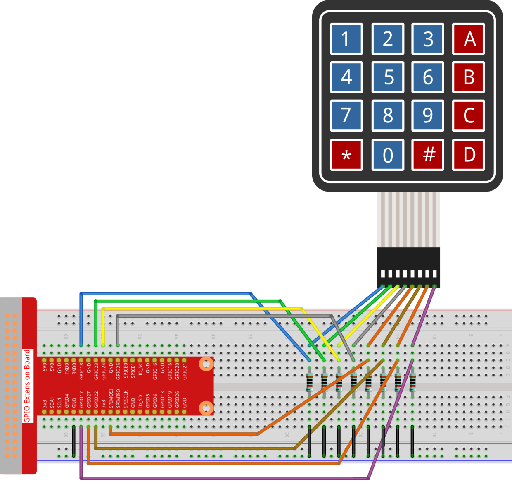

.. note::

    Ciao, benvenuto nella SunFounder Raspberry Pi & Arduino & ESP32 Enthusiasts Community su Facebook! Approfondisci Raspberry Pi, Arduino ed ESP32 con altri appassionati.

    **Perché Unirsi?**

    - **Supporto Esperto**: Risolvi problemi post-vendita e sfide tecniche con l'aiuto della nostra comunità e del nostro team.
    - **Impara & Condividi**: Scambia consigli e tutorial per migliorare le tue competenze.
    - **Anteprime Esclusive**: Ottieni accesso anticipato agli annunci dei nuovi prodotti.
    - **Sconti Speciali**: Godi di sconti esclusivi sui nostri prodotti più recenti.
    - **Promozioni Festive e Omaggi**: Partecipa a omaggi e promozioni speciali per le festività.

    👉 Pronto a esplorare e creare con noi? Clicca su [|link_sf_facebook|] e unisciti oggi stesso!

2.1.5 Tastierino Numerico
============================

Introduzione
---------------

Un tastierino numerico è una matrice rettangolare di pulsanti. 
In questo progetto, lo useremo per inserire caratteri.

Componenti
-------------

.. image:: ../img/list_2.1.5_keypad.png

Schema a Blocchi
------------------

.. image:: ../img/image315.png

.. image:: ../img/image316.png

Procedure Sperimentali
--------------------------

**Passo 1:** Costruisci il circuito.

**Passo 2:** Apri il file del codice.

.. raw:: html

   <run></run>

.. code-block::

    cd ~/davinci-kit-for-raspberry-pi/nodejs/

**Passo 3:** Esegui.

.. raw:: html

   <run></run>

.. code-block:: 

    sudo node keypad.js

Dopo l'esecuzione del codice, i valori dei pulsanti premuti sul tastierino 
(valore del pulsante) verranno stampati sullo schermo.

**Codice**

.. code-block:: js

    const Gpio = require('pigpio').Gpio; 

    var rowsPins = [18,23,24,25];
    var colsPins = [10,6,27,17];
    var keys = ["1","2","3","A",                
                "4","5","6","B",                
                "7","8","9","C",                
                "*","0","#","D"];      

    for(let i=0;i<rowsPins.length;i++){
        rowsPins[i] = new Gpio(rowsPins[i],{mode: Gpio.OUTPUT})
    }
    for(let i=0;i<colsPins.length;i++){
        colsPins[i] = new Gpio(colsPins[i],{
            mode: Gpio.INPUT,
            pullUpDown: Gpio.PUD_DOWN,
            edge: Gpio.RISING_EDGE
        })
    }

    var last_key_pressed = 0;

    var col=-1;
    for(let i=0;i<colsPins.length;i++){
        colsPins[i].on('interrupt',()=>{
            col=i;
            pressed_keys=keys[row*colsPins.length+col];
            if(last_key_pressed!=pressed_keys){
                console.log(`${pressed_keys}`);
            }
            last_key_pressed = pressed_keys;
        });
    }

    var row=-1;
    setInterval(() => {
        row=(row+1)%rowsPins.length;
        for(let i=0;i<rowsPins.length;i++){
            rowsPins[i].digitalWrite(0);
        }
        rowsPins[row].digitalWrite(1);
    }, 10);

**Spiegazione del Codice**

.. code-block:: js

    const Gpio = require('pigpio').Gpio; 

    var rowsPins = [18,23,24,25];
    var colsPins = [10,6,27,17];
    var keys = ["1","2","3","A",                
                "4","5","6","B",                
                "7","8","9","C",                
                "*","0","#","D"];      

    for(let i=0;i<rowsPins.length;i++){
        rowsPins[i] = new Gpio(rowsPins[i],{mode: Gpio.OUTPUT})
    }
    for(let i=0;i<colsPins.length;i++){
        colsPins[i] = new Gpio(colsPins[i],{
            mode: Gpio.INPUT,
            pullUpDown: Gpio.PUD_DOWN,
            edge: Gpio.RISING_EDGE
        })
    }

Dichiara due insiemi di pin e una matrice per il tastierino. Quattro pin 
rappresentano le righe e vengono impostati in modalità OUTPUT; gli altri 
quattro rappresentano le colonne e vengono impostati in modalità INPUT con 
l'interruzione sul fronte di salita.

Il funzionamento è il seguente: i pin delle righe forniscono alternativamente 
un livello alto. Se viene premuto un pulsante, il pin di colonna corrispondente 
rileva il livello alto rilasciato dal pin di riga, attivando così l'interruzione 
sul fronte di salita.

Ad esempio, premendo il pulsante **3**, quando i pin delle righe 2, 3 e 4 
rilasciano il livello alto, non accade nulla; invece, quando il pin di riga 
1 rilascia il livello alto, il pin di colonna 3 rileva il livello alto e 
attiva l'interruzione. In base alla combinazione di riga e colonna, il 
controller principale può identificare il tasto premuto.

.. image:: ../img/image187.png

.. code-block:: js

    var row=-1;
    setInterval(() => {
        row=(row+1)%rowsPins.length;
        for(let i=0;i<rowsPins.length;i++){
            rowsPins[i].digitalWrite(0);
        }
        rowsPins[row].digitalWrite(1);
    }, 10);

I quattro pin di riga ricevono periodicamente un livello alto, e la variabile ``row`` localizza il pin attivo corrente.

.. code-block:: js

    var col=-1;
    for(let i=0;i<colsPins.length;i++){
        colsPins[i].on('interrupt',()=>{
            col=i;
            // pressed_keys=keys[row*colsPins.length+col];
            // if(last_key_pressed!=pressed_keys){
            //     console.log(`${pressed_keys}`);
            // }
            // last_key_pressed = pressed_keys;
        });
    }

Imposta le funzioni di interruzione per i quattro pin di colonna. 
La variabile ``col`` localizza il pin che ha attivato l'interruzione.

.. code-block:: js

    pressed_keys=keys[row*colsPins.length+col];
    if(last_key_pressed!=pressed_keys){
        console.log(`${pressed_keys}`);
    }
    last_key_pressed = pressed_keys;

Il codice all'interno della funzione di interruzione recupera il valore 
del tasto dalla matrice ``keys`` in base ai valori di ``row`` e ``col`` 
e stampa il valore ogni volta che un tasto viene premuto.

Immagine del Fenomeno
-------------------------

.. image:: ../img/image188.jpeg

