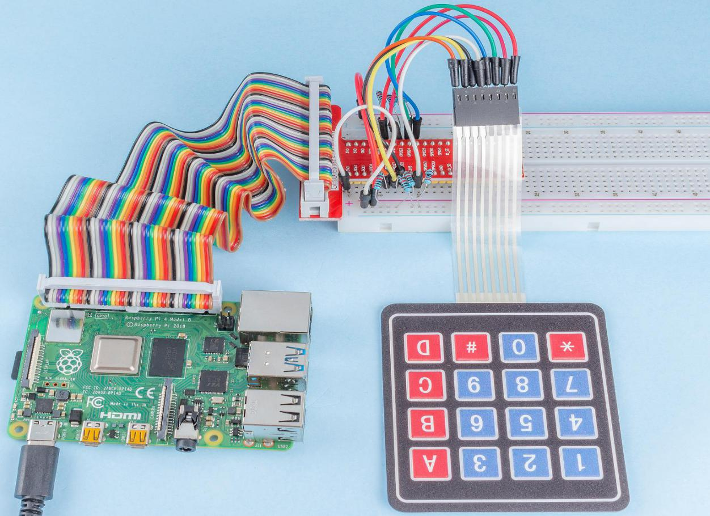

.. note::

    こんにちは、SunFounder Raspberry Pi & Arduino & ESP32 Enthusiasts Community on Facebookへようこそ！Raspberry Pi、Arduino、ESP32を愛好する仲間たちと一緒に、これらの技術を深く探求しましょう。

    **参加する理由**

    - **専門家のサポート**: コミュニティやチームの助けを借りて、購入後の問題や技術的な課題を解決します。
    - **学びと共有**: スキルを向上させるためのヒントやチュートリアルを交換します。
    - **独占プレビュー**: 新製品の発表やプレビューに早期アクセスできます。
    - **特別割引**: 最新の製品に対する独占割引を楽しめます。
    - **フェスティブプロモーションとギブアウェイ**: ギブアウェイやフェスティブプロモーションに参加できます。

    👉 私たちと一緒に探索と創造を始める準備はできましたか？[|link_sf_facebook|]をクリックして、今日参加しましょう！

2.1.5 キーパッド
===================

イントロダクション
-----------------

キーパッドはボタンの長方形配列です。このプロジェクトでは、文字を入力するためにキーパッドを使用します。

コンポーネント
-----------------

.. image:: ../img/list_2.1.5_keypad.png

回路図
-----------------

.. image:: ../img/image315.png

.. image:: ../img/image316.png

実験手順
-----------------------

**ステップ1:** 回路を構築します。

.. image:: ../img/image186.png

**ステップ2:** コードファイルを開きます。

.. raw:: html

   <run></run>

.. code-block:: 

    cd ~/davinci-kit-for-raspberry-pi/nodejs/

**ステップ3:** 実行します。

.. raw:: html

   <run></run>

.. code-block:: 

    sudo node keypad.js

コードが実行された後、キーパッドで押されたボタンの値（button Value）が画面に表示されます。

**コード**

.. code-block:: js

    const Gpio = require('pigpio').Gpio; 

    var rowsPins = [18,23,24,25];
    var colsPins = [10,6,27,17];
    var keys = ["1","2","3","A",            "4","5","6","B",            "7","8","9","C",            "*","0","#","D"];      

    for(let i=0;i<rowsPins.length;i++){
        rowsPins[i] = new Gpio(rowsPins[i],{mode: Gpio.OUTPUT})
    }
    for(let i=0;i<colsPins.length;i++){
        colsPins[i] = new Gpio(colsPins[i],{
            mode: Gpio.INPUT,
            pullUpDown: Gpio.PUD_DOWN,
            edge: Gpio.RISING_EDGE
        })
    }

    var last_key_pressed = 0;

    var col=-1;
    for(let i=0;i<colsPins.length;i++){
        colsPins[i].on('interrupt',()=>{
            col=i;
            pressed_keys=keys[row*colsPins.length+col];
            if(last_key_pressed!=pressed_keys){
                console.log(`${pressed_keys}`);
            }
            last_key_pressed = pressed_keys;
        });
    }

    var row=-1;
    setInterval(() => {
        row=(row+1)%rowsPins.length;
        for(let i=0;i<rowsPins.length;i++){
            rowsPins[i].digitalWrite(0);
        }
        rowsPins[row].digitalWrite(1);
    }, 10);

**コードの説明**

.. code-block:: js

    const Gpio = require('pigpio').Gpio; 

    var rowsPins = [18,23,24,25];
    var colsPins = [10,6,27,17];
    var keys = ["1","2","3","A",            "4","5","6","B",            "7","8","9","C",            "*","0","#","D"];      

    for(let i=0;i<rowsPins.length;i++){
        rowsPins[i] = new Gpio(rowsPins[i],{mode: Gpio.OUTPUT})
    }
    for(let i=0;i<colsPins.length;i++){
        colsPins[i] = new Gpio(colsPins[i],{
            mode: Gpio.INPUT,
            pullUpDown: Gpio.PUD_DOWN,
            edge: Gpio.RISING_EDGE
        })
    }

キーパッドのスタイルで、2セットのピンとマトリックスを宣言します。

ピンのうち4本はキーパッドの行であり、これらのピンを出力モードに設定します。
他の4本のピンはキーパッドの列であり、これらのピンを入力モードに設定し、上昇エッジ割り込みを設定します。

メインコントローラがキー値を取得できる原理は次のとおりです。
4つの行ピンが順に高レベルを提供すると、ボタンが押された場合、
対応する列ピンが行ピンによってリリースされた高レベルを取得し、上昇エッジ割り込みをトリガーします。

例えば、 **3** ボタンを押した場合、2番目、3番目、および4番目の行ピンが高レベルをリリースしても効果はありません。
1番目の行ピンが高レベルをリリースすると、3番目の列ピンが高レベルを取得し、上昇エッジ割り込みをトリガーします。この時、1番目、2番目、および4番目の列ピンはイベントをトリガーしません。

次に、高レベルをリリースする1番目の行ピンと高レベルを取得する3番目の列ピンに従って、メインコントローラは押されたボタンの位置が（1,3）、つまりボタン **3** であることを知ることができます。

.. image:: ../img/image187.png

.. code-block:: js

    var row=-1;
    setInterval(() => {
        row=(row+1)%rowsPins.length;
        for(let i=0;i<rowsPins.length;i++){
            rowsPins[i].digitalWrite(0);
        }
        rowsPins[row].digitalWrite(1);
    }, 10);

4つの行ピンには定期的に高レベルが供給され、変数 ``row`` を使用して現在動作している行ピンを特定します。

.. code-block:: js

    var col=-1;
    for(let i=0;i<colsPins.length;i++){
        colsPins[i].on('interrupt',()=>{
            col=i;
            // pressed_keys=keys[row*colsPins.length+col];
            // if(last_key_pressed!=pressed_keys){
            //     console.log(`${pressed_keys}`);
            // }
            // last_key_pressed = pressed_keys;
        });
    }

4つの列ピンに対して割り込み関数を設定し、変数 ``col`` を使用して上昇エッジ割り込みイベントをトリガーする列ピンを特定します。

.. code-block:: js

    pressed_keys=keys[row*colsPins.length+col];
    if(last_key_pressed!=pressed_keys){
        console.log(`${pressed_keys}`);
    }
    last_key_pressed = pressed_keys;

割り込み関数内には、 ``row`` と ``col`` に従って ``keys`` マトリックスから特定のキー値を取得するコードも含まれています。
新しいキー値が取得されるたびに、その値を表示します。

現象の写真
------------------

