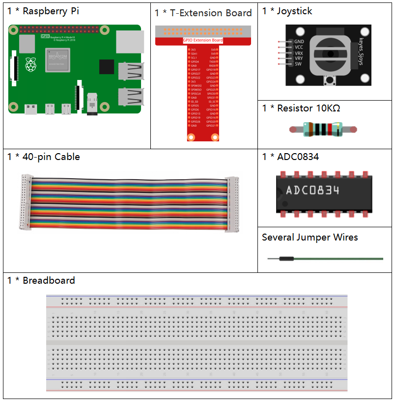
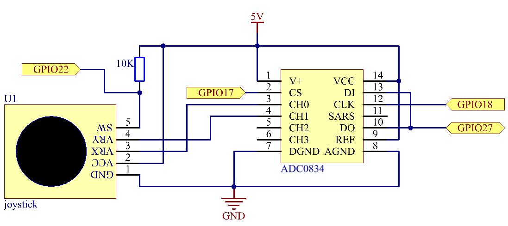
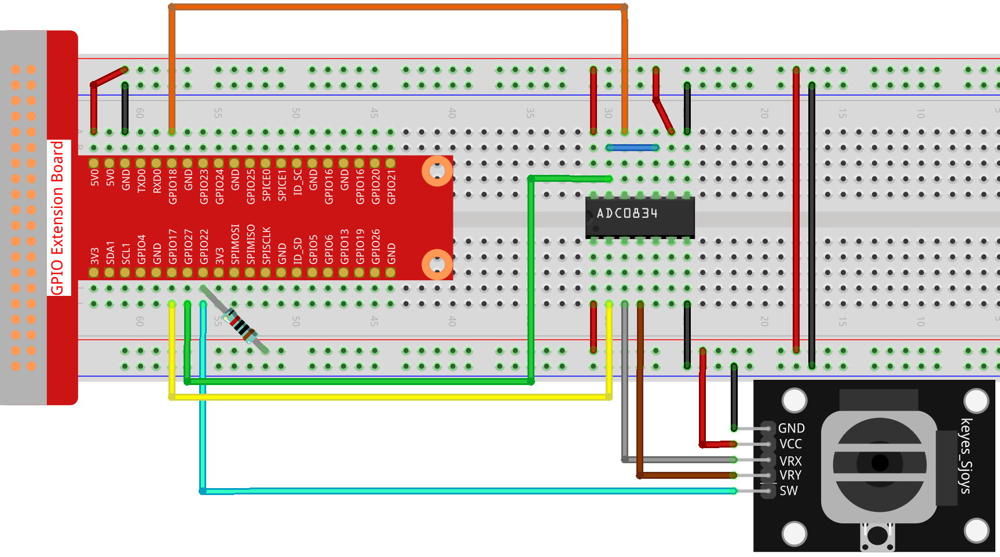
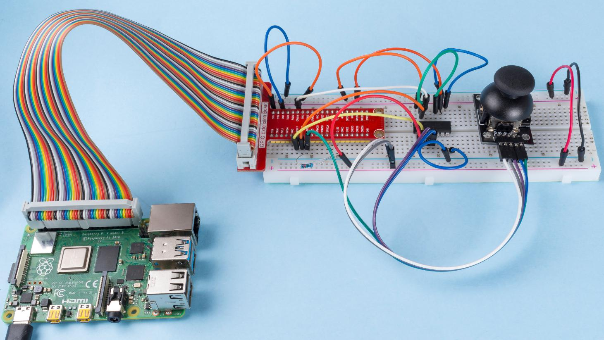

.. note::

    こんにちは、SunFounder Raspberry Pi & Arduino & ESP32 Enthusiasts Community on Facebookへようこそ！Raspberry Pi、Arduino、ESP32を愛好する仲間たちと一緒に、これらの技術を深く探求しましょう。

    **参加する理由**

    - **専門家のサポート**: コミュニティやチームの助けを借りて、購入後の問題や技術的な課題を解決します。
    - **学びと共有**: スキルを向上させるためのヒントやチュートリアルを交換します。
    - **独占プレビュー**: 新製品の発表やプレビューに早期アクセスできます。
    - **特別割引**: 最新の製品に対する独占割引を楽しめます。
    - **フェスティブプロモーションとギブアウェイ**: ギブアウェイやフェスティブプロモーションに参加できます。

    👉 私たちと一緒に探索と創造を始める準備はできましたか？[|link_sf_facebook|]をクリックして、今日参加しましょう！

2.1.6 ジョイスティック
=======================

イントロダクション
-------------------

このプロジェクトでは、ジョイスティックの動作を学びます。ジョイスティックを操作し、その結果を画面に表示します。

コンポーネント
---------------

回路図
-------------------

ジョイスティックのデータを読み取る際、軸によっていくつかの違いがあります。X軸とY軸のデータはアナログであり、ADC0834を使用してアナログ値をデジタル値に変換する必要があります。Z軸のデータはデジタルなので、GPIOを直接使用して読み取ることができますが、ADCを使用して読み取ることもできます。

.. image:: ../img/image319.png

実験手順
-----------------------

**ステップ1:** 回路を構築します。

**ステップ2:** コードのフォルダに移動します。

.. raw:: html

   <run></run>

.. code-block::

    cd ~/davinci-kit-for-raspberry-pi/nodejs/

**ステップ3:** コードを実行します。

.. raw:: html

   <run></run>

.. code-block::

    sudo node joystick.js

コードが実行されたら、ジョイスティックを動かして、対応するx、y、Btnの値が画面に表示されることを確認します。

**コード**

.. code-block:: js

    const Gpio = require('pigpio').Gpio;
    const ADC0834 = require('./adc0834.js').ADC0834;

    const adc = new ADC0834(17, 18, 22);
    const btn = new Gpio(25, {
        mode: Gpio.INPUT,
        pullUpDown: Gpio.PUD_UP,
    });

    setInterval(async() => {

        x_val = await adc.read(0);
        y_val = await adc.read(1);

        btn_val = btn.digitalRead();
        console.log(`x = ${x_val}, y = ${y_val}, btn = ${btn_val}\n`);
    }, 100);

**コードの説明**

.. code-block:: js

    const ADC0834 = require('./adc0834.js').ADC0834;

adc0834モジュールを使用するために ``ADC0834`` コンストラクタをインポートします。

.. code-block:: js

    setInterval(async() => {

        x_val = await adc.read(0);
        y_val = await adc.read(1);

        btn_val = btn.digitalRead();
        console.log(`x = ${x_val}, y = ${y_val}, btn = ${btn_val}\n`);
    }, 100);

ADC0834の複数のチャネルの値を同時に読み取る場合、非同期プログラミングが必要です。
ここではpromise関数を作成し、
async関数のawait命令を使用して、この複雑な非同期タスクをエレガントに記述します。

* `Promise <https://developer.mozilla.org/en-US/docs/Web/JavaScript/Reference/Global_Objects/Promise>`_
* `Async Function <https://developer.mozilla.org/en-US/docs/Web/JavaScript/Reference/Statements/async_function>`_

現象の写真
------------------

