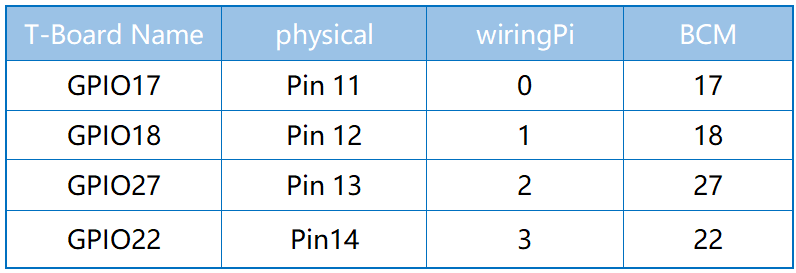
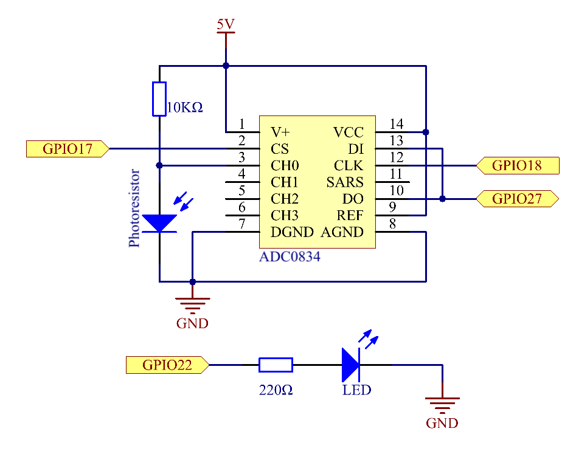
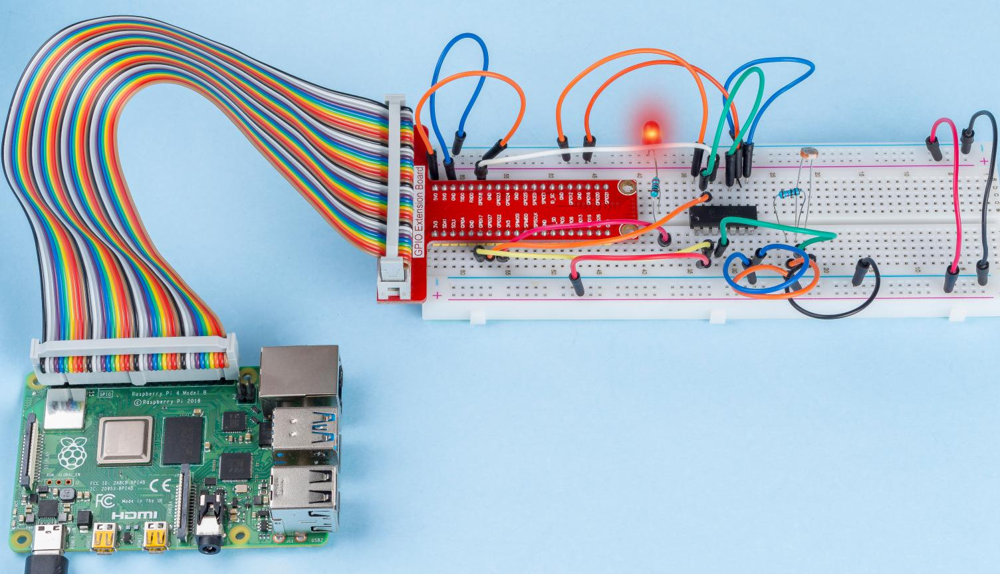

.. note::

    Hallo, willkommen in der SunFounder Raspberry Pi & Arduino & ESP32 Enthusiasten-Community auf Facebook! Tauchen Sie tiefer in Raspberry Pi, Arduino und ESP32 mit anderen Enthusiasten ein.

    **Warum beitreten?**

    - **Expertenunterstützung**: Lösen Sie nach dem Kauf auftretende Probleme und technische Herausforderungen mit Hilfe unserer Community und unseres Teams.
    - **Lernen & Teilen**: Tauschen Sie Tipps und Tutorials aus, um Ihre Fähigkeiten zu verbessern.
    - **Exklusive Vorschauen**: Erhalten Sie frühzeitigen Zugang zu neuen Produktankündigungen und Vorschauen.
    - **Spezielle Rabatte**: Genießen Sie exklusive Rabatte auf unsere neuesten Produkte.
    - **Festliche Aktionen und Gewinnspiele**: Nehmen Sie an Gewinnspielen und festlichen Aktionen teil.

    👉 Bereit, mit uns zu entdecken und zu kreieren? Klicken Sie auf [|link_sf_facebook|] und treten Sie noch heute bei!

2.2.1 Fotowiderstand
=========================

Einführung
------------

Der Fotowiderstand ist ein häufig verwendetes Bauteil zur Erkennung der Umgebungslichtintensität im Alltag. Er hilft dem Controller, Tag und Nacht zu erkennen und Lichtsteuerungsfunktionen wie Nachtlampen zu realisieren. Dieses Projekt ist dem Potentiometer sehr ähnlich, und man könnte denken, dass es die Spannung ändert, um Licht zu erkennen.

Komponenten
-----------------

.. image:: ../img/list_2.2.1_photoresistor.png

Schaltplan
-----------------

Experimentelle Vorgehensweise
-----------------------------------------

**Schritt 1:** Bauen Sie die Schaltung auf.

.. image:: ../img/image198.png

**Schritt 2:** Gehen Sie zum Ordner des Codes.

.. raw:: html

   <run></run>

.. code-block:: 

    cd ~/davinci-kit-for-raspberry-pi/nodejs/

**Schritt 3:** Führen Sie den Code aus.

.. raw:: html

   <run></run>

.. code-block:: 

    sudo node photoresistor.js

Wenn der Code läuft, ändert sich die Helligkeit der LED entsprechend der vom Fotowiderstand erfassten Lichtintensität.

**Code**

.. code-block:: js

    const Gpio = require('pigpio').Gpio;
    const ADC0834 = require('./adc0834.js').ADC0834;

    exports.ADC0834 = ADC0834;

    const adc = new ADC0834(17, 18, 27);

    const led = new Gpio(22, {mode: Gpio.OUTPUT});

    setInterval(() => {
      adc.read(0).then((value) => {
        console.log(value);
        led.pwmWrite(value);
      }, (error)=>{
        console.log("Error: " + error);
      });
    }, 100);

**Code Erklärung**

Der Code hier ist derselbe wie in 2.1.4 Potentiometer. Bitte überprüfen Sie die Code-Erklärung unter :ref:`2.1.4 Potentiometer` für Details.

Phänomenbild
------------------

