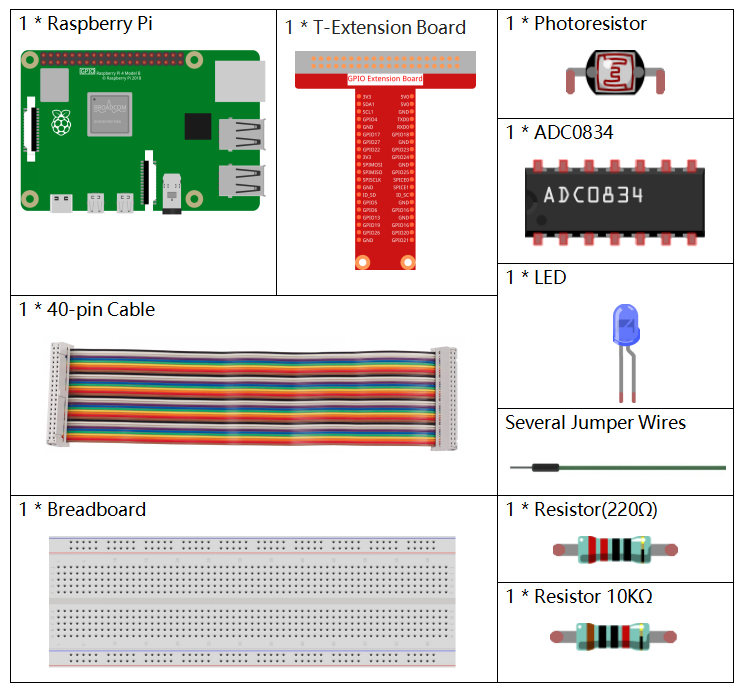

.. note::

    ¡Hola! Bienvenido a la Comunidad de Entusiastas de SunFounder para Raspberry Pi, Arduino y ESP32 en Facebook. Sumérgete en el fascinante mundo de Raspberry Pi, Arduino y ESP32 junto a otros entusiastas.

    **¿Por qué unirte?**

    - **Soporte Experto**: Resuelve problemas postventa y desafíos técnicos con la ayuda de nuestra comunidad y equipo.
    - **Aprende y Comparte**: Intercambia consejos y tutoriales para mejorar tus habilidades.
    - **Avances Exclusivos**: Obtén acceso anticipado a nuevos anuncios de productos y adelantos exclusivos.
    - **Descuentos Especiales**: Disfruta de descuentos exclusivos en nuestros productos más recientes.
    - **Promociones Festivas y Sorteos**: Participa en sorteos y promociones especiales de temporada.

     👉 ¿Listo para explorar y crear con nosotros? Haz clic en [|link_sf_facebook|] y únete hoy mismo.

2.2.1 Fotoresistor
======================

Introducción
---------------

El fotoresistor es un componente comúnmente utilizado para medir la intensidad 
de la luz ambiental. Ayuda al controlador a distinguir entre día y noche, 
permitiendo realizar funciones de control de luz, como las lámparas nocturnas. 
Este proyecto es muy similar al de un potenciómetro, ya que en lugar de cambiar 
el voltaje, se utiliza para detectar la luz.

Componentes
--------------

Diagrama del Circuito
-------------------------

.. image:: ../img/image321.png

.. image:: ../img/image322.png

Procedimientos Experimentales
---------------------------------

**Paso 1:** Construye el circuito.

.. image:: ../img/image198.png

**Paso 2:** Dirígete a la carpeta del código.

.. raw:: html

   <run></run>

.. code-block:: 

    cd ~/davinci-kit-for-raspberry-pi/nodejs/

**Paso 3:** Ejecuta el código.

.. raw:: html

   <run></run>

.. code-block:: 

    sudo node photoresistor.js

Cuando el código esté en ejecución, la intensidad de la luz detectada por 
el fotoresistor hará que la luminosidad del LED cambie en consecuencia.

**Código**

.. code-block:: js

    const Gpio = require('pigpio').Gpio;
    const ADC0834 = require('./adc0834.js').ADC0834;

    exports.ADC0834 = ADC0834;

    const adc = new ADC0834(17, 18, 27);

    const led = new Gpio(22, {mode: Gpio.OUTPUT});

    setInterval(() => {
      adc.read(0).then((value) => {
        console.log(value);
        led.pwmWrite(value);
      }, (error)=>{
        console.log("Error: " + error);
      });
    }, 100);

**Explicación del Código**

El código aquí es el mismo que en la sección 2.1.4 Potenciómetro. Por favor, consulta la explicación del código en :ref:`2.1.4 Potenciómetro` para obtener más detalles.

Imagen del Fenómeno
----------------------

.. image:: ../img/image199.jpeg
