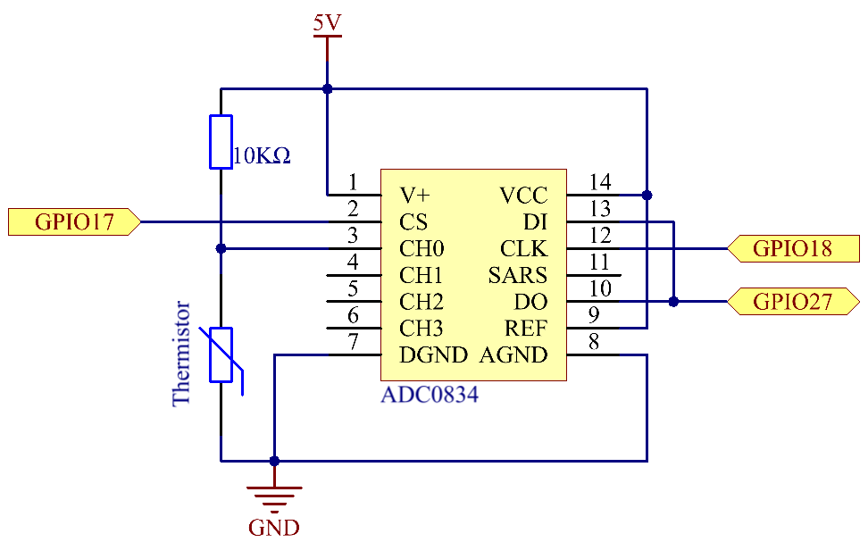
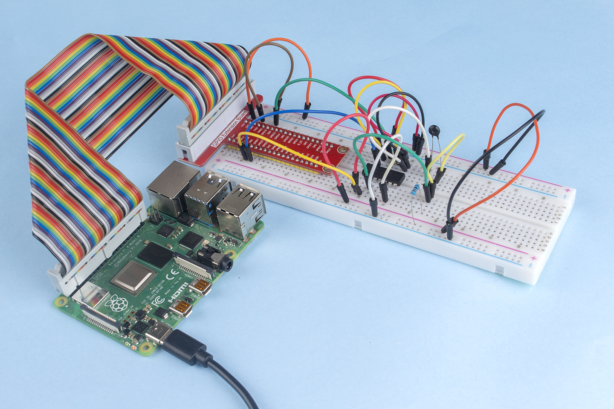

.. note::

    Ciao, benvenuto nella SunFounder Raspberry Pi & Arduino & ESP32 Enthusiasts Community su Facebook! Approfondisci Raspberry Pi, Arduino ed ESP32 con altri appassionati.

    **Perché Unirsi?**

    - **Supporto Esperto**: Risolvi problemi post-vendita e sfide tecniche con l'aiuto della nostra comunità e del nostro team.
    - **Impara & Condividi**: Scambia consigli e tutorial per migliorare le tue competenze.
    - **Anteprime Esclusive**: Ottieni accesso anticipato agli annunci dei nuovi prodotti.
    - **Sconti Speciali**: Godi di sconti esclusivi sui nostri prodotti più recenti.
    - **Promozioni Festive e Omaggi**: Partecipa a omaggi e promozioni speciali per le festività.

    👉 Pronto a esplorare e creare con noi? Clicca su [|link_sf_facebook|] e unisciti oggi stesso!

2.2.2 Termistore
==================

Introduzione
--------------

Come la fotoresistenza è sensibile alla luce, il termistore è un dispositivo 
elettronico sensibile alla temperatura che può essere utilizzato per funzioni 
di controllo della temperatura, come un allarme di calore.

Componenti
-------------

.. image:: ../img/list_2.2.2_thermistor.png

Schema a Blocchi
-------------------

.. image:: ../img/image323.png

Procedure Sperimentali
-------------------------

**Passo 1:** Costruisci il circuito.

.. image:: ../img/image202.png

**Passo 2:** Vai alla cartella del codice.

.. raw:: html

   <run></run>

.. code-block:: 

    cd ~/davinci-kit-for-raspberry-pi/nodejs/

**Passo 3:** Esegui il codice.

.. raw:: html

   <run></run>

.. code-block:: 

    sudo node thermistor.js

Quando il codice viene eseguito, il termistore rileva la temperatura 
ambientale, che verrà stampata a schermo una volta completato il calcolo 
del programma.

**Codice**

.. code-block:: js

    const Gpio = require('pigpio').Gpio;
    const ADC0834 = require('./adc0834.js').ADC0834;

    exports.ADC0834 = ADC0834;

    const adc = new ADC0834(17, 18, 27);

    setInterval(() => {
      adc.read(0).then((value) => {
        var Vr = 5 * value / 255;
        var Rt = 10000 * Vr / (5 - Vr);
        var temp = 1 / ((Math.log(Rt/10000) / 3950)+(1 / (273.15 + 25)));
        var cel = (temp - 273.15).toFixed(2);
        var Fah = (cel * 1.8 + 32).toFixed(2);
        console.log(`Celsius: ${cel} C  Fahrenheit: ${Fah} F\n`);
      }, (error)=>{
        console.log("Error: " + error);
      });
    }, 1000);

**Spiegazione del Codice**

.. code-block:: js

    setInterval(() => {
      adc.read(0).then((value) => {
        var Vr = 5 * value / 255;
        var Rt = 10000 * Vr / (5 - Vr);
        var temp = 1 / ((Math.log(Rt/10000) / 3950)+(1 / (273.15 + 25)));
        var cel = (temp - 273.15).toFixed(2);
        var Fah = (cel * 1.8 + 32).toFixed(2);
        console.log(`Celsius: ${cel} C  Fahrenheit: ${Fah} F\n`);
      }, (error)=>{
        console.log("Error: " + error);
      });
    }, 1000);

Leggiamo il valore del termistore con la dichiarazione ``adc.read(0).then((value) => {...})``.
.. code-block:: js

    var Vr = 5 * value / 255;
    var Rt = 10000 * Vr / (5 - Vr);
    var temp = 1 / ((Math.log(Rt/10000) / 3950)+(1 / (273.15 + 25)));
    var cel = (temp - 273.15).toFixed(2);
    var Fah = (cel * 1.8 + 32).toFixed(2);
    console.log(`Celsius: ${cel} C  Fahrenheit: ${Fah} F\n`);

Queste operazioni convertono il valore del termistore in una temperatura espressa in gradi Celsius.

.. code-block:: js

    var Vr = 5 * value / 255;
    var Rt = 10000 * Vr / (5 - Vr);

Queste due righe di codice calcolano la distribuzione della tensione dai valori letti, ottenendo Rt (resistenza del termistore).

.. code-block:: js

    var temp = 1 / ((Math.log(Rt/10000) / 3950)+(1 / (273.15 + 25)));  

Questa riga di codice calcola la temperatura in Kelvin sostituendo Rt nella formula **TK=1/(ln(RT/RN)/B+1/TN)**.

.. code-block:: js

    var cel = (temp - 273.15).toFixed(2);

Questo passaggio converte la temperatura Kelvin in gradi Celsius con due decimali.

.. code-block:: js

    var Fah = (cel * 1.8 + 32).toFixed(2);

Questo passaggio converte i gradi Celsius in Fahrenheit con due decimali.

.. code-block:: js

    console.log(`Celsius: ${cel} C  Fahrenheit: ${Fah} F\n`);

Stampa su terminale la temperatura in gradi Celsius, Fahrenheit e le rispettive unità.

Immagine del Fenomeno
-------------------------

