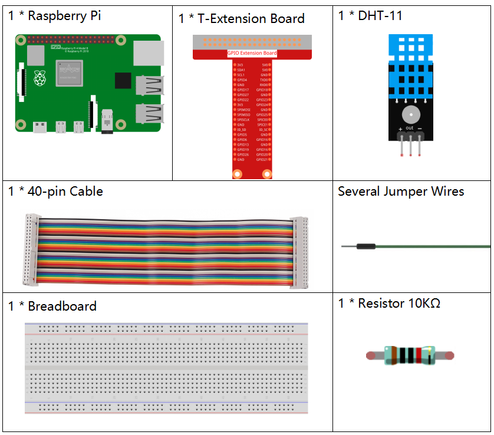
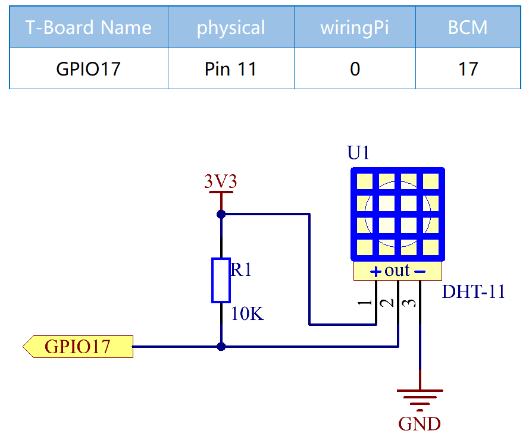
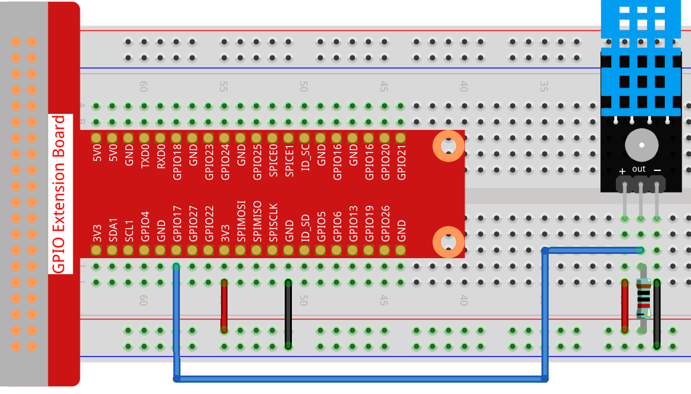
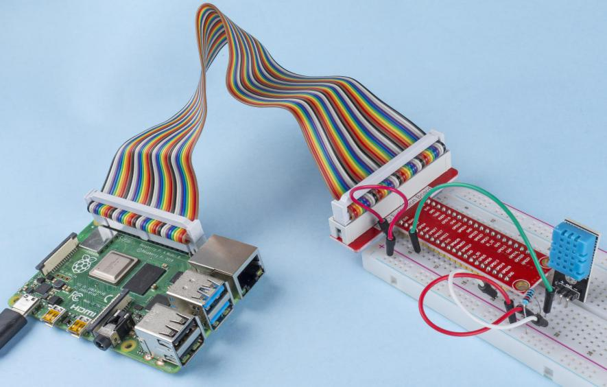

2.2.3 DHT-11
============

Introduction
--------------

The digital temperature and humidity sensor DHT11 is a composite sensor
that contains a calibrated digital signal output of temperature and
humidity. The technology of a dedicated digital modules collection and
the technology of the temperature and humidity sensing are applied to
ensure that the product has high reliability and excellent stability.

The sensors include a wet element resistive sensor and a NTC temperature
sensor and they are connected to a high performance 8-bit
microcontroller.

Components
----------

Schematic Diagram
-----------------

Experimental Procedures
-----------------------

**Step 1:** Build the circuit.

**Step 2:** Go to the folder of the code.

.. raw:: html

   <run></run>

.. code-block::

    cd ~/davinci-kit-for-raspberry-pi/nodejs/

**Step 3:** Install dependencies.

.. raw:: html

   <run></run>

.. code-block:: 

    sudo npm install node-dht-sensor

**Step 4:** Run the code.

.. raw:: html

   <run></run>

.. code-block::

    sudo node dht11.js

After the code runs, the program will print the temperature and humidity
detected by DHT11 on the computer screen.

**Code**

.. code-block:: js

    var sensor = require("node-dht-sensor");

    setInterval(function(){ 
      sensor.read(11, 17, function(err, temperature, humidity) {
        if (!err) {
          console.log(`temp: ${temperature}\`C, humidity: ${humidity}%`);
        }
      });
    },1000);

**Code Explanation**

.. code-block:: js

    var sensor = require("node-dht-sensor");

Import the module ``node-dht-sensor`` module, which provides functions for us to read the value of DHT-11.

.. note::
  For more details, please refer to: https://www.npmjs.com/package/node-dht-sensor

.. code-block:: js

    sensor.read(11, 17, function(err, temperature, humidity){...})

The ``node-dht-sensor`` module provides the ``read()`` function for us to read the measured temperature and humidity, 
where **11** means DHT-11, **17** means and its connected to GPIO17.

.. code-block:: js

    if (!err) {
      console.log(`temp: ${temperature}\`C, humidity: ${humidity}%`);
    }    

When there is no error in the reading, the temperature and humidity values are printed on the terminal.

Phenomenon Picture
------------------

    