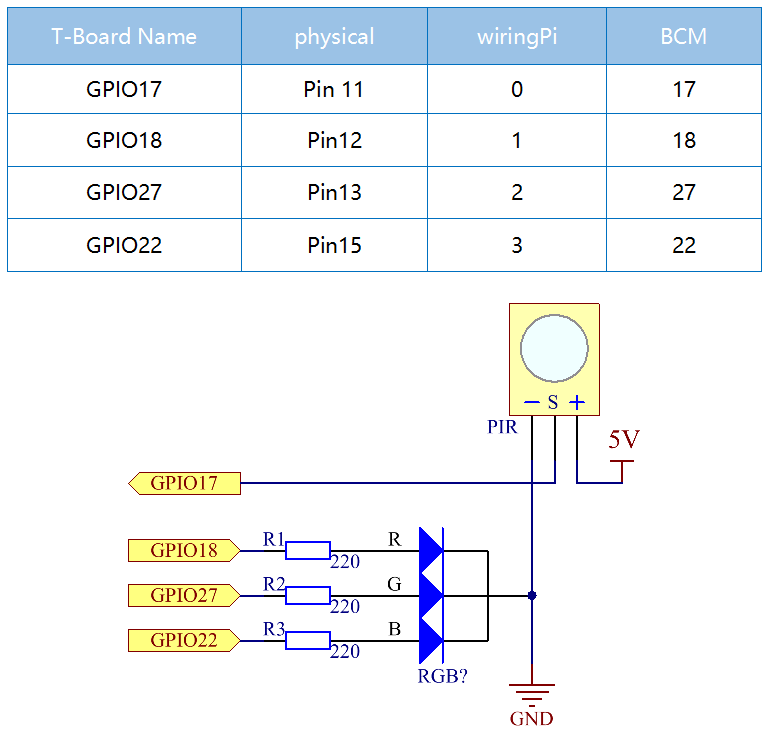
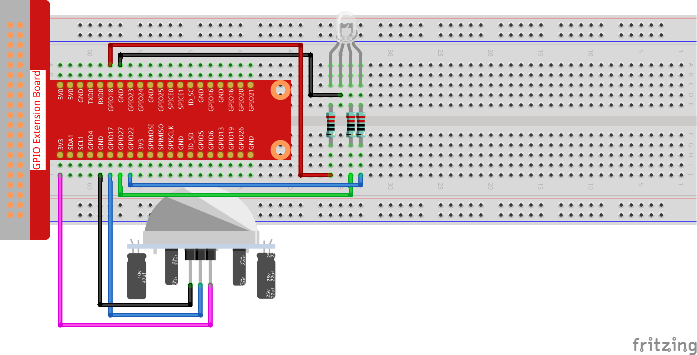
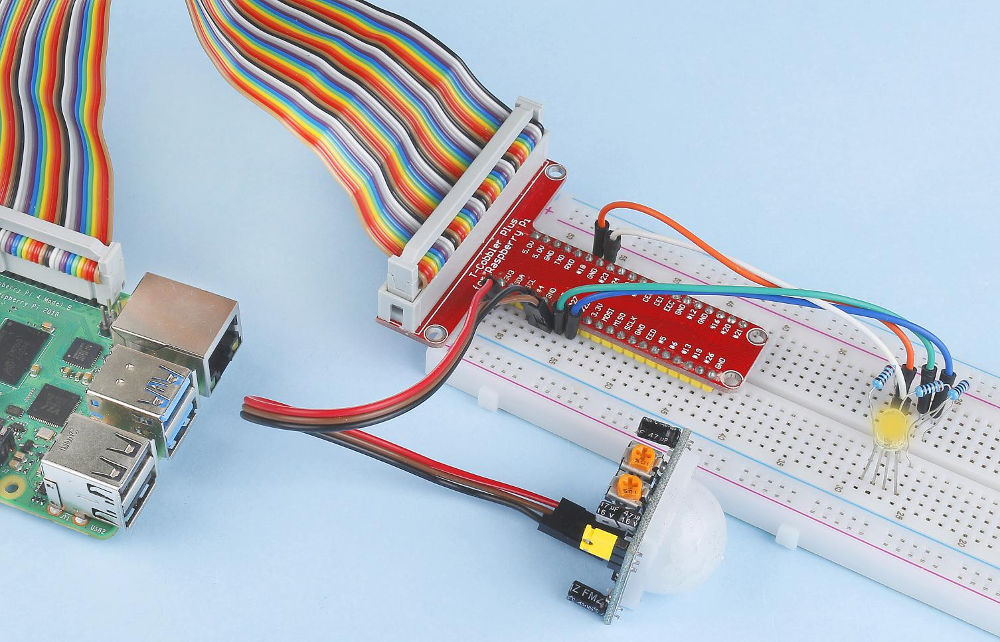

2.2.4 PIR
=========

Introduction
------------

In this project, we will make a device by using the human body infrared
pyroelectric sensors. When someone gets closer to the LED, the LED will
turn on automatically. If not, the light will turn off. This infrared
motion sensor is a kind of sensor that can detect the infrared emitted
by human and animals.

Components
----------

.. image:: ../media/list_2.2.4_pir2.png

* :ref:`GPIO Extension Board`
* :ref:`Breadboard`
* :ref:`Resistor`
* :ref:`RGB LED`
* :ref:`PIR Motion Sensor Module`

Schematic Diagram
-----------------

Experimental Procedures
-----------------------

**Step 1:** Build the circuit.

**Step 2:** Go to the folder of the code.

.. raw:: html

   <run></run>

.. code-block::

    cd /home/pi/davinci-kit-for-raspberry-pi/nodejs/

**Step 3:** Run the code.

.. raw:: html

   <run></run>

.. code-block::

    sudo node pir.js

After the code runs, PIR detects surroundings and let RGB LED glow
yellow if it senses someone walking by. There are two potentiometers on
the PIR module: one is to adjust sensitivity and the other is to adjust
the detection distance. In order to make the PIR module work better, you
need to try to adjust these two potentiometers.

**Code**

.. code-block:: js

    const Gpio = require('pigpio').Gpio;

    const pirPin = new Gpio(17, {
        mode: Gpio.INPUT,
        pullUpDown: Gpio.PUD_DOWN,
        edge: Gpio.EITHER_EDGE
    })    // the pir connect to pin17

    const redPin = new Gpio(18, { mode: Gpio.OUTPUT, })
    const greenPin = new Gpio(27, { mode: Gpio.OUTPUT, })
    const bluePin = new Gpio(22, { mode: Gpio.OUTPUT, })
    //'Red':18, 'Green':27, 'Blue':22

    var p_R, p_G, p_B

    // Set all led as pwm channel and frequece to 2KHz
    p_R = redPin.pwmFrequency(2000)
    p_G = greenPin.pwmFrequency(2000)
    p_B = bluePin.pwmFrequency(2000)

    // Set all begin with value 0
    p_R.pwmWrite(0)
    p_G.pwmWrite(0)
    p_B.pwmWrite(0)

    // Define a MAP function for mapping values.  Like from 0~255 to 0~100
    function MAP(x, in_min, in_max, out_min, out_max) {
        return (x - in_min) * (out_max - out_min) / (in_max - in_min) + out_min
    }

    // Define a function to set up colors
    function setColor(color) {
        // configures the three LEDs' luminance with the inputted color value .
        // Devide colors from 'color' veriable
        R_val = (color & 0xFF0000) >> 16
        G_val = (color & 0x00FF00) >> 8
        B_val = (color & 0x0000FF) >> 0
        // Map color value from 0~255 to 0~100
        R_val = MAP(R_val, 0, 255, 0, 100)
        G_val = MAP(G_val, 0, 255, 0, 100)
        B_val = MAP(B_val, 0, 255, 0, 100)

        //Assign the mapped duty cycle value to the corresponding PWM channel to change the luminance.
        p_R.pwmWrite(R_val)
        p_G.pwmWrite(G_val)
        p_B.pwmWrite(B_val)
        //print ("color_msg: R_val = %s, G_val = %s, B_val = %s"%(R_val, G_val, B_val))
    }

    pirPin.on('interrupt', (level) => {
        if (level) {
            setColor(0xFFFF00)
        }else{
            setColor(0x0000FF)
        }
    });

    process.on('SIGINT', function () {
        p_R.pwmWrite(0)
        p_G.pwmWrite(0)
        p_B.pwmWrite(0)
        process.exit();
    })

**Code Explanation**

The code for this example is a combination of :ref:`2.1.1 Button` and :ref:`1.1.2 RGB LED`, no need to go into details.

Phenomenon Picture
------------------

    