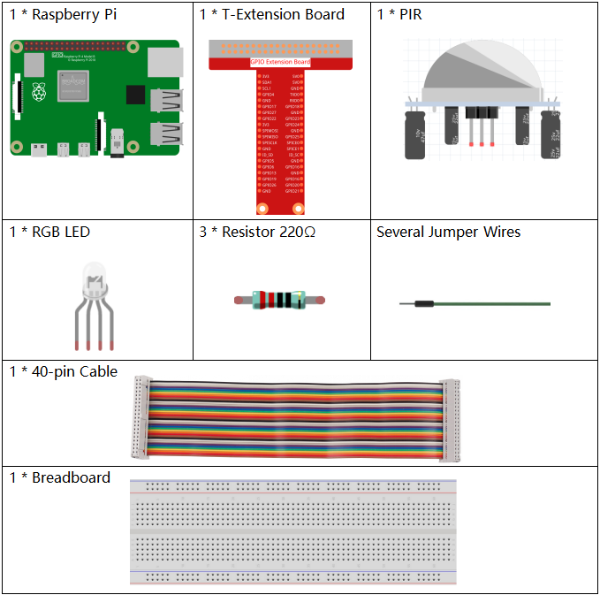
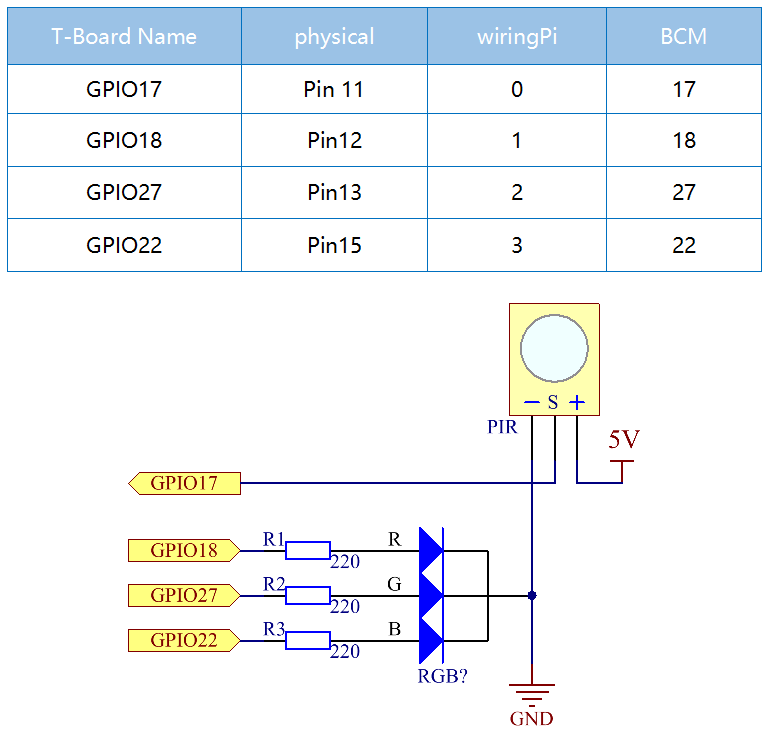
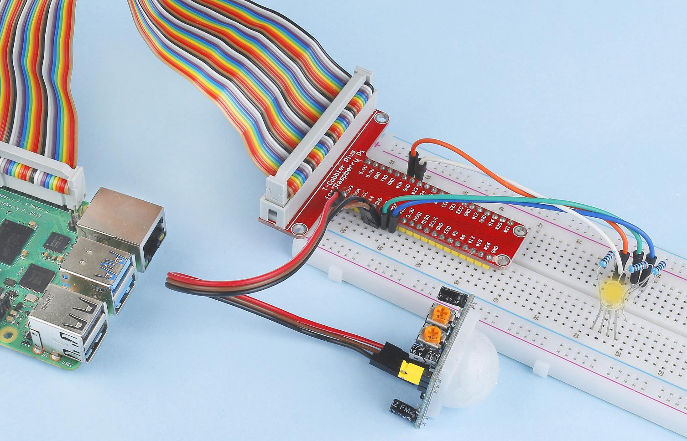

.. note::

    Bonjour et bienvenue dans la communauté SunFounder Raspberry Pi, Arduino et ESP32 sur Facebook ! Plongez plus profondément dans l'univers du Raspberry Pi, Arduino et ESP32 avec d'autres passionnés.

    **Pourquoi nous rejoindre ?**

    - **Support d'experts** : Résolvez les problèmes post-achat et les défis techniques avec l'aide de notre communauté et de notre équipe.
    - **Apprendre & Partager** : Échangez des conseils et des tutoriels pour améliorer vos compétences.
    - **Aperçus exclusifs** : Bénéficiez d'un accès anticipé aux annonces de nouveaux produits et aux avant-premières.
    - **Réductions spéciales** : Profitez de remises exclusives sur nos derniers produits.
    - **Promotions festives et cadeaux** : Participez à des concours et promotions spéciales.

    👉 Prêt à explorer et créer avec nous ? Cliquez sur [|link_sf_facebook|] et rejoignez-nous dès aujourd'hui !

2.2.4 PIR
=========

Introduction
---------------

Dans ce projet, nous allons créer un dispositif en utilisant des capteurs 
infrarouges pyroelectriques détectant le corps humain. Lorsque quelqu'un 
s'approche de la LED, celle-ci s'allume automatiquement. Sinon, la lumière 
s'éteint. Ce capteur de mouvement infrarouge est capable de détecter les 
infrarouges émis par les humains et les animaux.

Composants
-------------

Schéma de câblage
--------------------

Procédures expérimentales
----------------------------

**Étape 1 :** Montez le circuit.

.. image:: ../img/image214.png

**Étape 2 :** Accédez au répertoire du code.

.. raw:: html

   <run></run>

.. code-block::

    cd ~/davinci-kit-for-raspberry-pi/nodejs/

**Étape 3 :** Exécutez le code.

.. raw:: html

   <run></run>

.. code-block::

    sudo node pir.js

Une fois le programme lancé, le capteur PIR détecte les alentours et allume 
la LED RGB en jaune s'il détecte une présence à proximité. Le module PIR est 
équipé de deux potentiomètres : l'un pour ajuster la sensibilité et l'autre 
pour régler la distance de détection. Pour améliorer les performances du module 
PIR, ajustez ces deux potentiomètres selon vos besoins.

**Code**

.. code-block:: js

    const Gpio = require('pigpio').Gpio;

    const pirPin = new Gpio(17, {
        mode: Gpio.INPUT,
        pullUpDown: Gpio.PUD_DOWN,
        edge: Gpio.EITHER_EDGE
    })    // the pir connect to pin17

    const redPin = new Gpio(18, { mode: Gpio.OUTPUT, })
    const greenPin = new Gpio(27, { mode: Gpio.OUTPUT, })
    const bluePin = new Gpio(22, { mode: Gpio.OUTPUT, })
    //'Red':18, 'Green':27, 'Blue':22

    var p_R, p_G, p_B

    // Set all led as pwm channel and frequece to 2KHz
    p_R = redPin.pwmFrequency(2000)
    p_G = greenPin.pwmFrequency(2000)
    p_B = bluePin.pwmFrequency(2000)

    // Set all begin with value 0
    p_R.pwmWrite(0)
    p_G.pwmWrite(0)
    p_B.pwmWrite(0)

    // Define a MAP function for mapping values.  Like from 0~255 to 0~100
    function MAP(x, in_min, in_max, out_min, out_max) {
        return (x - in_min) * (out_max - out_min) / (in_max - in_min) + out_min
    }

    // Define a function to set up colors
    function setColor(color) {
        // configures the three LEDs' luminance with the inputted color value .
        // Devide colors from 'color' veriable
        R_val = (color & 0xFF0000) >> 16
        G_val = (color & 0x00FF00) >> 8
        B_val = (color & 0x0000FF) >> 0
        // Map color value from 0~255 to 0~100
        R_val = MAP(R_val, 0, 255, 0, 100)
        G_val = MAP(G_val, 0, 255, 0, 100)
        B_val = MAP(B_val, 0, 255, 0, 100)

        //Assign the mapped duty cycle value to the corresponding PWM channel to change the luminance.
        p_R.pwmWrite(R_val)
        p_G.pwmWrite(G_val)
        p_B.pwmWrite(B_val)
        //print ("color_msg: R_val = %s, G_val = %s, B_val = %s"%(R_val, G_val, B_val))
    }

    pirPin.on('interrupt', (level) => {
        if (level) {
            setColor(0xFFFF00)
        }else{
            setColor(0x0000FF)
        }
    });

    process.on('SIGINT', function () {
        p_R.pwmWrite(0)
        p_G.pwmWrite(0)
        p_B.pwmWrite(0)
        process.exit();
    })

**Explication du code**

Le code de cet exemple combine des concepts des sections :ref:`2.1.1 Button` et :ref:`1.1.2 RGB LED`, donc il n'est pas nécessaire de rentrer dans les détails.

Image du phénomène
-----------------------

