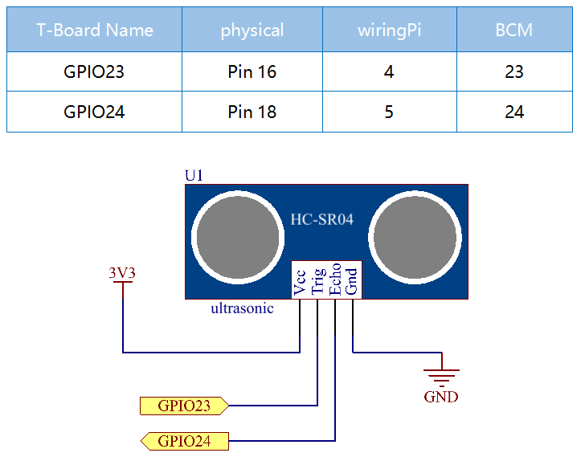

.. note::

    Ciao, benvenuto nella SunFounder Raspberry Pi & Arduino & ESP32 Enthusiasts Community su Facebook! Unisciti a noi per esplorare a fondo Raspberry Pi, Arduino e ESP32 insieme ad altri appassionati.

    **Perché unirsi a noi?**

    - **Supporto esperto**: Risolvi problematiche post-vendita e sfide tecniche con l'aiuto della nostra community e del nostro team.
    - **Impara e condividi**: Scambia suggerimenti e tutorial per migliorare le tue competenze.
    - **Anteprime esclusive**: Accedi in anticipo agli annunci di nuovi prodotti e contenuti in anteprima.
    - **Sconti speciali**: Approfitta di sconti esclusivi sui nostri prodotti più recenti.
    - **Promozioni festive e omaggi**: Partecipa a omaggi e promozioni per le festività.

    👉 Pronto a esplorare e creare con noi? Clicca su [|link_sf_facebook|] e unisciti oggi stesso!

2.2.5 Modulo Sensore a Ultrasuoni
===================================

Introduzione
---------------

Il sensore a ultrasuoni utilizza onde ultrasoniche per rilevare con 
precisione oggetti e misurare distanze. Emette onde ultrasoniche e 
le converte in segnali elettronici.

Componenti
-------------

.. image:: ../img/list_2.2.5.png

Schema Elettrico
--------------------

Procedura Sperimentale
--------------------------

**Passo 1:** Monta il circuito.

.. image:: ../img/image220.png

**Passo 2:** Vai alla cartella del codice.

.. raw:: html

   <run></run>

.. code-block::

    cd ~/davinci-kit-for-raspberry-pi/nodejs/

**Passo 3:** Esegui il codice.

.. raw:: html

   <run></run>

.. code-block::

    sudo node ultrasonic_sensor.js

Con l'esecuzione del codice, il modulo sensore a ultrasuoni rileva la 
distanza tra l'ostacolo di fronte e il modulo stesso, e il valore della 
distanza verrà stampato sullo schermo.

**Codice**

.. code-block:: js

    const Gpio = require('pigpio').Gpio;

    // Numero di microsecondi che il suono impiega per percorrere 1 cm a 20 gradi Celsius
    const MICROSECDONDS_PER_CM = 1e6/34321;

    const trigger = new Gpio(23, {mode: Gpio.OUTPUT});
    const echo = new Gpio(24, {mode: Gpio.INPUT, alert: true});

    trigger.digitalWrite(0); // Assicura che il trigger sia basso

    const watchHCSR04 = () => {
      let startTick;

      echo.on('alert', (level, tick) => {
        if (level === 1) {
          startTick = tick;
        } else {
          const endTick = tick;
          const diff = (endTick >> 0) - (startTick >> 0); // Unsigned 32 bit arithmetic
          console.log(diff / 2 / MICROSECDONDS_PER_CM);
        }
      });
    };

    watchHCSR04();

    // Esegui una misurazione della distanza una volta al secondo
    setInterval(() => {
      trigger.trigger(10, 1); // Imposta il trigger su alto per 10 microsecondi
    }, 1000);

**Spiegazione del Codice**

La funzione ``trigger`` può essere usata per generare un impulso su un 
GPIO e ``alerts`` può determinare il momento in cui cambia lo stato di un 
GPIO con una precisione di alcuni microsecondi.

Queste due caratteristiche possono essere combinate per misurare la distanza 
utilizzando un sensore a ultrasuoni HC-SR04.

.. code-block:: js

    setInterval(() => {
      trigger.trigger(10, 1); // Imposta il trigger su alto per 10 microsecondi
    }, 1000);

Questa funzione invia periodicamente un impulso ultrasonico di 10 microsecondi.

.. code-block:: js

  const watchHCSR04 = () => {

    echo.on('alert', (level, tick) => {
        if (level === 1) {
          startTick = tick;
        } else {
          const endTick = tick;
          const diff = (endTick >> 0) - (startTick >> 0); // Aritmetica non firmata a 32 bit
          console.log(diff / 2 / MICROSECDONDS_PER_CM);
        }    
    });
  };

Questa funzione imposta un alert che registra il tempo tra l'invio dell'impulso (level è 1) e la ricezione dell'eco (level è 0).
Moltiplicando la differenza di tempo per la velocità del suono (e dividendo per 2), si ottiene la distanza dall'ostacolo.

.. https://github.com/fivdi/pigpio

Immagine del Fenomeno
------------------------

.. image:: ../img/image221.jpeg
