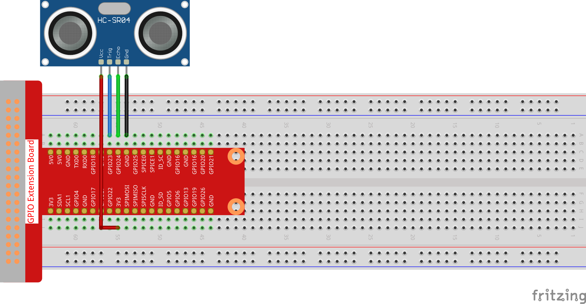

.. note::

    こんにちは、SunFounder Raspberry Pi & Arduino & ESP32 Enthusiasts Community on Facebookへようこそ！Raspberry Pi、Arduino、ESP32を愛好する仲間たちと一緒に、これらの技術を深く探求しましょう。

    **参加する理由**

    - **専門家のサポート**: コミュニティやチームの助けを借りて、購入後の問題や技術的な課題を解決します。
    - **学びと共有**: スキルを向上させるためのヒントやチュートリアルを交換します。
    - **独占プレビュー**: 新製品の発表やプレビューに早期アクセスできます。
    - **特別割引**: 最新の製品に対する独占割引を楽しめます。
    - **フェスティブプロモーションとギブアウェイ**: ギブアウェイやフェスティブプロモーションに参加できます。

    👉 私たちと一緒に探索と創造を始める準備はできましたか？[|link_sf_facebook|]をクリックして、今日参加しましょう！

2.2.5 超音波センサーモジュール
==================================

イントロダクション
------------------

超音波センサーは超音波を使用して正確に物体を検出し、距離を測定します。超音波を発信し、それを電子信号に変換します。

コンポーネント
----------------

.. image:: ../img/list_2.2.5.png

回路図
-----------------

.. image:: ../img/image329.png

実験手順
-----------------------

**ステップ1:** 回路を構築します。

**ステップ2:** コードのフォルダに移動します。

.. raw:: html

   <run></run>

.. code-block::

    cd ~/davinci-kit-for-raspberry-pi/nodejs/

**ステップ3:** コードを実行します。

.. raw:: html

   <run></run>

.. code-block::

    sudo node ultrasonic_sensor.js

コードが実行されると、超音波センサーモジュールが前方の障害物とモジュール自体との間の距離を検出し、その距離が画面に表示されます。

**コード**

.. code-block:: js

    const Gpio = require('pigpio').Gpio;

    // 20度で音が1cm進むのにかかるマイクロ秒数
    const MICROSECDONDS_PER_CM = 1e6/34321;

    const trigger = new Gpio(23, {mode: Gpio.OUTPUT});
    const echo = new Gpio(24, {mode: Gpio.INPUT, alert: true});

    trigger.digitalWrite(0); // トリガーを低にする

    const watchHCSR04 = () => {
      let startTick;

      echo.on('alert', (level, tick) => {
        if (level === 1) {
          startTick = tick;
        } else {
          const endTick = tick;
          const diff = (endTick >> 0) - (startTick >> 0); // 符号なし32ビット算術
          console.log(diff / 2 / MICROSECDONDS_PER_CM);
        }
      });
    };

    watchHCSR04();

    // 1秒ごとに距離測定をトリガー
    setInterval(() => {
      trigger.trigger(10, 1); // トリガーを10マイクロ秒間高にする
    }, 1000);

**コードの説明**

``trigger``関数はGPIOでパルスを生成するために使用でき、 ``alerts`` はGPIOの状態変化の時刻をマイクロ秒単位で測定するために使用できます。

これら2つの機能を組み合わせて、HC-SR04超音波センサーを使用して距離を測定できます。

.. code-block:: js

    setInterval(() => {
      trigger.trigger(10, 1); // トリガーを10マイクロ秒間高にする
    }, 1000);

これは定期的に10マイクロ秒の超音波パルスを送信するためのものです。

.. code-block:: js

  const watchHCSR04 = () => {

    echo.on('alert', (level, tick) => {
        if (level === 1) {
          startTick = tick;
        } else {
          const endTick = tick;
          const diff = (endTick >> 0) - (startTick >> 0); // 符号なし32ビット算術
          console.log(diff / 2 / MICROSECDONDS_PER_CM);
        }    
    });
  };

この関数は、パルスを送信（levelが1）してからエコーを受信（levelが0）するまでの時間を記録するアラートを設定します。
時間差に音速を掛けることで、前方の障害物までの距離を求めることができます。

.. https://github.com/fivdi/pigpio

現象の写真
------------------

.. image:: ../img/image221.jpeg

