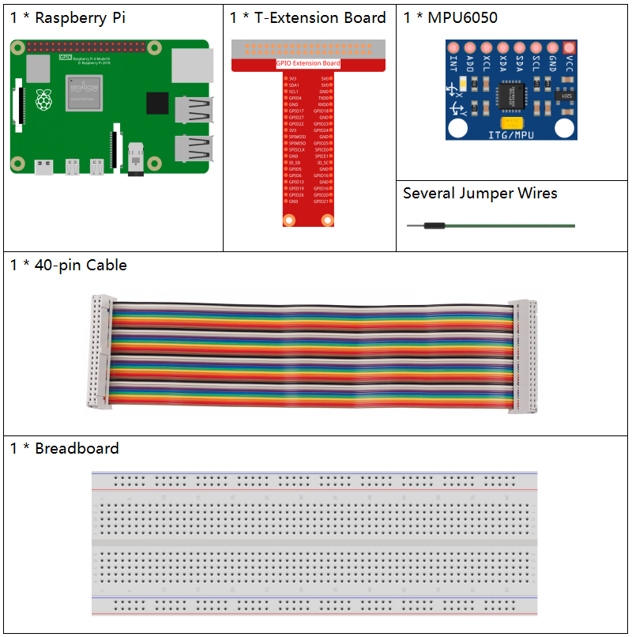
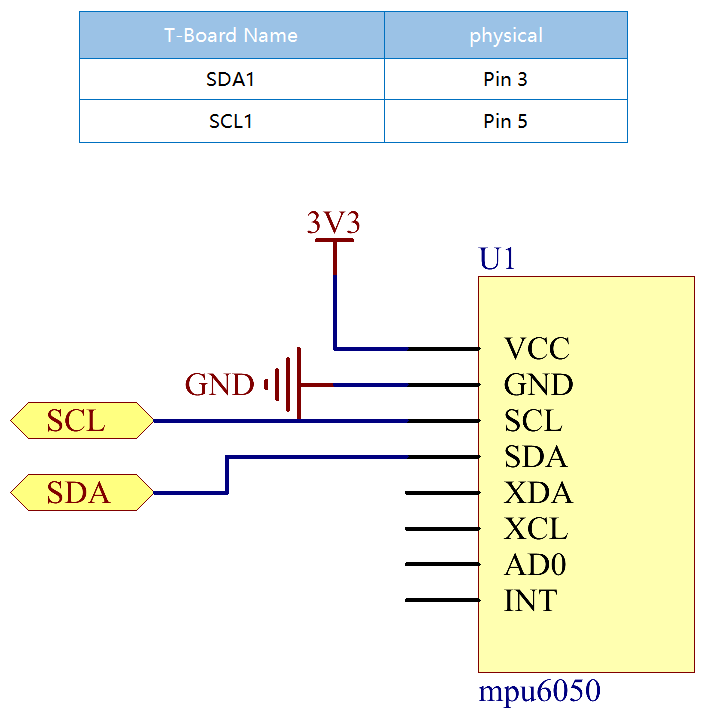
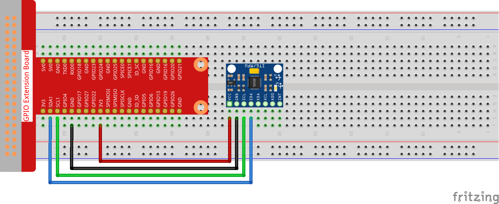
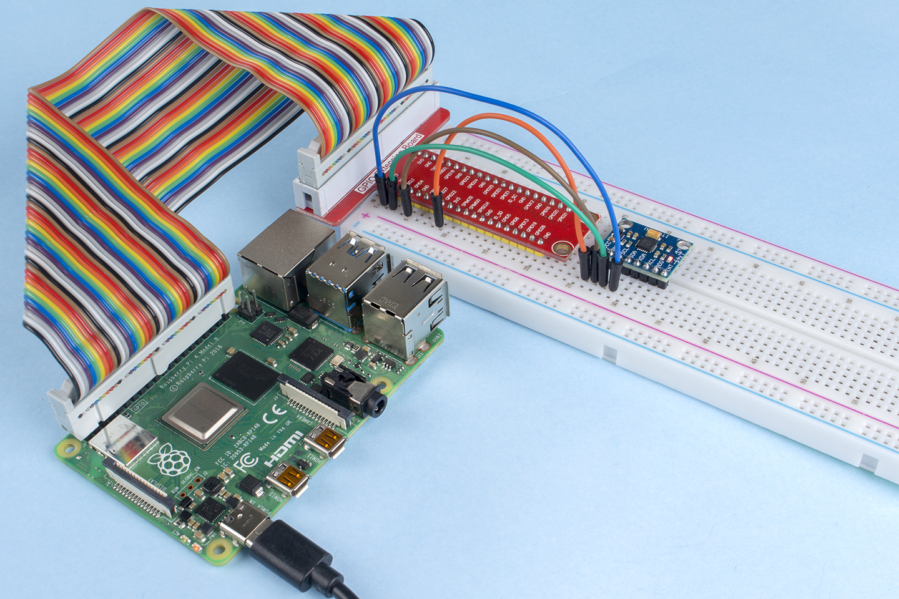

.. note::

    Hallo, willkommen in der SunFounder Raspberry Pi & Arduino & ESP32 Enthusiasten-Community auf Facebook! Tauchen Sie tiefer in Raspberry Pi, Arduino und ESP32 mit anderen Enthusiasten ein.

    **Warum beitreten?**

    - **Expertenunterstützung**: Lösen Sie nach dem Kauf auftretende Probleme und technische Herausforderungen mit Hilfe unserer Community und unseres Teams.
    - **Lernen & Teilen**: Tauschen Sie Tipps und Tutorials aus, um Ihre Fähigkeiten zu verbessern.
    - **Exklusive Vorschauen**: Erhalten Sie frühzeitigen Zugang zu neuen Produktankündigungen und Vorschauen.
    - **Spezielle Rabatte**: Genießen Sie exklusive Rabatte auf unsere neuesten Produkte.
    - **Festliche Aktionen und Gewinnspiele**: Nehmen Sie an Gewinnspielen und festlichen Aktionen teil.

    👉 Bereit, mit uns zu entdecken und zu kreieren? Klicken Sie auf [|link_sf_facebook|] und treten Sie noch heute bei!

2.2.6 MPU6050 Modul
====================

Einführung
------------

Das MPU-6050 ist das weltweit erste und einzige 6-Achsen-Motion-Tracking-Gerät (3-Achsen-Gyroskop und 3-Achsen-Beschleunigungssensor), das für Smartphones, Tablets und tragbare Sensoren entwickelt wurde, die diese Funktionen bieten, einschließlich geringer Leistung, niedriger Kosten und hoher Leistung.

In diesem Experiment verwenden wir I2C, um die Werte des dreiachsigen Beschleunigungssensors und des dreiachsigen Gyroskops des MPU6050 zu erhalten und auf dem Bildschirm anzuzeigen.

Komponenten
-------------------

Schaltplan
-----------------

Der MPU6050 kommuniziert über die I2C-Schnittstelle mit dem Mikrocontroller. Die SDA1 und SCL1 müssen mit den entsprechenden Pins verbunden werden.

Experimentelle Vorgehensweise
-------------------------------

**Schritt 1:** Bauen Sie die Schaltung auf.

**Schritt 2:** Richten Sie I2C ein (siehe Anhang :ref:`I2C Configuration`. Wenn I2C bereits eingerichtet ist, überspringen Sie diesen Schritt.)

**Schritt 2:** Gehen Sie zum Ordner des Codes.

.. raw:: html

   <run></run>

.. code-block::

    cd ~/davinci-kit-for-raspberry-pi/nodejs/

**Schritt 3:** Installieren Sie die Abhängigkeiten.

.. raw:: html

   <run></run>

.. code-block:: 

    sudo npm install mpu6050-gyro

**Schritt 4:** Führen Sie den Code aus.

.. raw:: html

   <run></run>

.. code-block::

    sudo node mpu6050_module.js

Nach dem Ausführen des Codes werden der Neigungswinkel der x- und y-Achse sowie die Beschleunigung und die Winkelgeschwindigkeit auf jeder Achse, die vom MPU6050 gelesen werden, nach der Berechnung auf dem Bildschirm angezeigt.

**Code**

.. code-block:: js

    var gyro = require("mpu6050-gyro");
    
    var address = 0x68; // MPU6050 Adresse
    var bus = 1; // verwendeter i2c-Bus   
    var gyro = new gyro(bus, address);
    
    async function update_telemetry() {
        
        var gyro_xyz = gyro.get_gyro_xyz();
        var accel_xyz = gyro.get_accel_xyz();
        
        var gyro_data = {
            gyro_xyz: gyro_xyz,
            accel_xyz: accel_xyz,
            rollpitch: gyro.get_roll_pitch(gyro_xyz, accel_xyz)
        }
        
        console.log(gyro_data);
        
        setTimeout(update_telemetry, 500);
    }
    
    if (gyro) {
        update_telemetry();
    }

**Code Erklärung**

.. code-block:: js

    var gyro = require("mpu6050-gyro");
    
    var address = 0x68; // MPU6050 Adresse
    var bus = 1; // verwendeter i2c-Bus   
    var gyro = new gyro(bus, address);

Importieren Sie das ``mpu6050-gyro`` Modul, bestimmen Sie die MPU6050-Adresse und den Bus, und erstellen Sie ein gyro-Objekt, um die im Modul enthaltenen Funktionen bequem aufzurufen.

.. note:: 
    Weitere Informationen zu diesem Modul finden Sie unter: https://www.npmjs.com/package/mpu6050-gyro

.. code-block:: js

    var gyro_xyz = gyro.get_gyro_xyz();
    var accel_xyz = gyro.get_accel_xyz();
    
    var gyro_data = {
        gyro_xyz: gyro_xyz,
        accel_xyz: accel_xyz,
        rollpitch: gyro.get_roll_pitch(gyro_xyz, accel_xyz)
    }
    
    console.log(gyro_data);
    
    setTimeout(update_telemetry, 500);

Das Modul kapselt drei verfügbare Funktionen:

``gyro.get_gyro_xyz()``: Gibt ein JSON-Objekt mit den Rohdaten x, y, z vom Gyroskop zurück.

``gyro.get_accel_xyz()``: Gibt ein JSON-Objekt mit den Rohdaten x, y, z vom Beschleunigungssensor zurück.

``gyro.get_roll_pitch(gyro_xyz, accel_xyz)``: Gibt ein JSON-Objekt mit den Roll- und Neigungswinkeln in Grad zurück.

Phänomenbild
------------------

    
