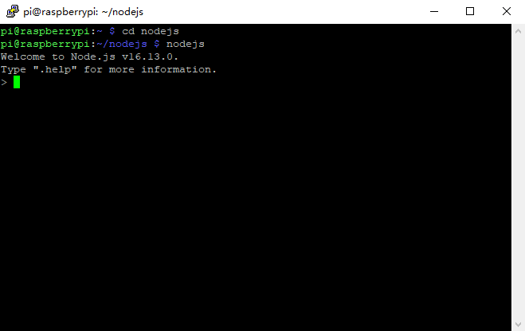
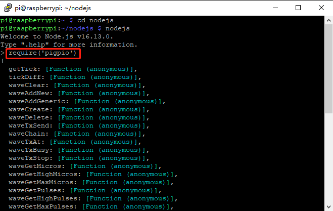
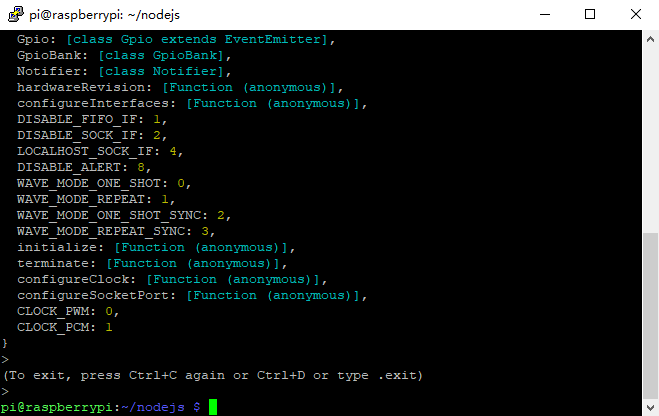

.. note::

    こんにちは、SunFounder Raspberry Pi & Arduino & ESP32 Enthusiasts Community on Facebookへようこそ！Raspberry Pi、Arduino、ESP32を愛好する仲間たちと一緒に、これらの技術を深く探求しましょう。

    **参加する理由**

    - **専門家のサポート**: コミュニティやチームの助けを借りて、購入後の問題や技術的な課題を解決します。
    - **学びと共有**: スキルを向上させるためのヒントやチュートリアルを交換します。
    - **独占プレビュー**: 新製品の発表やプレビューに早期アクセスできます。
    - **特別割引**: 最新の製品に対する独占割引を楽しめます。
    - **フェスティブプロモーションとギブアウェイ**: ギブアウェイやフェスティブプロモーションに参加できます。

    👉 私たちと一緒に探索と創造を始める準備はできましたか？[|link_sf_facebook|]をクリックして、今日参加しましょう！

Check the pigpio
=======================

pigpioは、Raspberry PiのGPIOチャンネルを制御するためのモジュールです。このパッケージは、Raspberry PiのGPIOを制御するためのいくつかの方法を提供します。例やドキュメントについては、https://www.npmjs.com/package/pigpio をご覧ください。

以下のコマンドを入力してpigpioライブラリをインストールします。

.. raw:: html

    <run></run>

.. code-block::

    npm install pigpio

ライブラリが正常にインストールされたかどうかを確認するために、ディレクトリを変更し、nodejsに入ります。

.. raw:: html

    <run></run>

.. code-block::

    cd ~/davinci-kit-for-raspberry-pi/nodejs
    nodejs

次に、require('pigpio')を入力します。

.. raw:: html

    <run></run>

.. code-block::

    require('pigpio')

上記の画面が表示された場合、ライブラリのインストールは成功です。

node CLIを終了したい場合は、Ctrl+Cを2回押してください。

