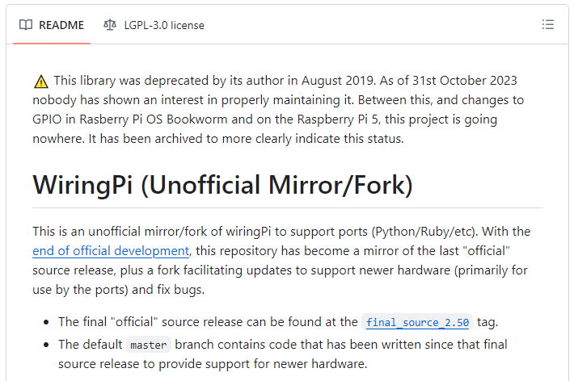

.. note:: 

    Ciao, benvenuto nella Community di appassionati di SunFounder Raspberry Pi & Arduino & ESP32 su Facebook! Approfondisci le tue conoscenze su Raspberry Pi, Arduino ed ESP32 insieme ad altri appassionati.

    **Perché unirsi a noi?**

    - **Supporto da esperti**: Risolvi problemi post-vendita e sfide tecniche con l'aiuto della nostra community e del nostro team.
    - **Impara e condividi**: Scambia consigli e tutorial per migliorare le tue competenze.
    - **Anteprime esclusive**: Ottieni un accesso anticipato agli annunci di nuovi prodotti e alle anteprime.
    - **Sconti speciali**: Approfitta di sconti esclusivi sui nostri prodotti più recenti.
    - **Promozioni e omaggi**: Partecipa a promozioni speciali e omaggi durante le festività.

    👉 Sei pronto a esplorare e creare con noi? Clicca su [|link_sf_facebook|] e unisciti oggi!

Altri Linguaggi (per Pi 5)
============================

Il lancio di Raspberry Pi 5 ci ha portato un modello più potente, ma ha anche introdotto alcuni cambiamenti, in particolare per quanto riguarda il GPIO.

Anche se mantiene la sua interfaccia standard a 40 pin, la funzionalità è cambiata a causa della connessione con il nuovo chip RP1 southbridge integrato. Questo chip personalizzato RP1 ora gestisce le periferiche del Pi 5, generando diversi problemi di compatibilità.

Linguaggio C
--------------
L'implementazione in linguaggio C si basa sulla libreria wiringPi. Tuttavia, la libreria wiringPi della community è stata archiviata e non riceve più aggiornamenti, rendendola inadatta per progetti su Raspberry Pi 5. Per ulteriori informazioni, consulta: https://github.com/WiringPi/WiringPi

Processing
------------
Quando si utilizza Processing 4 su Raspberry Pi 5, la programmazione GPIO presenta delle difficoltà. Errori come "Invalid argument" e "GPIO pin 17 seems to be unavailable on your platform" compaiono durante l'esecuzione di codice relativo al GPIO (come illustrato nell'immagine di accompagnamento). Per maggiori dettagli, visita: https://github.com/benfry/processing4/issues/807

.. image:: img/pi5_processing.png

Node.js
---------
Node.js utilizza la libreria pigpio, che, al momento, non supporta Raspberry Pi 5. Per ulteriori informazioni, visita: https://github.com/joan2937/pigpio/issues/589

.. image:: img/pi5_nodejs.png
    :width: 700

Scratch
---------
Su un sistema a 64 bit, l'importazione della libreria GPIO di Raspberry Pi presenta problemi, causando una mancata risposta. Per maggiori informazioni, visita: https://github.com/raspberrypi/bookworm-feedback/issues/91
