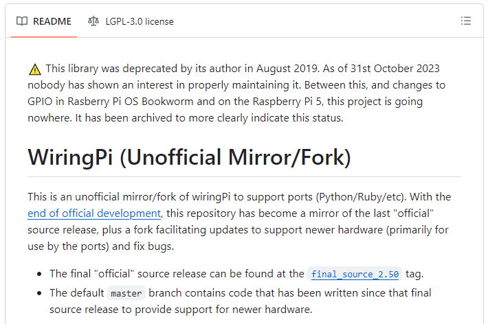
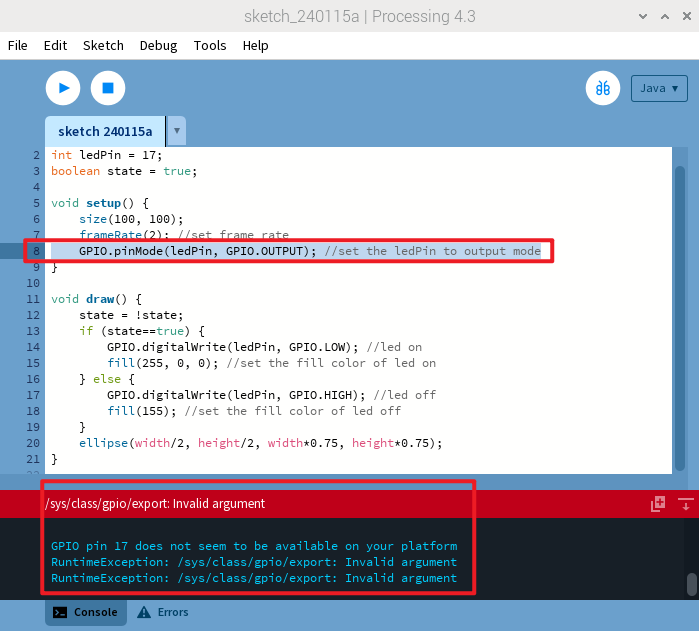
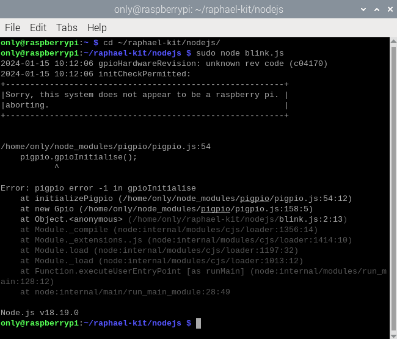

他言語（Pi 5用）
=====================

Raspberry Pi 5のリリースにより、より強力なモデルが私たちにもたらされましたが、GPIOに最も顕著な変更が導入されました。

標準の40ピンインターフェースは保持されていますが、新しく統合されたRP1サウスブリッジチップとの接続により機能が変更されました。このカスタムRP1チップは現在、Pi 5上の周辺機器を処理し、さまざまな互換性の懸念が生じています。

C言語
----------

C言語の実装は、wiringPiライブラリに依存しています。しかし、wiringPiコミュニティライブラリは現在アーカイブされており、更新が行われなくなり、Raspberry Pi 5プロジェクトには不適切です。詳細については、以下を参照してください：https://github.com/WiringPi/WiringPi

    
Processing
--------------

Raspberry Pi 5でProcessing 4を使用する際、GPIOプログラミングには課題が伴います。"Invalid argument"や"GPIO pin 17 seems to be unavailable on your platform"などのエラーがGPIO関連のコードの実行中に発生します（添付画像で示されているように）。詳細については、こちらをご覧ください：https://github.com/benfry/processing4/issues/807

Node.js
---------------

Node.jsは、現時点でRaspberry Pi 5をサポートしていないpigpioライブラリを使用します。さらなる洞察については、こちらを訪れてください：https://github.com/joan2937/pigpio/issues/589

Scratch
------------

64ビットシステムでは、Raspberry Pi GPIOライブラリのインポートに問題が発生し、反応しなくなります。詳細については、こちらを訪れてください：https://github.com/raspberrypi/bookworm-feedback/issues/91