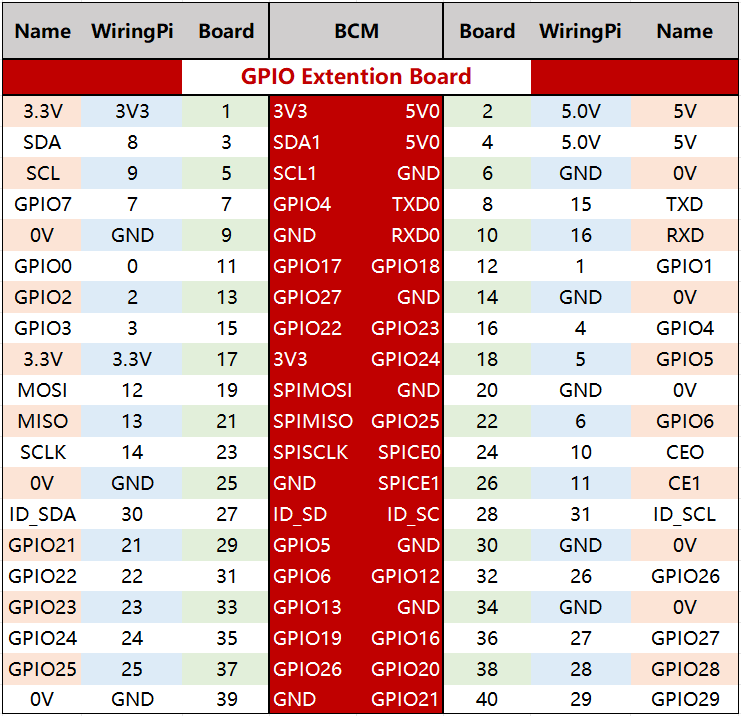

.. note::

    ¡Hola! Bienvenido a la Comunidad de Entusiastas de SunFounder para Raspberry Pi, Arduino y ESP32 en Facebook. Sumérgete en el mundo de Raspberry Pi, Arduino y ESP32 junto a otros entusiastas.

    **¿Por qué unirse?**

    - **Soporte Experto**: Resuelve problemas postventa y desafíos técnicos con la ayuda de nuestra comunidad y equipo.
    - **Aprende y Comparte**: Intercambia consejos y tutoriales para mejorar tus habilidades.
    - **Avances Exclusivos**: Accede anticipadamente a anuncios de nuevos productos y adelantos exclusivos.
    - **Descuentos Especiales**: Aprovecha descuentos exclusivos en nuestros productos más recientes.
    - **Promociones Festivas y Sorteos**: Participa en sorteos y promociones especiales.

    👉 ¿Listo para explorar y crear con nosotros? Haz clic en [|link_sf_facebook|] y únete hoy mismo.

Placa de Extensión GPIO
=========================

Antes de comenzar a aprender los comandos, primero necesitas conocer más 
sobre los pines de la Raspberry Pi, lo cual es clave para el estudio posterior.

Podemos conectar fácilmente los pines de la Raspberry Pi a una placa de pruebas 
mediante una placa de extensión GPIO, evitando así daños al GPIO causados por 
conexiones frecuentes. Esta es nuestra placa de extensión GPIO de 40 pines y 
el cable GPIO para el modelo Raspberry Pi B+, modelo 2 B, y modelo 3, 4 B.

.. image:: img/image32.png
    :align: center

**Numeración de Pines**

Los pines de la Raspberry Pi se nombran de tres maneras: WiringPi, BCM y Board.

Entre estos métodos, la placa de extensión GPIO de 40 pines utiliza la nomenclatura BCM. Sin embargo, algunos pines especiales, como los puertos I2C y SPI, conservan su nombre propio.

La siguiente tabla muestra los métodos de nomenclatura WiringPi, Board y el nombre propio de cada pin en la placa de extensión GPIO. Por ejemplo, para el GPIO17, el nombre en el método Board es 11, en el método WiringPi es 0, y su nombre propio es GPIO0.

.. note::

    1) En lenguaje C, el método de nomenclatura utilizado es WiringPi.
    
    2) En lenguaje Python, los métodos aplicados son Board y BCM, y la función GPIO.setmode() se utiliza para configurarlos.

