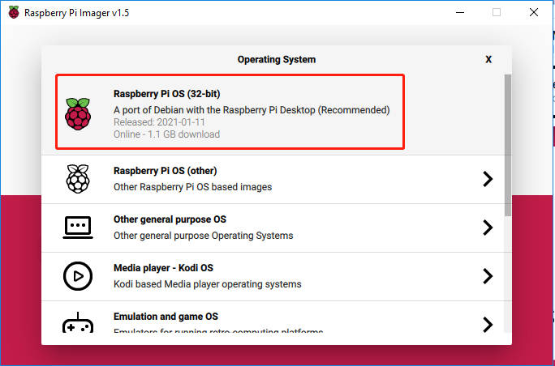

.. note::

    ¡Hola! Bienvenido a la Comunidad de Entusiastas de SunFounder para Raspberry Pi, Arduino y ESP32 en Facebook. Sumérgete en el mundo de Raspberry Pi, Arduino y ESP32 junto a otros entusiastas.

    **¿Por qué unirse?**

    - **Soporte Experto**: Resuelve problemas postventa y desafíos técnicos con la ayuda de nuestra comunidad y equipo.
    - **Aprende y Comparte**: Intercambia consejos y tutoriales para mejorar tus habilidades.
    - **Avances Exclusivos**: Accede anticipadamente a anuncios de nuevos productos y adelantos exclusivos.
    - **Descuentos Especiales**: Aprovecha descuentos exclusivos en nuestros productos más recientes.
    - **Promociones Festivas y Sorteos**: Participa en sorteos y promociones especiales.

    👉 ¿Listo para explorar y crear con nosotros? Haz clic en [|link_sf_facebook|] y únete hoy mismo.

.. _install_os:

Instalación del Sistema Operativo (Común)
============================================

**Paso 1**

Raspberry Pi ha desarrollado una herramienta gráfica para escribir en 
tarjetas SD que funciona en Mac OS, Ubuntu 18.04 y Windows. Es la opción 
más sencilla para la mayoría de usuarios, ya que descarga la imagen e 
instala automáticamente el sistema operativo en la tarjeta SD.

Visita la página de descarga: https://www.raspberrypi.org/software/. Haz 
clic en el enlace de **Raspberry Pi Imager** correspondiente a tu sistema 
operativo. Una vez descargado, ábrelo para iniciar la instalación.

.. image:: img/image11.png
    :align: center

**Paso 2**

Al iniciar el instalador, tu sistema operativo podría intentar bloquear la 
ejecución. Por ejemplo, en Windows aparece el siguiente mensaje:

Si ves este mensaje, haz clic en **Más información** y luego en 
**Ejecutar de todos modos**, y sigue las instrucciones para instalar Raspberry Pi Imager.

.. image:: img/image12.png
    :align: center

**Paso 3**

Inserta tu tarjeta SD en el lector de tarjetas de tu computadora o laptop.

**Paso 4**

En Raspberry Pi Imager, selecciona el sistema operativo que deseas instalar y la tarjeta SD donde se instalará.

.. note:: 

    * Necesitarás conexión a internet la primera vez que lo uses.
    * Ese sistema operativo se guardará para uso sin conexión en el futuro (``lastdownload.cache``, ``C:/Users/tu_nombre_usuario/AppData/Local/Raspberry Pi/Imager/cache``). La próxima vez que abras el software, verás "Released: fecha, cached on your computer".

.. Descarga la imagen `raspios_armhf-2020-05-28 <https://downloads.raspberrypi.org/raspios_armhf/images/raspios_armhf-2021-05-28/2021-05-07-raspios-buster-armhf.zip>`_ y selecciónala en Raspberry Pi Imager.

.. .. image:: img/otherOS.png
..     :align: center

.. .. warning::
..     Raspberry Pi OS ha tenido cambios importantes a partir de la versión 2021-05-28, lo cual podría hacer que algunas funciones no estén disponibles. Por el momento, no uses la última versión.

.. .. mark

**Paso 5**

Selecciona la tarjeta SD que estás utilizando.

.. image:: img/image14.png
    :align: center

**Paso 6**

Presiona **Ctrl+Shift+X** o haz clic en el ícono de **configuración** para abrir las **Opciones avanzadas** y habilitar SSH, además de configurar el nombre de usuario y la contraseña.

    .. note::
        * Dado que la Raspberry Pi ya no tiene una contraseña predeterminada, deberás establecerla. También puedes cambiar el nombre de usuario.
        * Para acceder de forma remota, también necesitarás habilitar SSH manualmente.

.. image:: img/image15.png
    :align: center

A continuación, desplázate hacia abajo para completar la configuración de wifi y haz clic en **GUARDAR**.

.. note::

    El ``país del wifi`` debe establecerse con el código de dos letras `ISO/IEC alpha2 code <https://en.wikipedia.org/wiki/ISO_3166-1_alpha-2#Officially_assigned_code_elements>`_ del país en el que usas tu Raspberry Pi.

.. image:: img/image16.png
    :align: center

**Paso 7**

Haz clic en el botón **ESCRIBIR**.

.. image:: img/image17.png
    :align: center

**Paso 8**

Si tu tarjeta SD contiene archivos, puede que desees hacer 
una copia de seguridad para no perderlos permanentemente. 
Si no necesitas hacer una copia, haz clic en **Sí**.

.. image:: img/image18.png
    :align: center

**Paso 9**

Después de un tiempo de espera, aparecerá la siguiente ventana indicando 
que la escritura se ha completado.

.. image:: img/image19.png
    :align: center

