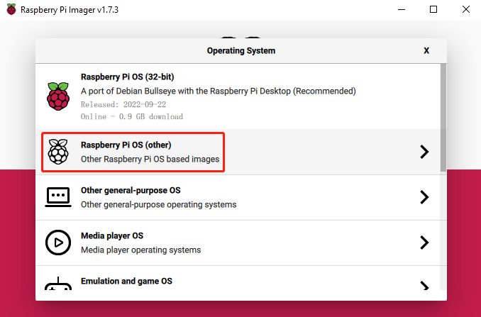
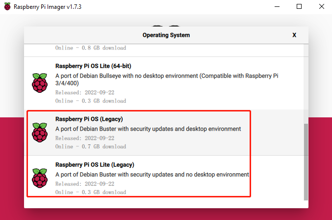
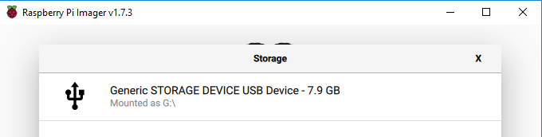
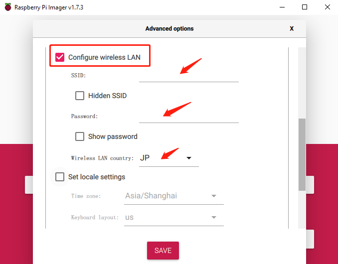
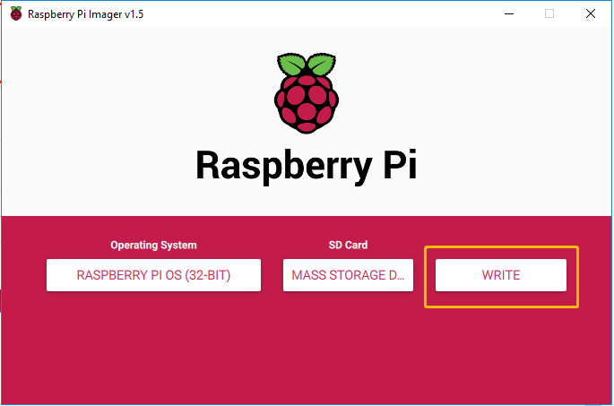
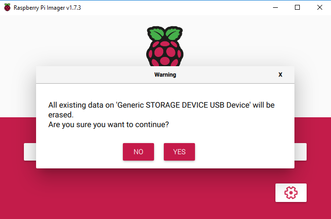
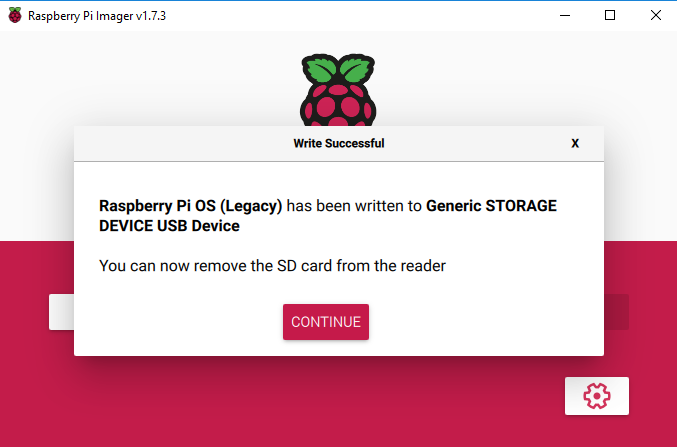

.. note::

    こんにちは、SunFounderのRaspberry Pi & Arduino & ESP32愛好家コミュニティへようこそ！Facebook上でRaspberry Pi、Arduino、ESP32についてもっと深く掘り下げ、他の愛好家と交流しましょう。

    **参加する理由は？**

    - **エキスパートサポート**：コミュニティやチームの助けを借りて、販売後の問題や技術的な課題を解決します。
    - **学び＆共有**：ヒントやチュートリアルを交換してスキルを向上させましょう。
    - **独占的なプレビュー**：新製品の発表や先行プレビューに早期アクセスしましょう。
    - **特別割引**：最新製品の独占割引をお楽しみください。
    - **祭りのプロモーションとギフト**：ギフトや祝日のプロモーションに参加しましょう。

    👉 私たちと一緒に探索し、創造する準備はできていますか？[|link_sf_facebook|]をクリックして今すぐ参加しましょう！

.. _install_os:

Raspberry pi OSのインストール
====================================

**必要なもの**

* Raspberry Pi 本体
* PC（Windows Mac Linux/UNIX）
* マイクロSDカード  8GB以上のもの

**ステップ1**

Raspberry Pi専用にSDカード書き込みツールが用意されました。Mac、WindowsならびにUbuntu 18.04で動作しますので、ほとんどの方にとって最も簡単なRaspberry pi用のSDカードの作成方法です。

ダウンロードページにアクセスしてください: 
https://www.raspberrypi.org/software/

お使いのパソコン用のRaspberry Pi Imagerのリンクをクリックしダウンロードし、完了したらそれをクリックしてインストーラーを起動します。

.. image:: img/image11.png
    :align: center

**ステップ2**

インストーラーを起動するとＯＳがインストーラーの実行を禁止しようとする場合があります。 たとえば、Windows では次のメッセージが表示されます。

このポップアップが表示された場合は、[**More info**] をクリックしてから [**Run anyway**] をクリックし指示に従ってRaspberry Pi Imagerをインストールします。

.. image:: img/image12.png
    :align: center

**ステップ3**

SDカードをパソコンのSDカード スロットに挿入します。（SDカードスロットが無いパソコンの場合USBマイクロSDカードアダプターを使用してください）
SDカードのフォーマットなどのメニュー画面が表示された場合、それらは無視して閉じてください。

**ステップ4**

.. Raspberry Pi ImagerでインストールするＯＳを選択します。
.. インストール先のSDカードを選択します。

.. .. image:: img/image13.png
..     :align: center

.. .. note:: 

..     1) 作業を行っているパソコンがインターネットに接続されていることを確認してください。

..     2) その選択されたOSは将来オフラインで使用するために保存されます (lastdownload.cache、C:/Users/yourname/AppData/Local/Raspberry Pi/Imager/cache)。そのため、次にソフトウェアを開くと、「リリース日: コンピューターにキャッシュされた日付」と表示されます。

.. ダウンロードされたRaspberry pi OS `raspios_armhf-2020-05-28 <https://downloads.raspberrypi.org/raspios_armhf/images/raspios_armhf-2021-05-28/2021-05-07-raspios-buster-armhf.zip>`_ のイメージファイルをRaspberry Pi Imagerで選択します。

.. .. image:: img/otherOS.png
..     :align: center

.. .. warning::
..     Raspberry Pi OS は 2021-05-28 バージョン以降に大きな変更があり、一部の機能が利用できなくなる可能性があります。 現時点では最新バージョンを使用しないでください。

.. warning::

    Raspberry Pi OS を **Debian Bullseye** にアップグレードすると、一部の機能が動作しなくなるため、**Debian Buster** バージョンを引き続き使用することをお勧めします。

Raspberry Pi Imagerで、 **CHOOSE OS** から **Raspberry Pi OS(other)** を選択してクリックします。

新しく開いたページの最後までスクロールすると **Raspberry Pi OS(Legacy)** と **Raspberry Pi OS Lite(Legacy)** が表示されます。これらの違いはデスクトップ（GUI環境：普段から馴染みのあるマウスで操作できる画面）の有る／無しの違いです。
**Raspberry Pi OS(Legacy)** をインストールすることをお勧めします。これによりRaspberry Piデスクトップにアクセスしてカメラで捉えている映像をリアルタイムで見ることができるようになります。

**ステップ5**

使用するSDカードを選択します。

**ステップ6**

 **設定** ボタン（画面右下のギアマーク：OSを選択すると表示される）をクリックして **詳細オプション** ページを開き、SSHを有効にしてWi-Fiを設定します。
 最低これら2つの項目を設定する必要があり他の項目は選択に応じて異なりますがパスワードはここで設定しておくと楽です。
 このカスタマイズ オプションを常に使用するように選択できます（次回利用時のデフォルトになる）。

.. image:: img/image15.png
    :align: center

下にスクロールしてWi-Fiの設定を完了し **SAVE** をクリックします。

.. note::

    **wifi country** には、2 文字の `ISO/IEC alpha2 コード <https://en.wikipedia.org/wiki/ISO_3166-1_alpha-2#Officially_assigned_code_elements>`_ を設定する必要があります。
    
    日本国内で使用しているならば「JP」と設定してください。

**ステップ7**

**書き込む** ボタンをクリックしてください。

**ステップ8**

現在SDカードにファイルが保存されている場合はそれらのファイルを削除してしまわないように、事前にファイルをバックアップすることをお勧めします。
バックアップするファイルがない場合は、[ **はい** ] をクリックします。

**ステップ9**

しばらく待つと、次のウィンドウが表示され、書き込みが完了したことを示します。
そのままSDカードを取り出してRaspberry Pi Imagerを終了させます。

