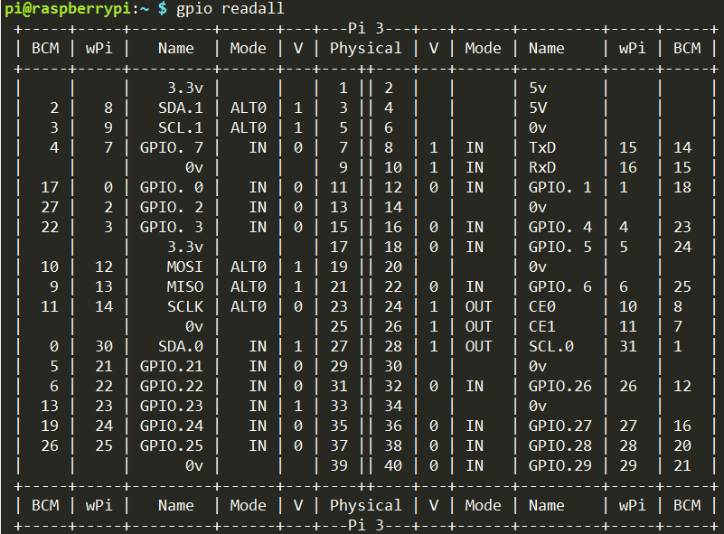

.. note::

    ¡Hola! Bienvenido a la Comunidad de Entusiastas de SunFounder para Raspberry Pi, Arduino y ESP32 en Facebook. Sumérgete en el mundo de Raspberry Pi, Arduino y ESP32 junto a otros entusiastas.

    **¿Por qué unirse?**

    - **Soporte Experto**: Resuelve problemas postventa y desafíos técnicos con la ayuda de nuestra comunidad y equipo.
    - **Aprende y Comparte**: Intercambia consejos y tutoriales para mejorar tus habilidades.
    - **Avances Exclusivos**: Accede anticipadamente a anuncios de nuevos productos y adelantos exclusivos.
    - **Descuentos Especiales**: Aprovecha descuentos exclusivos en nuestros productos más recientes.
    - **Promociones Festivas y Sorteos**: Participa en sorteos y promociones especiales.

    👉 ¿Listo para explorar y crear con nosotros? Haz clic en [|link_sf_facebook|] y únete hoy mismo.

Librerías
============

Para programar con Raspberry Pi, se utilizan dos librerías importantes: 
wiringPi y RPi.GPIO. Raspberry Pi OS las instala de manera predeterminada, 
por lo que puedes usarlas directamente.

RPi.GPIO
------------

Si eres usuario de Python, puedes programar los GPIOs con la API proporcionada por RPi.GPIO.

RPi.GPIO es un módulo para controlar los canales GPIO de Raspberry Pi. 
Este paquete ofrece una clase para gestionar el GPIO en Raspberry Pi. 
Para ver ejemplos y documentación, visita: http://sourceforge.net/p/raspberry-gpio-python/wiki/Home/.

Para comprobar si RPi.GPIO está instalado, escribe en Python:

.. raw:: html

    <run></run>

.. code-block:: 

    python

.. image:: img/image27.png

En el CLI de Python, ingresa "import RPi.GPIO". Si no aparece ningún error, 
significa que RPi.GPIO está instalado.

.. raw:: html

    <run></run>

.. code-block::

    import RPi.GPIO

.. image:: img/image28.png

Si deseas salir del CLI de Python, escribe:

.. raw:: html

    <run></run>

.. code-block:: 

    exit()

.. _install_wiringpi:

Instalar y Verificar WiringPi
-------------------------------------

``wiringPi`` es una biblioteca de GPIO en lenguaje C, utilizada en 
Raspberry Pi, y cumple con la licencia GNU Lv3. Las funciones en wiringPi 
son similares a las del sistema wiring de Arduino, facilitando su uso para 
quienes ya están familiarizados con Arduino.

``wiringPi`` incluye numerosos comandos de GPIO que permiten controlar todo 
tipo de interfaces en Raspberry Pi.

Ejecuta el siguiente comando para instalar la biblioteca ``wiringPi``:

.. raw:: html

   <run></run>

.. code-block::

    sudo apt-get update
    git clone https://github.com/WiringPi/WiringPi
    cd WiringPi 
    ./build

Puedes verificar si la biblioteca wiringPi se instaló correctamente con la 
siguiente instrucción:

.. raw:: html

    <run></run>

.. code-block::

    gpio -v

.. image:: img/image30.png

Revisa el GPIO con el siguiente comando:

.. raw:: html

    <run></run>

.. code-block:: 

    gpio readall

Para más detalles sobre wiringPi, puedes consultar `WiringPi <https://github.com/WiringPi/WiringPi>`_.
