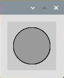

Blingking Dot
===========================

In this project, we will draw a dot on Processing, which blinks synchronously with the LED. Please build the circuit as shown in the diagram and run the program.

.. image:: img/clickable_dot_on.png

**Wiring**

.. image:: img/image49.png

**Code**

.. code-block:: arduino

    import processing.io.*;
    int ledPin = 17; 
    boolean state = true; 

    void setup() {
        size(100, 100);
        frameRate(2); //set frame rate
        GPIO.pinMode(ledPin, GPIO.OUTPUT); //set the ledPin to output mode 
    }

    void draw() {
        state = !state;
        if (state==true) {
            GPIO.digitalWrite(ledPin, GPIO.HIGH); //led on 
            fill(255, 0, 0); //set the fill color of led on
        } else {
            GPIO.digitalWrite(ledPin, GPIO.LOW); //led off
            fill(155); //set the fill color of led off
        } 
        ellipse(width/2, height/2, width*0.75, height*0.75);
    }

**How it works?**

At the beginning of the program, you need to embed Processing's GPIO function library by ``import processing.io.*;``, which is indispensable for circuit experiments.

Frame rate is the frequency of bitmaps appearing on the board, expressed in hertz (Hz).

In other words, it is also the frequency at which the ``draw()`` function is called. In ``setup()``, setting the frame rate to 2 will call ``draw()`` every 0.5s.

Each call of the ``draw()`` function takes the inverse of ``state`` and subsequently determines it. If the value is ``true``, the LED is lit and the brush is filled with red; if not, the LED is turned off and the brush is filled with gray.
After completing the judgment, the circle is drawn.

There are two other points to note. When using GPIOs, you need to use the ``GPIO.pinMode()`` function to set the INPUT/OUTPUT state of the pin, and then use the ``GPIO.digitalWrite()`` function to assign a value (HIGH/LOW) to the pin .

.. note::

    Please try to avoid using ``delay()`` in ``draw()`` because it will affect the display window refresh.