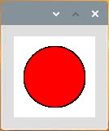

.. _processing_blinkdot:

Blinkender Punkt
===========================

In diesem Projekt werden wir einen Punkt auf Processing zeichnen, der synchron mit der LED blinkt. Bitte bauen Sie die Schaltung wie im Diagramm gezeigt auf und führen Sie die Skizze aus.

.. image:: img/blinking_dot.png

**Verdrahtung**

.. image:: img/image49.png

**Skizzieren**

.. code-block:: arduino

    import processing.io.*;
    int ledPin = 17; 
    boolean state = true; 

    void setup() {
        size(100, 100);
        frameRate(2); //set frame rate
        GPIO.pinMode(ledPin, GPIO.OUTPUT); //set the ledPin to output mode 
    }

    void draw() {
        state = !state;
        if (state==true) {
            GPIO.digitalWrite(ledPin, GPIO.LOW); //led on 
            fill(255, 0, 0); //set the fill color of led on
        } else {
            GPIO.digitalWrite(ledPin, GPIO.HIGH); //led off
            fill(155); //set the fill color of led off
        } 
        ellipse(width/2, height/2, width*0.75, height*0.75);
    }

**Wie es funktioniert?**

Am Anfang der Skizze müssen Sie die GPIO-Funktionsbibliothek von Processing durch ``import processing.io.*;`` einbetten, was für Schaltungsexperimente unverzichtbar ist.

**Framerate** ist die Frequenz der auf der Platine erscheinenden Bitmaps, ausgedrückt in Hertz (Hz). Mit anderen Worten, es ist auch die Häufigkeit, mit der die Funktion ``draw()`` aufgerufen wird. Wenn Sie in ``setup()`` die **Framerate** auf 2 setzen, wird ``draw()`` alle 0,5s aufgerufen.

Jeder Aufruf der Funktion ``draw()`` nimmt die Umkehrung von ``state`` 
und bestimmt diese anschließend. Wenn der Wert ``true`` ist, leuchtet die LED und der Pinsel ist rot gefüllt; wenn nicht, wird die LED ausgeschaltet und der Pinsel wird mit Grau gefüllt.

Verwenden Sie nach Abschluss der Beurteilung die Funktion ``ellipse()`` 
, um einen Kreis zu zeichnen. Es sollte beachtet werden, dass ``width`` und ``height`` 
Systemvariablen sind, die verwendet werden, um die Breite und Höhe des Anzeigefensters zu speichern.

Es sind noch zwei weitere Punkte zu beachten. Wenn Sie GPIOs verwenden, müssen Sie die Funktion 
``GPIO.pinMode()`` verwenden, um den INPUT/OUTPUT-Zustand des Pins festzulegen, und dann die Funktion 
``GPIO.digitalWrite()`` verwenden, um einen Wert (HIGH) // (LOW) an den Stift .

.. note::

    Bitte vermeiden Sie die Verwendung von ``delay()`` in ``draw()`` , da dies die Aktualisierung des Anzeigefensters beeinflusst.

Weitere Informationen finden Sie unter `Processing Reference <https://processing.org/reference/>`_.