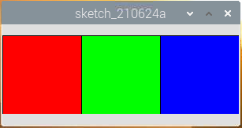

.. note::

    Ciao, benvenuto nella Community di Facebook dedicata agli appassionati di SunFounder Raspberry Pi, Arduino e ESP32! Approfondisci le tue conoscenze su Raspberry Pi, Arduino e ESP32 insieme ad altri appassionati.

    **Perché unirsi a noi?**

    - **Supporto Esperto**: Risolvi problematiche post-vendita e sfide tecniche con l’aiuto della nostra comunità e del nostro team.
    - **Impara e Condividi**: Scambia consigli e tutorial per migliorare le tue competenze.
    - **Anteprime Esclusive**: Ottieni accesso anticipato agli annunci di nuovi prodotti e alle anteprime.
    - **Sconti Speciali**: Approfitta di sconti esclusivi sui nostri prodotti più recenti.
    - **Promozioni Festive e Giveaway**: Partecipa a concorsi e promozioni speciali.

    👉 Sei pronto a esplorare e creare con noi? Clicca su [|link_sf_facebook|] e unisciti subito!

Blocchi di Colore Cliccabili
=================================

Abbiamo già provato a disegnare un punto cliccabile per controllare il LED, quindi facciamo un passo avanti e disegniamo 3 quadrati colorati per regolare i colori RGB!

**Collegamenti**

.. image:: img/image61.png

**Sketch**

.. code-block:: arduino

    import processing.io.*; // usa la libreria GPIO

    int[] pins = { 17, 18, 27 };

    void setup() {
        for (int i = 0; i < pins.length; i++) {
            GPIO.pinMode(pins[i], GPIO.OUTPUT);
        }
        size(300, 100);
        background(255);
    }

    void draw() {
        fill(255, 0, 0);
        rect(0, 0, width/3, height);

        fill(0,255,0);
        rect(width/3, 0, 2*width/3, height);

        fill(0,0,255);
        rect(2*width/3, 0, width, height);
    }

    void mouseClicked() {
        for (int i = 0; i < pins.length; i++) {
            GPIO.digitalWrite(pins[i],GPIO.LOW);
        }
        if (mouseX<width/3){
            GPIO.digitalWrite(pins[0],GPIO.HIGH);
        }else if (mouseX>width/3&&mouseX<2*width/3){
            GPIO.digitalWrite(pins[1],GPIO.HIGH);
        }else if (mouseX>2*width/3){
            GPIO.digitalWrite(pins[2],GPIO.HIGH);
        }        
    }

**Come funziona?**

Questo progetto ha molto in comune con :ref:`Punto Cliccabile`, eccetto che affina le condizioni per determinare l’evento di click del mouse.

Prima disegna tre blocchi di colore in ``draw()``, poi rileva quale blocco è stato cliccato in base al valore di mouseX (la coordinata X del mouse), infine illumina il colore corrispondente sui LED RGB.

**Che altro?**

Grazie alla sintesi additiva, possiamo fare in modo che i LED RGB mostrino sette colori - aggiungendo il rosso al verde si ottiene il giallo; aggiungendo i tre colori primari insieme si ottiene il bianco.
Ora puoi provarlo tu stesso.

Per maggiori dettagli, consulta il `Processing Reference <https://processing.org/reference/>`_.
