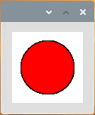

.. note::

    Bonjour, bienvenue dans la communauté SunFounder dédiée aux passionnés de Raspberry Pi, Arduino et ESP32 sur Facebook ! Plongez plus profondément dans l'univers du Raspberry Pi, de l'Arduino et de l'ESP32 avec d'autres passionnés.

    **Pourquoi nous rejoindre ?**

    - **Support d'experts** : Résolvez vos problèmes après-vente et relevez vos défis techniques grâce à l'aide de notre communauté et de notre équipe.
    - **Apprendre & Partager** : Échangez des astuces et des tutoriels pour améliorer vos compétences.
    - **Aperçus exclusifs** : Bénéficiez d'un accès anticipé aux annonces de nouveaux produits et aux avant-premières.
    - **Réductions spéciales** : Profitez de réductions exclusives sur nos derniers produits.
    - **Promotions festives et concours** : Participez à des concours et à des promotions spéciales lors des périodes de fête.

    👉 Prêt à explorer et à créer avec nous ? Cliquez sur [|link_sf_facebook|] et rejoignez-nous dès aujourd'hui !

Clickable Dot
==================

Nous avons déjà essayé de dessiner des graphiques animés, de répondre aux événements de la souris et de contrôler une LED. Alors pourquoi ne pas combiner ces fonctionnalités pour dessiner un point cliquable permettant de contrôler la LED ?  

**Câblage**

.. image:: img/image49.png

**Code**

.. code-block:: arduino

    import processing.io.*; 
    boolean state = false;
    int ledPin = 17;

    void setup() {
        GPIO.pinMode(ledPin, GPIO.OUTPUT);
        background(255);
    }

    void draw() {
        if (state == true) { 
            GPIO.digitalWrite(ledPin, GPIO.LOW);
            fill(255, 0, 0);
        }else { 
            GPIO.digitalWrite(ledPin, GPIO.HIGH);
            fill(155);
        }
        ellipse(width/2, height/2, width*0.75, height*0.75);
    }

    void mouseClicked() {
        // Basculer l'état :
        if (2*dist(mouseX,mouseY,width/2, height/2)<=width*0.75)
            {state = !state;}
        }

**Comment ça fonctionne ?**

Ce projet est très similaire au :ref:`Blinking Dot`, à la différence qu'ici, l'état de bascule est contrôlé par un événement de la souris. Cela signifie que la LED ne clignote pas automatiquement, mais s'allume et s'éteint avec un clic de souris.

Dans l'événement ``mouseClicked()``, la fonction ``dist()`` est utilisée pour déterminer la position de la souris au moment du clic. Le point est considéré comme cliqué uniquement si la distance entre la souris et le centre du point est inférieure au rayon.

Pour plus d'informations, consultez la `Processing Reference <https://processing.org/reference/>`_.
