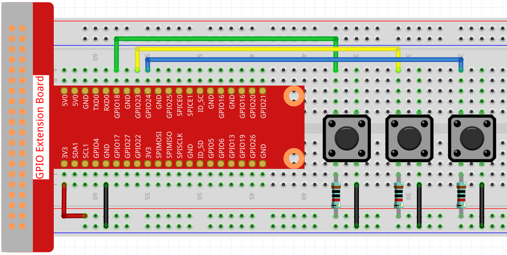

.. note::

    Hallo und willkommen in der SunFounder Raspberry Pi & Arduino & ESP32 Enthusiasten-Gemeinschaft auf Facebook! Tauchen Sie tiefer ein in die Welt von Raspberry Pi, Arduino und ESP32 mit anderen Enthusiasten.

    **Warum beitreten?**

    - **Expertenunterstützung**: Lösen Sie Nachverkaufsprobleme und technische Herausforderungen mit Hilfe unserer Gemeinschaft und unseres Teams.
    - **Lernen & Teilen**: Tauschen Sie Tipps und Anleitungen aus, um Ihre Fähigkeiten zu verbessern.
    - **Exklusive Vorschauen**: Erhalten Sie frühzeitigen Zugang zu neuen Produktankündigungen und exklusiven Einblicken.
    - **Spezialrabatte**: Genießen Sie exklusive Rabatte auf unsere neuesten Produkte.
    - **Festliche Aktionen und Gewinnspiele**: Nehmen Sie an Gewinnspielen und Feiertagsaktionen teil.

    👉 Sind Sie bereit, mit uns zu erkunden und zu erschaffen? Klicken Sie auf [|link_sf_facebook|] und treten Sie heute bei!

Punkt auf der Schaukel
==============================

In diesem Projekt sind 3 Schaltflächen verbunden, eine zum Ändern der Punktgröße, 
eine zum Ändern der Position und die letzte zum Ändern der Farbe. 
Wenn Sie alle 3 Tasten gleichzeitig drücken, 
erhalten Sie einen schwingenden Punkt mit variabler Farbe.

.. image:: img/dancing_dot.png

**Verdrahtung**

**Skizzieren**

.. code-block:: arduino

    import processing.io.*;

    // Define an instance of the Dot object
    Dot myDot;

    // Define the pins that will be reading button presses
    int[] pins = { 18, 23, 24 };

    void setup() {
        size(400, 400);
        // Change the color mode of the sketch to HSB
        colorMode(HSB, 360, 100, 100);
        noStroke();

        for (int i = 0; i < pins.length; i++) {
            GPIO.pinMode(pins[i], GPIO.INPUT_PULLUP);
        }

        // Create a Dot in the middle of the screen 
        myDot = new Dot(width / 2, height / 2, 100, 255);
    }

    void draw() {
        background(0); 

        // Modify attributes of the Dot depending on which buttons are pressed
        if (GPIO.digitalRead(pins[0]) == GPIO.LOW) {myDot.setSize();} 
        if (GPIO.digitalRead(pins[1]) == GPIO.LOW) {myDot.setPosition();} 
        if (GPIO.digitalRead(pins[2]) == GPIO.LOW) {myDot.setColor();} 

        // Update the Dot state
        myDot.update();
        // And draw it to the screen
        myDot.show();
    }

    class Dot { 

        float initX;
        float initY;
        float currentX;
        float currentY;
        int positionRange = 60;

        float initSize;
        float currentSize;
        int sizeRange = 50;

        int initColor;
        int currentColor;
        int ColorRange = 80;

        float timer = 0.0;
        float speed = 0.06;

        Dot(float x, float y, float s, int c) {
            initX = x;
            initY = y;
            currentX = x;
            currentY = y;

            initSize = s;
            currentSize = s;

            initColor = c;
            currentColor = c;
        }

        void setSize() {
            currentSize = initSize + sizeRange * sin( timer );
        }

        void setPosition() {
            currentY = initY + positionRange * cos( timer *2);
        }

        void setColor() {
            currentColor = int(initColor + ColorRange * sin( timer ));
        }

        void update() {
            timer += speed;
        }

        void show() {
            fill(currentColor, 100, 100); 
            ellipse(currentX, currentY, currentSize, currentSize);
        }
    }

**Wie es funktioniert?**

Anstatt einen Punkt direkt zu zeichnen, erstellen wir hier eine ``Dot`` -Klasse. Dann deklarieren Sie das Objekt (in diesem Fall ``myDot``).

Dies ist eine einfache Möglichkeit, Punkte mit mehreren identischen Eigenschaften zu zeichnen. Wenn wir beispielsweise dem Punkt in diesem Projekt drei Funktionen hinzufügen - Größe ändern, Position ändern und Farbe ändern -, dann hat jeder von uns deklarierte Punkt dieselbe Funktion. Wir können dieselbe Schaltfläche verwenden, damit sie dasselbe tun, oder wir können verschiedene Schaltflächen verwenden, um jeden Punkt separat zu steuern.

Die Verwendung von **classes** macht Ihre Skizze schön, kraftvoll und flexibel.

`Class (Computerprogrammierung) - Wikipedia <https://en.wikipedia.org/wiki/Class_(computer_programming)>`_

Als nächstes werfen wir einen genaueren Blick auf die Klasse ``Dot`` . 

.. code-block:: arduino

    Dot(float x, float y, float s, int c)

In der Deklaration muss es vier Parameter übergeben, nämlich den X- und Y-Koordinatenwert der Position, 
die Größe und die Farbe (hier ist es auf den `HSB color mode <https://en.wikipedia.org/wiki/HSL_and_HSV>`_ ).

Jedem Parameter werden 2 Wertesätze zugewiesen (Anfangswert und aktueller Wert).

.. code-block:: arduino

    float initX;
    float initY;
    float currentX;
    float currentY;
    int positionRange = 60;

    float initSize;
    float currentSize;
    int sizeRange = 50;

    int initColor;
    int currentColor;
    int ColorRange = 80;

Neben dem Anfangswert und dem aktuellen Wert gibt es auch eine Reihe von Bereichswerten. Es ist nicht schwer zu verstehen, dass der Anfangswert verwendet wird, um den Anfangszustand des Punktes (bestimmt durch die eingehenden Parameter) zu bestimmen, während sich der aktuelle Wert innerhalb des Bereichs ändert, um den Punkt zu bewegen.

Daher werden die aktuellen Werte der anderen drei Parameter mit Ausnahme des X-Koordinatenwertes wie folgt berechnet:

.. code-block:: arduino

    void setSize() {
        currentSize = initSize + sizeRange * sin( timer );
    }

    void setPosition() {
        currentY = initY + positionRange * cos( timer *2);
    }

    void setColor() {
        currentColor = int(initColor + ColorRange * sin( timer ));
    }

Wenn Sie mit trigonometrischen Funktionen vertraut sind, 
sollte es nicht schwer sein, `sine and cosine <https://en.wikipedia.org/wiki/Sine>`_ 
zu verstehen, was eine gleichmäßige periodische Änderung (von -1 zu 1) ergibt. des aktuellen Wertes des Punktes.

Wir müssen auch einen Startwert, ``timer`` , 
für die periodische Variation hinzufügen. Es fügt den festen Wert in die Methode 
``update()`` ein und wird in ``draw()`` aufgerufen.

.. code-block:: arduino

    void update() {
        timer += speed;
    }

Schließlich wird der Punkt mit der Methode ``show()`` entsprechend dem aktuellen Wert angezeigt, 
die auch in ``draw()`` aufgerufen wird.

.. code-block:: arduino

    void show() {
        fill(currentColor, 100, 100); 
        ellipse(currentX, currentY, currentSize, currentSize);
    }

**Was mehr?**

Wenn Sie die Verwendung von Klassen beherrschen, 
können Sie bereits mehrere Punkte mit den gleichen Eigenschaften zeichnen. 
Warum also nicht etwas Cooleres versuchen? Wie wäre es zum Beispiel, 
ein stabiles Doppelsternsystem zu zeichnen oder ein ‚DUET‘-Spiel zu machen?

Weitere Informationen finden Sie unter `Processing Reference <https://processing.org/reference/>`_.