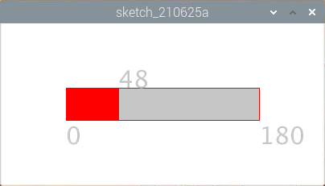

.. note::

    ¡Hola! Bienvenido a la Comunidad de Entusiastas de SunFounder para Raspberry Pi, Arduino y ESP32 en Facebook. Sumérgete en el mundo de Raspberry Pi, Arduino y ESP32 junto a otros entusiastas.

    **¿Por qué unirse?**

    - **Soporte Experto**: Resuelve problemas postventa y desafíos técnicos con la ayuda de nuestra comunidad y equipo.
    - **Aprende y Comparte**: Intercambia consejos y tutoriales para mejorar tus habilidades.
    - **Avances Exclusivos**: Accede anticipadamente a anuncios de nuevos productos y adelantos exclusivos.
    - **Descuentos Especiales**: Aprovecha descuentos exclusivos en nuestros productos más recientes.
    - **Promociones Festivas y Sorteos**: Participa en sorteos y promociones especiales.

    👉 ¿Listo para explorar y crear con nosotros? Haz clic en [|link_sf_facebook|] y únete hoy mismo.

Control Deslizante de Números
================================================

Vamos a dibujar una barra deslizante para controlar el Display de 7 segmentos.

	

**Conexión**

.. image:: img/image125.png

**Código**

.. code-block:: arduino

    import processing.io.*;

    int number = 0;
    int levelRange=9;
    Slider mySlider;

    int SDI=17;   // entrada de datos en serie
    int RCLK=18;  // entrada de reloj de memoria (STCP)
    int SRCLK =27;   // entrada de reloj de registro de desplazamiento (SHCP)

    int[] SegCode= {0x3f,0x06,0x5b,0x4f,0x66,0x6d,0x7d,0x07,0x7f,0x6f,0x77,0x7c,0x39,0x5e,0x79,0x71};

    void hc595_shift(int dat){
    int i;

    for(i=0;i<8;i++){
        int n=(0x80 & (dat << i)); 
        if ( n==0){
        GPIO.digitalWrite(SDI, 0);
        } else {
        GPIO.digitalWrite(SDI, 1);
        }
        GPIO.digitalWrite(SRCLK, 1);
        delay(1);
        GPIO.digitalWrite(SRCLK, 0);
    }

        GPIO.digitalWrite(RCLK, 1);
        delay(1);
        GPIO.digitalWrite(RCLK, 0);
    }

    void setup() {
        size(400, 200);
        frameRate(50);
        mySlider = new Slider(width * 0.2,height * 0.4,width * 0.8,height * 0.6,0,levelRange,number);
        GPIO.pinMode(SDI, GPIO.OUTPUT); 
        GPIO.pinMode(RCLK, GPIO.OUTPUT); 
        GPIO.pinMode(SRCLK, GPIO.OUTPUT); 
    
        GPIO.digitalWrite(SDI, 0);
        GPIO.digitalWrite(RCLK, 0);
        GPIO.digitalWrite(SRCLK, 0);
    }

    void draw() {

        background(255);
        mySlider.show();
        hc595_shift(SegCode[number]);
    }

    void mouseDragged(){
        number = mySlider.dragPoint(mouseX,mouseY);
    }

    class Slider{
        float slotPointAX;
        float slotPointBX;
        float slotPointAY;
        float slotPointBY;
        float linePoint;
        float depth;
        int maxRange;
        int minRange;
        int value;

        Slider(float ax, float ay, float bx, float by, int min, int max, int v){
            slotPointAX = ax;
            slotPointAY = ay;
            slotPointBX = bx;
            slotPointBY = by;
            maxRange = max;
            minRange = min;
            value = v;
            linePoint = slotPointAX;// + map(value, minRange, maxRange, slotPointAX, slotPointBX);
            depth = (slotPointBY - slotPointAY)*0.75;
        }

        void show(){
            rectMode(CORNERS);
            fill(200);
            stroke(255,0,0);
            rect(slotPointAX, slotPointAY, slotPointBX, slotPointBY);
            fill(255,0,0);
            rect(slotPointAX, slotPointAY, linePoint, slotPointBY);
            fill(200);
            textSize(depth);
            text(minRange, slotPointAX, slotPointBY+depth);
            text(maxRange, slotPointBX, slotPointBY+depth);
            text(value, linePoint, slotPointAY);
        }

        int dragPoint(float mx, float my){
            if(mx>=slotPointAX && mx<=slotPointBX && my>=slotPointAY && my<=slotPointBY){
                value = int(map(mx,slotPointAX,slotPointBX,minRange,maxRange));
                linePoint = map(value,minRange,maxRange,slotPointAX,slotPointBX);
            }
            return value;
        }
    }

**¿Cómo funciona?**

Este proyecto integra el control deslizante (Slider) y el Display de 7 segmentos del curso anterior. Para temas específicos, consulta :ref:`Show Number` y :ref:`Metronome`.  
