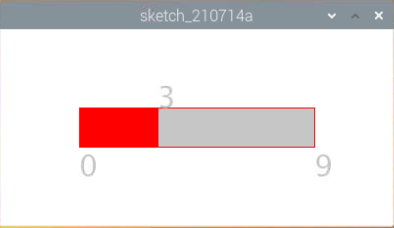

.. note::

    Ciao, benvenuto nella Community di Facebook dedicata agli appassionati di SunFounder Raspberry Pi, Arduino e ESP32! Approfondisci le tue conoscenze su Raspberry Pi, Arduino e ESP32 insieme ad altri appassionati.

    **Perché unirsi a noi?**

    - **Supporto Esperto**: Risolvi problematiche post-vendita e sfide tecniche con l’aiuto della nostra comunità e del nostro team.
    - **Impara e Condividi**: Scambia consigli e tutorial per migliorare le tue competenze.
    - **Anteprime Esclusive**: Ottieni accesso anticipato agli annunci di nuovi prodotti e alle anteprime.
    - **Sconti Speciali**: Approfitta di sconti esclusivi sui nostri prodotti più recenti.
    - **Promozioni Festive e Giveaway**: Partecipa a concorsi e promozioni speciali.

    👉 Sei pronto a esplorare e creare con noi? Clicca su [|link_sf_facebook|] e unisciti subito!

Controllo del Numero con Slider
================================================

In questo progetto, disegneremo una barra di scorrimento per controllare il display a 7 segmenti.

	

**Collegamenti**

.. image:: img/image125.png

**Sketch**

.. code-block:: arduino

    import processing.io.*;

    int number = 0;
    int levelRange=9;
    Slider mySlider;

    int SDI = 17;   // ingresso dati seriali
    int RCLK = 18;  // ingresso clock di memoria (STCP)
    int SRCLK = 27; // ingresso clock del registro a scorrimento (SHCP)

    int[] SegCode= {0x3f,0x06,0x5b,0x4f,0x66,0x6d,0x7d,0x07,0x7f,0x6f,0x77,0x7c,0x39,0x5e,0x79,0x71};

    void hc595_shift(int dat){
        int i;

    for(i=0;i<8;i++){
        int n=(0x80 & (dat << i)); 
        if ( n==0){
                GPIO.digitalWrite(SDI, 0);
            } else {
                GPIO.digitalWrite(SDI, 1);
            }
            GPIO.digitalWrite(SRCLK, 1);
            delay(1);
            GPIO.digitalWrite(SRCLK, 0);
        }

        GPIO.digitalWrite(RCLK, 1);
        delay(1);
        GPIO.digitalWrite(RCLK, 0);
    }

    void setup() {
        size(400, 200);
        frameRate(50);
        mySlider = new Slider(width * 0.2,height * 0.4,width * 0.8,height * 0.6,0,levelRange,number);
        GPIO.pinMode(SDI, GPIO.OUTPUT); 
        GPIO.pinMode(RCLK, GPIO.OUTPUT); 
        GPIO.pinMode(SRCLK, GPIO.OUTPUT); 
    
        GPIO.digitalWrite(SDI, 0);
        GPIO.digitalWrite(RCLK, 0);
        GPIO.digitalWrite(SRCLK, 0);
    }

    void draw() {

        background(255);
        mySlider.show();
        hc595_shift(SegCode[number]);
    }

    void mouseDragged(){
        number = mySlider.dragPoint(mouseX,mouseY);
    }

    class Slider{
        float slotPointAX;
        float slotPointBX;
        float slotPointAY;
        float slotPointBY;
        float linePoint;
        float depth;
        int maxRange;
        int minRange;
        int value;

        Slider(float ax, float ay, float bx, float by, int min, int max, int v){
            slotPointAX = ax;
            slotPointAY = ay;
            slotPointBX = bx;
            slotPointBY = by;
            maxRange = max;
            minRange = min;
            value = v;
            linePoint = slotPointAX;// + map(value, minRange, maxRange, slotPointAX, slotPointBX);
            depth = (slotPointBY - slotPointAY)*0.75;
        }

        void show(){
            rectMode(CORNERS);
            fill(200);
            stroke(255,0,0);
            rect(slotPointAX, slotPointAY, slotPointBX, slotPointBY);
            fill(255,0,0);
            rect(slotPointAX, slotPointAY, linePoint, slotPointBY);
            fill(200);
            textSize(depth);
            text(minRange, slotPointAX, slotPointBY+depth);
            text(maxRange, slotPointBX, slotPointBY+depth);
            text(value, linePoint, slotPointAY);
        }

        int dragPoint(float mx, float my){
            if(mx>=slotPointAX && mx<=slotPointBX && my>=slotPointAY && my<=slotPointBY){
                value = int(map(mx,slotPointAX,slotPointBX,minRange,maxRange));
                linePoint = map(value,minRange,maxRange,slotPointAX,slotPointBX);
            }
            return value;
        }
    }

**Come funziona?**

Questo progetto integra lo Slider e il Display a 7 segmenti del corso precedente. Per punti di riferimento specifici, consulta :ref:`Mostrare un Numero` e :ref:`Metronomo`.
