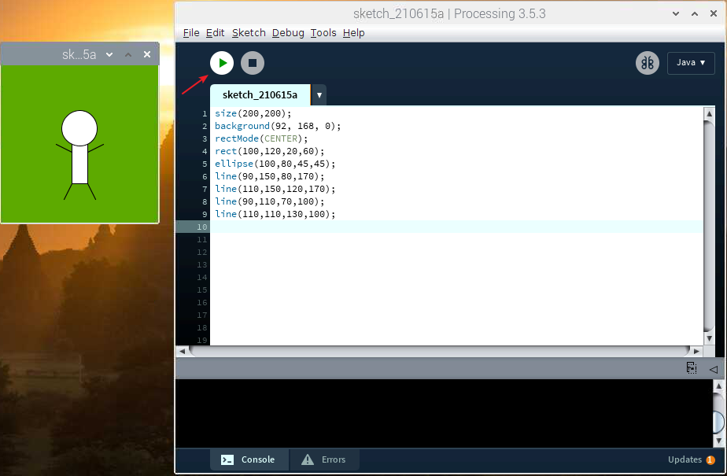
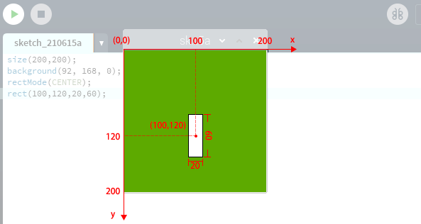

Draw a Matchmaker
========================

You're now running the Processing Development Environment (or PDE). 
There's not much to it; the large area is the Text Editor, and there's a row of buttons across the top; this is the toolbar. 
Below the editor is the Message Area, and below that is the Console. 
The Message Area is used for one line messages, and the Console is used for more technical details.

Let's get familiar with the usage of Processing and draw a matchmaker.

**Sketch**

Copy the sketch below into Processing and run it. A new display window will appear and a cheering matchmaker will be drawn.

.. code-block:: arduino

    size(200,200);
    background(92, 168, 0); 
    rectMode(CENTER);
    rect(100,120,20,60);
    ellipse(100,80,45,45);
    line(90,150,80,170);
    line(110,150,120,170);
    line(90,110,70,100);
    line(110,110,130,100);

.. note:: 

    If you run it and the message area turns red and reports some errors, then there is something wrong with the sketch. Make sure you copy the sample sketch exactly: numbers should be enclosed in parentheses, with commas between each number, and lines should end with semicolons.

**How it works?**

The key here is to realize that the display window can be treated as a square of paper.

Each pixel of the display window is a coordinate (x,y) that determines the position of a point in space. The origin (0,0) of the coordinates is in the upper left corner, the positive direction of the X-axis is horizontally to the right, and the positive direction of the Y-axis is vertically down.

What we have to do is to specify what shape and color should appear at these pixel coordinates.

For example, draw a rectangle of width 20 and height 60 with coordinates (100,120) as the midpoint.

.. code-block:: arduino

    rectMode(CENTER);
    rect(100,120,20,60);

Once we understand the relationship between the display window and the axes, this sketch is not difficult for us, we just need to understand some simple graphic drawing statements.

    * ``size(width, height)``: Defines the dimension of the display window width and height in units of pixels.
    * ``background(red, green, blue)``: Set the background color of the display window.
    * ``rectMode(mode)``: Modifies the location from which rectangles are drawn by changing the way in which parameters given to ``rect()`` are intepreted.
    * ``rect(x, y, width, height)``: Draws a rectangle to the screen. 
    * ``ellipse(x, y, width, height)``: Draws an ellipse (oval) to the screen. 
    * ``line(x1, y1, x2, y2)``: Draws a line (a direct path between two points) to the screen.

For more please refer to `Processing Reference <https://processing.org/reference/>`_.

