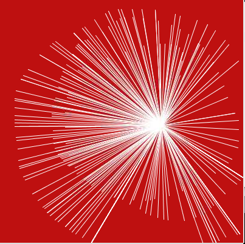

Hello Mouse
==================

In this project, your mouse will keep shooting lines towards a point; move the mouse and you will draw a unique line of stars. Press the mouse to restart the drawing.

**Sketch**

.. code-block:: arduino

    int pointX = 172;
    int pointY = 88;

    void setup() {
        size(400, 400);
        stroke(255);
        background(192, 16, 18);
    }

    void draw() {
        line(pointX, pointY, mouseX, mouseY);
    }

    void mousePressed() {
        pointX=mouseX;
        pointY=mouseY;
        background(192, 16, 18);
    }

**How it works?**

The previous project was drawing a single image without any animation or interaction.

If we want to make an interactive sketch, we need to add the ``setup()`` and ``draw()`` functions (these are built-in functions that are called automatically) to build the frame.

* ``setup()``: Executed only once at the start of the sketch.
* ``draw()``: Executed repeatedly, where we usually add the sketch for drawing the animation.

.. code-block:: arduino

    int pointX = 172;
    int pointY = 88;

    void setup() {
        size(400, 400);
        stroke(255);
        background(192, 16, 18);
    }

    void draw() {
        line(pointX, pointY, mouseX, mouseY);
    }

This sketch above already works smoothly as an interactive sketch.

Next you can add a mouse click event. This event can be implemented with the ``mousePressed()`` function, where we add statements to refresh the target point and clear the screen.

.. code-block:: arduino

    int pointX = 172;
    int pointY = 88;

    void setup() {
        size(400, 400);
        stroke(255);
        background(192, 16, 18);
    }

    void draw() {
        line(pointX, pointY, mouseX, mouseY);
    }

    void mousePressed() {
        pointX=mouseX;
        pointY=mouseY;
        background(192, 16, 18);
    }

For more please refer to `Processing Reference <https://processing.org/reference/>`_.

