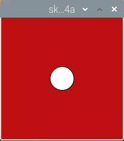
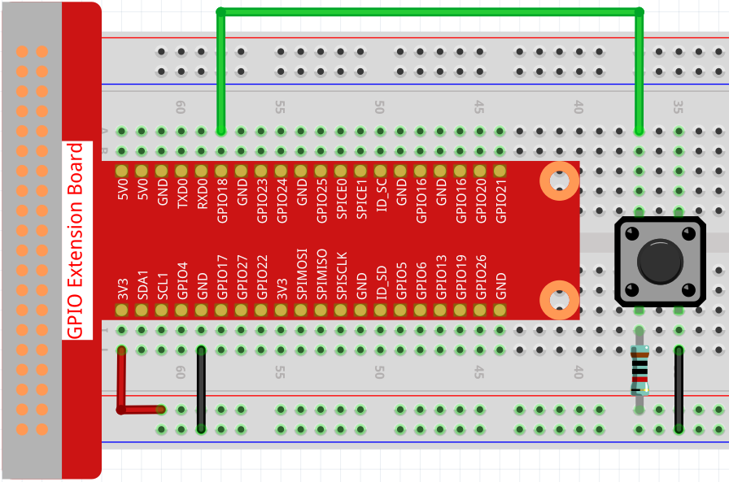

.. note::

    ¡Hola! Bienvenido a la Comunidad de Entusiastas de SunFounder para Raspberry Pi, Arduino y ESP32 en Facebook. Sumérgete en el mundo de Raspberry Pi, Arduino y ESP32 junto a otros entusiastas.

    **¿Por qué unirse?**

    - **Soporte Experto**: Resuelve problemas postventa y desafíos técnicos con la ayuda de nuestra comunidad y equipo.
    - **Aprende y Comparte**: Intercambia consejos y tutoriales para mejorar tus habilidades.
    - **Avances Exclusivos**: Accede anticipadamente a anuncios de nuevos productos y adelantos exclusivos.
    - **Descuentos Especiales**: Aprovecha descuentos exclusivos en nuestros productos más recientes.
    - **Promociones Festivas y Sorteos**: Participa en sorteos y promociones especiales.

    👉 ¿Listo para explorar y crear con nosotros? Haz clic en [|link_sf_facebook|] y únete hoy mismo.

Inflando el Punto
===========================

Ahora, vamos a construir un circuito que permita al botón controlar el tamaño del punto.
Cuando presionemos el botón, el punto se agrandará rápidamente; al soltarlo, el punto se reducirá gradualmente, dando la apariencia de un globo inflándose.

**Conexión**

**Sketch**

.. code-block:: arduino

    import processing.io.*;
    int buttonPin = 18; 

    float diameter;

    void setup() {
        size(200, 200);
        frameRate(64); //establece la velocidad de fotogramas
        GPIO.pinMode(buttonPin, GPIO.INPUT_PULLUP); 
        diameter = width*0.5;
    }

    void draw() {
        if (GPIO.digitalRead(buttonPin)==GPIO.LOW) {
            if(diameter<width*0.8) {diameter=diameter+5;}
        } else {
            if(diameter>=width*0.2) {diameter--;}
        } 
        background(192, 16, 18);
        ellipse(width/2, height/2,diameter, diameter);
    }

**¿Cómo funciona?**

Este proyecto utiliza la función de entrada en comparación con los dos proyectos anteriores, que usaban la función de salida del GPIO.

La función ``GPIO.pinMode()`` se utiliza para configurar ``buttonPin`` en modo de entrada pull-up, lo que hace que el pin esté alto automáticamente en estado predeterminado.

Luego, se usa la función ``GPIO.digitalRead()`` para leer el valor de ``buttonPin``. Cuando el valor es LOW, significa que el botón está presionado; en ese momento, el diámetro del punto aumenta en 5; si el botón se suelta, el diámetro del punto disminuye en 1.

Para más información, consulta `Processing Reference <https://processing.org/reference/>`_.
