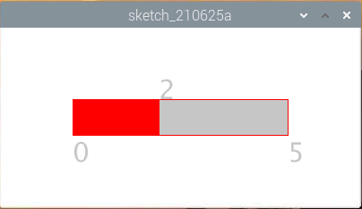

.. _processing_metronome:

Metronom
====================

Hier machen wir ein Metronom, das Metronom ist in 5 Stufen unterteilt, je höher die Stufe, desto dringender der Summerruf.

**Verdrahtung**

.. image:: img/image106.png

.. note::

    Hier wird ein aktiver Summer verwendet, der mit einem weißen Aufkleber versehen ist.
    
**Skizzieren**

.. code-block:: Arduino

    import processing.io.*;

    int level = 0;
    int buzzerPin = 17;
    int levelRange=5;
    Slider mySlider;

    void setup() {
        size(400, 200);
        frameRate(50);
        mySlider = new Slider(width * 0.2,height * 0.4,width * 0.8,height * 0.6,0,levelRange,level);
        GPIO.pinMode(buzzerPin, GPIO.OUTPUT);
    }

    void draw() {

        background(255);
        mySlider.show();
        if(level==0){
            GPIO.digitalWrite(buzzerPin, GPIO.HIGH);
        }else if((frameCount/5) % (levelRange-level+1) ==0){
            GPIO.digitalWrite(buzzerPin, GPIO.LOW);
        }else{
            GPIO.digitalWrite(buzzerPin, GPIO.HIGH);
        }
    }

    void mouseDragged(){
        level = mySlider.dragPoint(mouseX,mouseY);
    }

    class Slider{
        float slotPointAX;
        float slotPointBX;
        float slotPointAY;
        float slotPointBY;
        float linePoint;
        float depth;
        int maxRange;
        int minRange;
        int value;

        Slider(float ax, float ay, float bx, float by, int min, int max, int v){
            slotPointAX = ax;
            slotPointAY = ay;
            slotPointBX = bx;
            slotPointBY = by;
            maxRange = max;
            minRange = min;
            value = v;
            linePoint = slotPointAX;// + map(value, minRange, maxRange, slotPointAX, slotPointBX);
            depth = (slotPointBY - slotPointAY)*0.75;
        }

        void show(){
            rectMode(CORNERS);
            fill(200);
            stroke(255,0,0);
            rect(slotPointAX, slotPointAY, slotPointBX, slotPointBY);
            fill(255,0,0);
            rect(slotPointAX, slotPointAY, linePoint, slotPointBY);
            fill(200);
            textSize(depth);
            text(minRange, slotPointAX, slotPointBY+depth);
            text(maxRange, slotPointBX, slotPointBY+depth);
            text(value, linePoint, slotPointAY);
        }

        int dragPoint(float mx, float my){
            if(mx>=slotPointAX && mx<=slotPointBX && my>=slotPointAY && my<=slotPointBY){
                value = int(map(mx,slotPointAX,slotPointBX,minRange,maxRange));
                linePoint = map(value,minRange,maxRange,slotPointAX,slotPointBX);
            }
            return value;
        }
    }

**Wie es funktioniert?**

Hier haben wir eine ``Slider`` -Klasse erstellt und sie als **WIDGET** fungieren lassen.

.. code-block:: arduino

    Slider(ax, ay, bx, by, min, max, v)

In der Deklaration muss es in 7 Parametern übergeben werden.

Die ersten vier Parameter bestimmen die Größe des Widgets, 
gefolgt von den Koordinaten (x1, y1) des Startpunkts in der oberen linken Ecke und (x2, y2) 
in der unteren rechten Ecke.

Die letzten drei Parameter bestimmen seinen Zahlenbereich (min bis max) und den Anfangswert.

Es hat zwei Methoden, die Wirkung von ``dragPoint()`` besteht darin, 
den Schieberegler verschiebbar zu machen und den aktuellen Positionswert des Schiebereglers zurückzugeben.

.. code-block:: arduino

    int dragPoint(float mx, float my){
        if(mx>=slotPointAX && mx<=slotPointBX && my>=slotPointAY && my<=slotPointBY){
            value = int(map(mx,slotPointAX,slotPointBX,minRange,maxRange));
            linePoint = map(value,minRange,maxRange,slotPointAX,slotPointBX);
        }
        return value;
    }

Eine andere Methode ``show()`` besteht darin, den Slider anzuzeigen. 
Gleichzeitig werden der Bereichswert und der aktuelle Wert an der entsprechenden Stelle angezeigt.

.. code-block:: arduino

    void show(){
        rectMode(CORNERS);
        fill(200);
        stroke(255,0,0);
        rect(slotPointAX, slotPointAY, slotPointBX, slotPointBY);
        fill(255,0,0);
        rect(slotPointAX, slotPointAY, linePoint, slotPointBY);
        fill(200);
        textSize(depth);
        text(minRange, slotPointAX, slotPointBY+depth);
        text(maxRange, slotPointBX, slotPointBY+depth);
        text(value, linePoint, slotPointAY);
    }

Weitere Informationen finden Sie unter `Processing Reference <https://processing.org/reference/>`_.