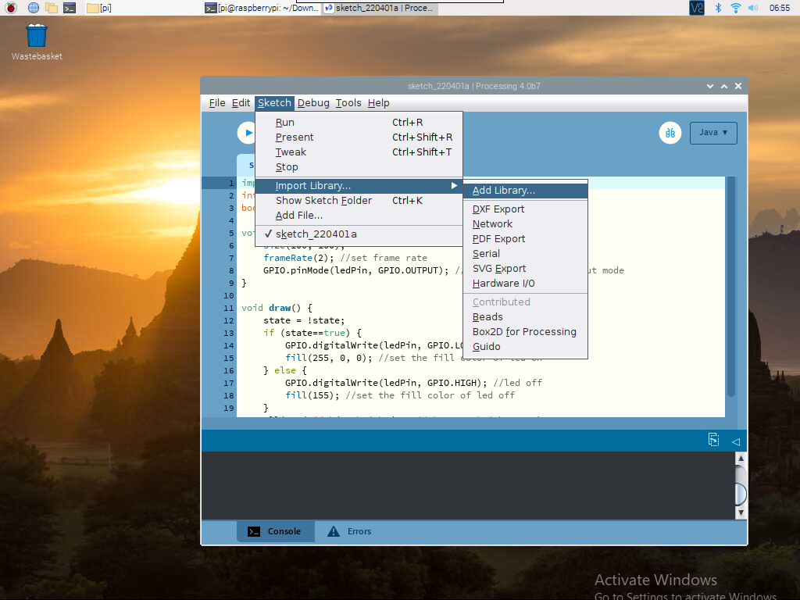

.. note::

    Ciao, benvenuto nella Community di Facebook dedicata agli appassionati di SunFounder Raspberry Pi, Arduino e ESP32! Approfondisci le tue conoscenze su Raspberry Pi, Arduino ed ESP32 insieme ad altri appassionati.

    **Perché unirsi a noi?**

    - **Supporto Esperto**: Risolvi problematiche post-vendita e sfide tecniche con l’aiuto della nostra comunità e del nostro team.
    - **Impara e Condividi**: Scambia consigli e tutorial per migliorare le tue competenze.
    - **Anteprime Esclusive**: Ottieni accesso anticipato agli annunci di nuovi prodotti e alle anteprime.
    - **Sconti Speciali**: Approfitta di sconti esclusivi sui nostri prodotti più recenti.
    - **Promozioni Festive e Giveaway**: Partecipa a concorsi e promozioni speciali.

    👉 Sei pronto a esplorare e creare con noi? Clicca su [|link_sf_facebook|] e unisciti subito!

Gioca con Processing 
=====================================

Cos'è Processing?
---------------------------

Processing è un ambiente di programmazione semplice, creato per facilitare lo sviluppo di applicazioni visivamente orientate, con enfasi sull'animazione e sul fornire feedback istantanei agli utenti tramite l'interazione. 
I suoi sviluppatori desideravano un modo per "abbozzare" idee in codice. 
Poiché le sue capacità si sono ampliate negli ultimi dieci anni, Processing è ora utilizzato per lavori avanzati a livello di produzione, oltre che per i suoi ruoli di sketching. 
Inizialmente costruito come estensione specifica di Java per artisti e designer, Processing è diventato uno strumento completo di progettazione e prototipazione utilizzato per installazioni su larga scala, motion graphics e visualizzazioni di dati complesse.

Processing è basato su Java, ma poiché gli elementi di programmazione sono piuttosto semplici, puoi imparare a usarlo anche se non conosci Java. Se sei già familiare con Java, ti consigliamo di dimenticare temporaneamente che Processing sia basato su Java fino a quando non avrai familiarizzato con il suo API.

Questo testo è tratto dal tutorial `Processing Overview <https://processing.org/tutorials/overview/>`_.

Installazione di Processing
------------------------------

.. note:: 

    Prima di poter usare Processing, devi accedere in remoto al desktop del Raspberry Pi (:ref:`Desktop Remoto`) o collegare un display al Raspberry Pi.

.. Esegui il seguente comando nel Terminale per installare Processing.

.. .. raw:: html

..    <run></run>

.. .. code-block:: 

..     curl https://processing.org/download/install-arm.sh | sudo sh

.. Una volta completata l'installazione, digita ``processing`` per aprirlo.

.. .. image:: img/processing1.png

.. For a detailed tutorial, please refer to `Pi Processing <https://pi.processing.org/>`_.

Benvenuto in Processing! Visita il sito https://processing.org/download e seleziona la versione ``Linux ARM32-bit``

Scaricherai un file ``.tar.gz`` che dovrebbe essere familiare agli utenti Linux. 
Scarica il file nella tua directory principale, quindi apri una finestra di terminale e digita:

.. code-block:: 

    tar xvfz processing-xxxx.tgz

(Sostituisci xxxx con il resto del nome del file, che rappresenta il numero della versione.) Questo creerà una cartella denominata processing-2.0 o simile. Cambia quindi directory:

.. code-block:: 

    cd processing-xxxx

e avvialo:

.. code-block:: 

    ./processing

Se tutto è andato bene, dovrebbe apparire la finestra principale di Processing.

.. image:: img/processing2.png

Installazione della libreria Hardware I/O
----------------------------------------------

Per utilizzare il GPIO del Raspberry Pi, è necessario aggiungere manualmente la `Hardware I/O library <https://processing.org/reference/libraries/io/index.html>`_.

Clicca su ``Sketch`` -> ``Import Library`` -> ``Add Library......`` 

Trova Hardware I/O, selezionala e quindi clicca su Installa. Al termine, apparirà un'icona di spunta.

.. image:: img/import-02.png

Progetti
---------------

.. toctree::
    draw_a_matchmaker
    hello_mouse
    blinking_dot
    clickable_dot
    clickable_color_blocks
    inflating_the_dot
    dot_on_the_swing
    metronome
    show_number
    drag_number

