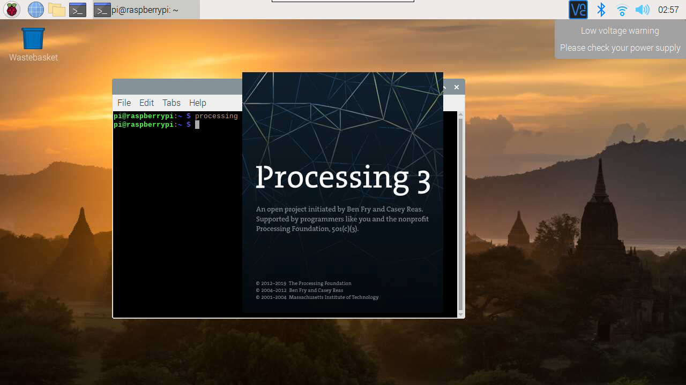

Play with Processing
==========================

What is Processing？
---------------------------

Processing is a simple programming environment that was created to make it easier to develop visually oriented applications with an emphasis on animation and providing users with instant feedback through interaction. 
The developers wanted a means to “sketch” ideas in code. 
As its capabilities have expanded over the past decade, Processing has come to be used for more advanced production-level work in addition to its sketching role. 
Originally built as a domain-specific extension to Java targeted towards artists and designers, Processing has evolved into a full-blown design and prototyping tool used for large-scale installation work, motion graphics, and complex data visualization.

Processing is based on Java, but because program elements in Processing are fairly simple, you can learn to use it even if you don't know any Java. If you're familiar with Java, it's best to forget that Processing has anything to do with Java for a while, until you get the hang of how the API works.

The latest version of Processing can be downloaded at http://processing.org/download.

An important goal for the project was to make this type of programming accessible to a wider audience. 
For this reason, Processing is free to download, free to use, and open source. 
But projects developed using the Processing environment and core libraries can be used for any purpose. 
This model is identical to GCC, the GNU Compiler Collection. GCC and its associated libraries (e.g. libc) are open source under the GNU Public License (GPL), which stipulates that changes to the code must be made available. 
However, programs created with GCC (examples too numerous to mention) are not themselves required to be open source.

This text is adapted from the tutorial, `Processing Overview <https://processing.org/tutorials/overview/>`_ by Ben Fry and Casey Reas.

Install the Processing
------------------------------

.. note:: 

    Before you can use Processing, you need to access the Raspberry Pi desktop remotely (:ref:`Remote Desktop`) or connect a display for the Raspberry Pi.

Run the following command in Terminal to install Processing.

.. code-block:: 

    curl https://processing.org/download/install-arm.sh | sudo sh

Once the installation is complete, type ``processing`` to open it.

For a detailed tutorial, please refer to `Pi Processing <https://pi.processing.org/>`_.

Projects
---------------

.. toctree::
    draw_a_matchmaker
    hello_mouse
    blinking_dot
    clickable_dot
    clickable_color_blocks
    inflating_the_dot
    dot_on_the_swing
    self-turning_servo
    slider-controlled_servo
    metronome
