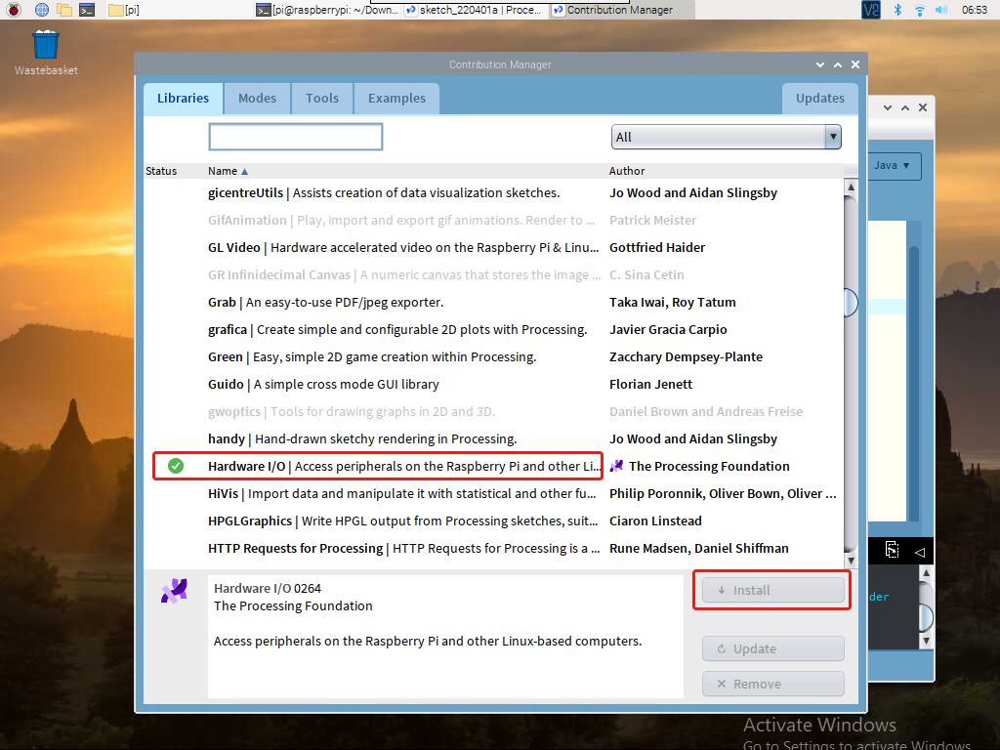

Processingで遊ぶ (Pi 5用ではない)
=====================================

Processingとは？
---------------------------

Processingは、アニメーションに重点を置いた視覚指向のアプリケーションの開発を容易にし、対話を通じてユーザーに即時のフィードバックを提供するために作成された単純なプログラミング環境です。 開発者は、コードでアイデアを「スケッチ」する手段を望んでいました。 その機能が過去10年間で拡大するにつれて、Processingは、スケッチの役割に加えて、より高度な本番レベルの作業に使用されるようになりました。 もともとアーティストやデザイナーを対象としたJavaのドメイン固有の拡張機能として構築されたProcessingは、大規模なインストール作業、モーショングラフィックス、複雑なデータの視覚化に使用される本格的なデザインおよびプロトタイピングツールに進化しました。

ProcessingはJavaに基づいていますが、Processingのプログラム要素は非常に単純であるため、Javaを知らなくても使用方法を学ぶことができます。 Javaに精通している場合は、APIがどのように機能するかを理解するまで、Processingはしばらくの間Javaと関係があることを忘れておくのが最善です。

このテキストは、チュートリアル `Processing Overview <https://processing.org/tutorials/overview/>`_ からのものです。

Processingをインストールする
------------------------------

.. note:: 

    Processingを使用する前に、Raspberry Piデスクトップにリモートでアクセスするか( :ref:`set_up_raspberrypi` ) 、RaspberryPiのディスプレイを接続する必要があります。

最初に https://processing.org/download にアクセスし、``Linux ARM32-bit`` バージョンを選択します。

次に、ほとんどの Linux ユーザーになじみのある ``.tar.gz`` ファイルにダウンロードします。
ファイルをホーム ディレクトリにダウンロードし、ターミナル ウィンドウを開いて次のように入力します。

.. code-block:: 

    tar xvfz processing-xxxx.tgz

(xxxx をファイル名の残りの部分 (バージョン番号) に置き換えます。) これにより、processing-2.0 などの名前のフォルダーが作成されます。次に、そのディレクトリに移動します。

.. code-block:: 

    cd processing-xxxx

そしてそれを実行します：

.. code-block:: 

    ./processing

運が良ければ、メインの Processing ウィンドウが表示されます。

.. image:: img/processing2.png

安装硬件 I/O
--------------------

Raspberry Pi の GPIO を使用するには、 `ハードウェア I/O ライブラリ <https://processing.org/reference/libraries/io/index.html>`_ を手動で追加する必要があります。

``Sketch`` -> ``Import Library`` -> ``Add Library...`` をクリックします。

.. image:: img/import-00.png

ハードウェア I/O を見つけて選択し、[インストール] をクリックします。完了すると、チェックマーク アイコンが表示されます。

プロジェクト
---------------

.. toctree::
    draw_a_matchmaker
    hello_mouse
    blinking_dot
    clickable_dot
    clickable_color_blocks
    inflating_the_dot
    dot_on_the_swing
    metronome
    show_number
    drag_number
