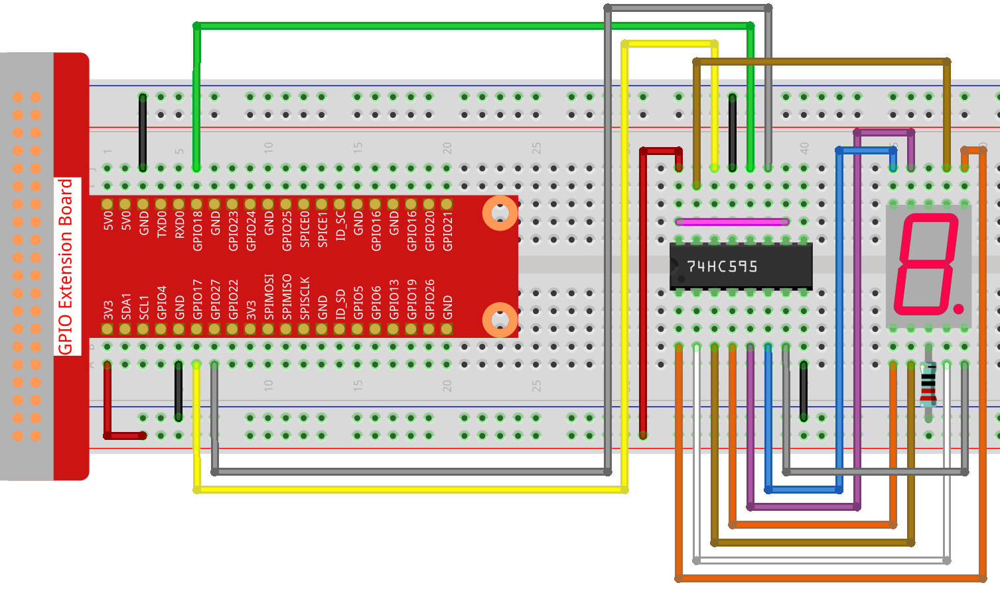

Slider-controlled Servo
=============================

Let's draw a slider bar to control the Servo.

.. image:: img/drag_servo.png

**Wiring**

**Sketch**

.. code-block:: arduino

    import processing.io.*;
    SoftwareServo servo;

    Slider mySlider;

    float angle = 0.0;

    void setup() {
        size(400, 200);
        servo = new SoftwareServo(this);
        servo.attach(18);
        mySlider = new Slider(width * 0.2,height * 0.4,width * 0.8,height * 0.6,0,180,0);
    }

    void draw() {
        background(255);
        mySlider.show();
        servo.write(angle);
    }

    void mouseDragged(){
        angle = mySlider.dragPoint(mouseX,mouseY);
    }

    class Slider{
        float slotPointAX;
        float slotPointBX;
        float slotPointAY;
        float slotPointBY;
        float linePoint;
        float depth;
        int maxRange;
        int minRange;
        int value;

        Slider(float ax, float ay, float bx, float by, int min, int max, int v){
            slotPointAX = ax;
            slotPointAY = ay;
            slotPointBX = bx;
            slotPointBY = by;
            maxRange = max;
            minRange = min;
            value = v;
            linePoint = slotPointAX + map(value, minRange, maxRange, slotPointAX, slotPointBX);
            depth = (slotPointBY - slotPointAY)*0.75;
        }

        void show(){
            rectMode(CORNERS);
            fill(200);
            stroke(255,0,0);
            rect(slotPointAX, slotPointAY, slotPointBX, slotPointBY);
            fill(255,0,0);
            rect(slotPointAX, slotPointAY, linePoint, slotPointBY);
            fill(200);
            textSize(depth);
            text(minRange, slotPointAX, slotPointBY+depth);
            text(maxRange, slotPointBX, slotPointBY+depth);
            text(value, linePoint, slotPointAY);
        }

        int dragPoint(float mx, float my){
            if(mx>=slotPointAX && mx<=slotPointBX && my>=slotPointAY && my<=slotPointBY){
                linePoint = mx;
                value = int(map(linePoint,slotPointAX,slotPointBX,minRange,maxRange));
            }
            return value;
        }
    }

**How it works?**

Here, we created a ``Slider`` class and made it act as **WIDGET**.

.. code-block:: arduino

    Slider(ax, ay, bx, by, min, max, v)

In the declaration, it needs to be passed in 7 parameters.

The first four parameters determine the size of the widget, followed by the coordinates (x1, y1) of the starting point in the upper left corner and (x2, y2) in the lower right corner.

The last three parameters determine its numerical range (min to max) and initial value.

It has two methods, the effect of ``dragPoint()`` is to make the slider draggable and return the slider's current position value.

.. code-block:: arduino

    int dragPoint(float mx, float my){
        if(mx>=slotPointAX && mx<=slotPointBX && my>=slotPointAY && my<=slotPointBY){
            linePoint = mx;
            value = int(map(linePoint,slotPointAX,slotPointBX,minRange,maxRange));
        }
        return value;
    }

Another method ``show()`` is to show the Slider. At the same time, the range value and current value are displayed in the corresponding position.

.. code-block:: arduino

    void show(){
        rectMode(CORNERS);
        fill(200);
        stroke(255,0,0);
        rect(slotPointAX, slotPointAY, slotPointBX, slotPointBY);
        fill(255,0,0);
        rect(slotPointAX, slotPointAY, linePoint, slotPointBY);
        fill(200);
        textSize(depth);
        text(minRange, slotPointAX, slotPointBY+depth);
        text(maxRange, slotPointBX, slotPointBY+depth);
        text(value, linePoint, slotPointAY);
    }

