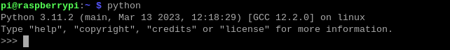

「GPIO Zero」の確認
==========================

もし、Raspberry Pi 5を使用してPythonユーザーであれば、
「GPIO Zero」が提供するAPIを使用してGPIOをプログラムできます。

「GPIO Zero」は、Raspberry PiのGPIOピンを制御するためのモジュールです。
このパッケージは、Raspberry Pi上のGPIOを制御するための使いやすいクラスや関数の範囲を提供します。
詳細や例については、こちらを参照してください：https://gpiozero.readthedocs.io/en/latest/。

GPIO Zeroがインストールされているかどうかをテストするには、Pythonで次のコマンドを入力してください：

.. raw:: html

   <run></run>

.. code-block::

    python

Python CLIで、 ``import gpiozero`` と入力します。
エラーメッセージが表示されなければ、GPIO Zeroがインストールされていることを意味します。

.. raw:: html

   <run></run>

.. code-block::

    import gpiozero

.. image:: ../python_pi5/img/zero_02.png
    :width: 100%

Python CLIを終了する場合は、次のコマンドを入力してください：

.. raw:: html

   <run></run>

.. code-block::

    exit()

.. image:: ../python_pi5/img/zero_03.png
    :width: 100%
