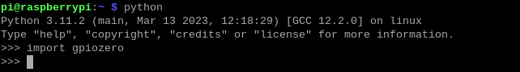

.. note::

    こんにちは、SunFounderのRaspberry Pi & Arduino & ESP32愛好家コミュニティへようこそ！Facebook上でRaspberry Pi、Arduino、ESP32についてもっと深く掘り下げ、他の愛好家と交流しましょう。

    **参加する理由は？**

    - **エキスパートサポート**：コミュニティやチームの助けを借りて、販売後の問題や技術的な課題を解決します。
    - **学び＆共有**：ヒントやチュートリアルを交換してスキルを向上させましょう。
    - **独占的なプレビュー**：新製品の発表や先行プレビューに早期アクセスしましょう。
    - **特別割引**：最新製品の独占割引をお楽しみください。
    - **祭りのプロモーションとギフト**：ギフトや祝日のプロモーションに参加しましょう。

    👉 私たちと一緒に探索し、創造する準備はできていますか？[|link_sf_facebook|]をクリックして今すぐ参加しましょう！

「GPIO Zero」の確認
==========================

もし、Raspberry Pi 5を使用してPythonユーザーであれば、
「GPIO Zero」が提供するAPIを使用してGPIOをプログラムできます。

「GPIO Zero」は、Raspberry PiのGPIOピンを制御するためのモジュールです。
このパッケージは、Raspberry Pi上のGPIOを制御するための使いやすいクラスや関数の範囲を提供します。
詳細や例については、こちらを参照してください：https://gpiozero.readthedocs.io/en/latest/。

GPIO Zeroがインストールされているかどうかをテストするには、Pythonで次のコマンドを入力してください：

.. raw:: html

   <run></run>

.. code-block::

    python

.. image:: ../python_pi5/img/zero_01.png
    :width: 100%

Python CLIで、 ``import gpiozero`` と入力します。
エラーメッセージが表示されなければ、GPIO Zeroがインストールされていることを意味します。

.. raw:: html

   <run></run>

.. code-block::

    import gpiozero

Python CLIを終了する場合は、次のコマンドを入力してください：

.. raw:: html

   <run></run>

.. code-block::

    exit()

.. image:: ../python_pi5/img/zero_03.png
    :width: 100%
