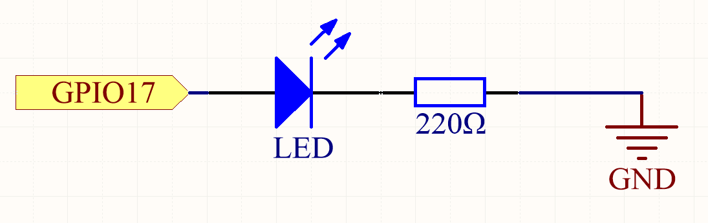

.. note::

    こんにちは、SunFounderのRaspberry Pi & Arduino & ESP32愛好家コミュニティへようこそ！Facebook上でRaspberry Pi、Arduino、ESP32についてもっと深く掘り下げ、他の愛好家と交流しましょう。

    **参加する理由は？**

    - **エキスパートサポート**：コミュニティやチームの助けを借りて、販売後の問題や技術的な課題を解決します。
    - **学び＆共有**：ヒントやチュートリアルを交換してスキルを向上させましょう。
    - **独占的なプレビュー**：新製品の発表や先行プレビューに早期アクセスしましょう。
    - **特別割引**：最新製品の独占割引をお楽しみください。
    - **祭りのプロモーションとギフト**：ギフトや祝日のプロモーションに参加しましょう。

    👉 私たちと一緒に探索し、創造する準備はできていますか？[|link_sf_facebook|]をクリックして今すぐ参加しましょう！

.. _1.1.1_py_pi5:

1.1.1 点滅するLED
=========================

概要
-----------------

このプロジェクトでは、プログラムによって点滅するLEDを作成する方法を学びます。
設定により、LEDはさまざまな興味深い現象を生成できます。さあ、始めましょう。

必要なコンポーネント
------------------------------

このプロジェクトには、次のコンポーネントが必要です。

.. image:: ../python_pi5/img/1.1.1_blinking_led_list.png
    :width: 800
    :align: center

.. raw:: html

    

回路図
---------------------

この実験では、Raspberry PiのGPIOピン17をLEDの陽極（長いピン）に接続し、LEDの陰極（短いピン）を抵抗に接続し、抵抗のもう一方の端をRaspberry PiのGNDピンに接続します。LEDを点灯させるには、GPIO17を高電圧（3.3V）に設定する必要があります。これはプログラムによって実現できます。

.. note::

    **Pin11** は、Raspberry Piの左から右への11番目のピンを指します。それに対応する **BCM** ピン番号は以下の表に示されています。

Python言語関連の内容の中で、BCM 17は以下の表のBCM列で17になります。
同時に、それはRaspberry Piの11番目のピンであり、Pin 11と同じです。

============ ======== ===
T-Board Name physical BCM
GPIO17       Pin 11   17
============ ======== ===

実験手順
-----------------------------

**ステップ1:** 回路を組み立てます。

.. image:: ../python_pi5/img/1.1.1_blinking_led_circuit.png
    :width: 800
    :align: center

**ステップ2:** コードのフォルダに移動し、実行します。

1. 画面を使用する場合、以下の手順をお勧めします。

「1.1.1_BlinkingLed_zero.py」を見つけてダブルクリックして開きます。これでファイルが開きます。

ウィンドウで **Run** -> **Run Module** をクリックすると、次のコンテンツが表示されます。

実行を停止するには、右上のXボタンをクリックして閉じ、コードに戻ります。コードを変更した場合は、**Run Module (F5)** をクリックする前に保存する必要があります。その後、結果を確認できます。

2. Raspberry Piにリモートでログインする場合、次のコマンドを入力します：

.. raw:: html

   <run></run>

.. code-block::

   cd ~/davinci-kit-for-raspberry-pi/python-pi5

.. note::
    この実験のコードのパスに ``cd`` を使用してディレクトリを変更します。

**ステップ3:** コードを実行します。

.. raw:: html

   <run></run>

.. code-block::

   sudo python3 1.1.1_BlinkingLed_zero.py

.. note::
    ここで、sudo - superuser do、pythonはPythonでファイルを実行することを意味します。

コードを実行した後、LEDが点滅するのを見ることができます。

**ステップ4:** コードファイル「1.1.1_BlinkingLed_zero.py」を編集したい場合、「Ctrl + C」を押してコードの実行を停止します。その後、次のコマンドを入力して「1.1.1_BlinkingLed_zero.py」を開きます：

.. raw:: html

   <run></run>

.. code-block::

   nano 1.1.1_BlinkingLed_zero.py

.. note::
    nanoはテキストエディタツールです。このツールを使用してコードファイル「1.1.1_BlinkingLed_zero.py」を開くためにこのコマンドが使用されます。

「Ctrl+X」を押して終了します。コードを変更した場合、変更を保存するかどうかを確認するプロンプトが表示されます。保存する場合は「Y」（保存）、保存しない場合は「N」（保存しない）を入力します。

その後、効果を確認するために再度「nano 1.1.1_BlinkingLed_zero.py」を入力します。

**コード**

以下はプログラムコードです：

.. note::

   以下のコードは **変更/リセット/コピー/実行/停止** することができます。ただし、それを行う前に「davinci-kit-for-raspberry-pi/python-pi5」というソースコードのパスに移動する必要があります。コードを変更した後、そのまま実行して効果を確認できます。

.. raw:: html

    <run></run>

.. code-block:: python

   #!/usr/bin/env python3
   from gpiozero import LED
   from time import sleep

   # GPIO Zeroライブラリを使用してGPIOピン17に接続されたLEDを初期化します。
   led = LED(17)

   try:
      # LEDの状態を切り替えるための無限ループを開始します。
      while True:
         # LEDをオンにしてコンソールにメッセージを表示します
         led.on()
         print('...LED ON')

         # LEDを0.5秒間オンにしたまま待機します。
         sleep(0.5)

         # LEDをオフにしてコンソールにメッセージを表示します
         led.off()
         print('LED OFF...')

         # LEDを0.5秒間オフにしたまま待機します。
         sleep(0.5)

   except KeyboardInterrupt:
      # キーボードインタラプト（Ctrl+Cを押すなど）を優雅に処理してループを終了します。
      # GPIO Zeroは終了時にGPIO設定のクリーンアップを自動的に処理します。
      pass

**コードの説明**

#. システムがこれを検出すると、env設定でpythonのインストールパスを検索し、対応するインタープリタを呼び出して操作を完了します。これは、ユーザーがpythonを ``/usr/bin`` のデフォルトパスにインストールしていない場合でも、操作を行うためのものです。

   .. code-block:: python

       #!/usr/bin/env python3

#. これらの行は必要なクラスと関数をインポートします。 LEDはLED制御用の ``gpiozero`` から、 ``sleep`` は遅延用の ``time`` からです。

   .. code-block:: python

       from gpiozero import LED
       from time import sleep

#. この行はGPIOピン17に接続されたLEDオブジェクトを作成します。

   .. code-block:: python

       # GPIO Zeroライブラリを使用してGPIOピン17に接続されたLEDを初期化します。
       led = LED(17)

#. ``while True:`` を使用して無限ループを開始します。ループ内では、LEDがオンになり（ ``led.on()`` ）、メッセージが表示されます。プログラムは0.5秒間一時停止します（ ``sleep(0.5)`` ）。その後、LEDがオフになり（ ``led.off()`` ）、別のメッセージが表示され、プログラムは再び0.5秒間一時停止します。

   .. code-block:: python

       try:
           # LEDの状態を切り替える無限ループを開始します。
           while True:
               # LEDをオンにしてコンソールにメッセージを表示します。
               led.on()
               print('...LED ON')

               # LEDがオンの状態で0.5秒間待ちます。
               sleep(0.5)

               # LEDをオフにしてコンソールにメッセージを表示します。
               led.off()
               print('LED OFF...')

               # LEDがオフの状態で0.5秒間待ちます。
               sleep(0.5)

#. ``except`` ブロックは ``KeyboardInterrupt`` （Ctrl+Cを押すなど）をキャッチし、ループを安全に終了します。ここで ``pass`` ステートメントは、割り込み時に特定のアクションを実行しないことを示すプレースホルダーとして使用されます。

   .. code-block:: python

       except KeyboardInterrupt:
           # キーボードの割り込み（Ctrl+C）を安全に処理し、ループを中断します。
           # 終了時にはGPIO Zeroが自動的にGPIOの設定をクリーンアップします。
           pass