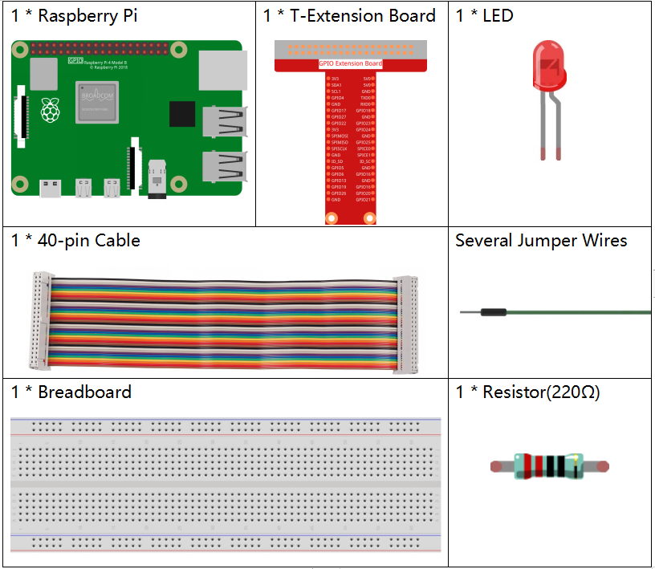

.. note::

    Ciao, benvenuto nella Community di Facebook dedicata agli appassionati di SunFounder Raspberry Pi, Arduino e ESP32! Approfondisci le tue conoscenze su Raspberry Pi, Arduino ed ESP32 insieme ad altri appassionati.

    **Perché unirsi a noi?**

    - **Supporto Esperto**: Risolvi problematiche post-vendita e sfide tecniche con l’aiuto della nostra comunità e del nostro team.
    - **Impara e Condividi**: Scambia consigli e tutorial per migliorare le tue competenze.
    - **Anteprime Esclusive**: Ottieni accesso anticipato agli annunci di nuovi prodotti e alle anteprime.
    - **Sconti Speciali**: Approfitta di sconti esclusivi sui nostri prodotti più recenti.
    - **Promozioni Festive e Giveaway**: Partecipa a concorsi e promozioni speciali.

    👉 Sei pronto a esplorare e creare con noi? Clicca su [|link_sf_facebook|] e unisciti subito!
    
.. _1.1.1_py_pi5:

1.1.1 LED Lampeggiante
=========================

Introduzione
-----------------

In questo progetto, impareremo come realizzare un LED lampeggiante tramite programmazione.
Impostando i parametri, il LED potrà creare una serie di effetti interessanti. Andiamo avanti!

Componenti Necessari
------------------------------

Per questo progetto, avremo bisogno dei seguenti componenti.

.. raw:: html

    

Schema a Blocchi
---------------------

In questo esperimento, colleghiamo il pin GPIO 17 del Raspberry Pi al terminale positivo (pin lungo) del LED, poi il terminale negativo (pin corto) del LED a una resistenza, e infine colleghiamo l’altro terminale della resistenza al pin GND del Raspberry Pi. Per accendere il LED, dobbiamo impostare GPIO17 su alto (3,3V). Questo fenomeno può essere ottenuto tramite programmazione.

.. note::

    **Pin11** si riferisce all’11º pin del Raspberry Pi da sinistra a destra, e i numeri di pin **BCM** corrispondenti sono mostrati nella tabella seguente.

Nel contesto del linguaggio Python, BCM 17 è 17 nella colonna
BCM della tabella seguente. Allo stesso tempo, corrisponde all’11º pin del Raspberry Pi, Pin 11.

============ ======== ===
T-Board Name physical BCM
GPIO17       Pin 11   17
============ ======== ===

.. image:: ../python_pi5/img/1.1.1_blinking_led_schematic.png
    :width: 800
    :align: center

Procedure Sperimentali
-----------------------------

**Passo 1:** Costruisci il circuito.

.. image:: ../python_pi5/img/1.1.1_blinking_led_circuit.png
    :width: 800
    :align: center

**Passo 2:** Vai nella cartella del codice e avvialo.

1. Se utilizzi uno schermo, ti consigliamo di seguire i seguenti passaggi.

Trova `1.1.1_BlinkingLed_zero.py` e fai doppio clic per aprirlo. Ora ti trovi
nel file.

Clicca su **Run** ->\ **Run Module** nella finestra e apparirà il contenuto seguente.

Per interrompere l’esecuzione, clicca semplicemente sul pulsante X in alto a destra
per chiudere, e tornerai al codice. Se modifichi il codice,
prima di cliccare su **Run Module (F5)** è necessario salvarlo. Poi potrai vedere i risultati.

2. Se accedi al Raspberry Pi da remoto, digita il seguente comando:

.. raw:: html

   <run></run>

.. code-block::

   cd ~/davinci-kit-for-raspberry-pi/python-pi5

.. note::
    Cambia la directory al percorso del codice in questo esperimento tramite ``cd``.

**Passo 3:** Esegui il codice

.. raw:: html

   <run></run>

.. code-block::

   sudo python3 1.1.1_BlinkingLed_zero.py

.. note::
    Qui sudo significa eseguire come superutente, e python è utilizzato per eseguire il file con Python.

Dopo l’esecuzione del codice, vedrai il LED lampeggiare.

**Passo 4:** Se vuoi modificare il file di codice `1.1.1_BlinkingLed_zero.py`,
premi ``Ctrl + C`` per interrompere l’esecuzione del codice. Poi digita il seguente
comando per aprire `1.1.1_BlinkingLed_zero.py`:

.. raw:: html

   <run></run>

.. code-block::

   nano 1.1.1_BlinkingLed_zero.py

.. note::
    nano è uno strumento di editing testuale. Il comando serve per aprire il
    file di codice `1.1.1_BlinkingLed_zero.py` con questo strumento.

Premi ``Ctrl+X`` per uscire. Se hai modificato il codice, ci sarà un
messaggio che chiede se salvare le modifiche o meno. Digita ``Y`` (salva)
o ``N`` (non salvare).

Poi premi ``Enter`` per uscire. Digita nano `1.1.1_BlinkingLed_zero.py` di nuovo per
vedere l’effetto dopo la modifica.

.. warning::

    Se appare l’errore ``RuntimeError: Cannot determine SOC peripheral base address``, consulta :ref:`faq_soc` 

**Codice**

Di seguito è riportato il codice del programma:

.. note::

   Puoi **Modificare/Reimpostare/Copiare/Eseguire/Arrestare** il codice qui sotto. Ma prima, è necessario andare al percorso del codice sorgente come ``davinci-kit-for-raspberry-pi/python-pi5``. Dopo aver modificato il codice, puoi eseguirlo direttamente per vedere l’effetto.

.. raw:: html

    <run></run>

.. code-block:: python

   #!/usr/bin/env python3
   from gpiozero import LED
   from time import sleep

   # Inizializza un LED collegato al pin GPIO 17 utilizzando la libreria GPIO Zero.
   led = LED(17)

   try:
      # Avvia un ciclo infinito per alternare lo stato del LED.
      while True:
         # Accendi il LED e stampa un messaggio sulla console.
         led.on()
         print('...LED ON')

         # Attendi 0.5 secondi con il LED acceso.
         sleep(0.5)

         # Spegni il LED e stampa un messaggio sulla console.
         led.off()
         print('LED OFF...')

         # Attendi 0.5 secondi con il LED spento.
         sleep(0.5)

   except KeyboardInterrupt:
      # Gestisce in modo sicuro un’interruzione da tastiera (Ctrl+C) uscendo dal ciclo.
      # GPIO Zero gestisce automaticamente la pulizia delle impostazioni GPIO all’uscita.
      pass

**Spiegazione del Codice**

#. Quando il sistema rileva questo, cercherà il percorso di installazione di Python nelle impostazioni env, quindi chiamerà l’interprete corrispondente per completare l’operazione. Serve per evitare che l’utente non abbia installato Python sul percorso di default ``/usr/bin``.

   .. code-block:: python

       #!/usr/bin/env python3

#. Queste righe importano le classi e le funzioni necessarie. ``LED`` da ``gpiozero`` per il controllo del LED e ``sleep`` da ``time`` per i ritardi.

   .. code-block:: python

       from gpiozero import LED
       from time import sleep

#. Questa riga crea un oggetto LED collegato al pin GPIO 17.

   .. code-block:: python

       # Inizializza un LED collegato al pin GPIO 17 utilizzando la libreria GPIO Zero.
       led = LED(17)

#. Viene avviato un ciclo infinito usando ``while True:``. All'interno del ciclo, il LED viene acceso (``led.on()``) e viene stampato un messaggio. Successivamente, il programma si ferma per 0.5 secondi (``sleep(0.5)``). Dopo di che, il LED viene spento (``led.off()``), viene stampato un altro messaggio, e il programma si ferma di nuovo per 0.5 secondi.

   .. code-block:: python

       try:
           # Avvia un ciclo infinito per alternare lo stato del LED.
           while True:
               # Accendi il LED e stampa un messaggio sulla console.
               led.on()
               print('...LED ON')

               # Attendi 0.5 secondi con il LED acceso.
               sleep(0.5)

               # Spegni il LED e stampa un messaggio sulla console.
               led.off()
               print('LED OFF...')

               # Attendi 0.5 secondi con il LED spento.
               sleep(0.5)

#. Il blocco ``except`` intercetta un ``KeyboardInterrupt`` (come la pressione di Ctrl+C) ed esce in sicurezza dal ciclo. Il comando ``pass`` viene usato come segnaposto per indicare che non viene eseguita alcuna azione specifica in caso di interruzione.

   .. code-block:: python

       except KeyboardInterrupt:
           # Gestisce in modo sicuro un’interruzione da tastiera (Ctrl+C) uscendo dal ciclo.
           # GPIO Zero gestisce automaticamente la pulizia delle impostazioni GPIO all’uscita.
           pass
